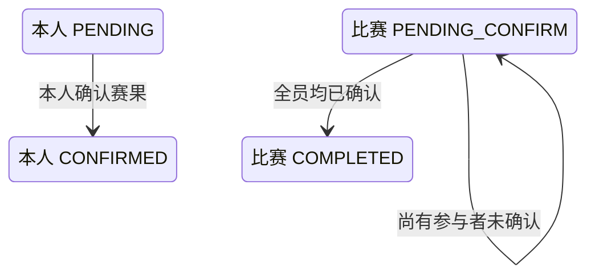

## 一句话价值

记录本人确认并在全员确认后完成比赛。

## 核心概念

- 自办赛事  由业务方配置规则、接受报名、组织匹配并推进比赛的竞赛活动。
- 赛事报名  用户参加自办赛事的资格与进度载体，记录参赛编号、阶段、轮次、状态和偏好。
- 参赛编号  一支参赛单元的编号；单打通常对应一人，双打队友共享同一编号。
- 资格赛  自办赛事进入正赛前的筛选阶段，胜者可能先进入待支付。
- 正赛  自办赛事锁定席位后的淘汰阶段，胜者按轮次继续晋级。
- 赛事比赛  自办赛事中一次由若干参赛单元完成的对阵，经历匹配、订场、确认、比赛和赛果确认。
- 赛果  赛事比赛提交的胜方结论，需要其他参赛者确认或由超时规则完成确认。
- 待支付报名  资格赛晋级后尚未锁定正赛席位的赛事报名；它与支付单的待支付状态是两个对象。

## 业务对象

### 赛事比赛

| 业务名称 | 描述 | 取值说明 |
|---|---|---|
| 比赛编号 | 唯一标识本次确认赛果的赛事比赛。 | — |
| 比赛轮次 | 本场比赛所属轮次。 | 资格赛、64 强、32 强、16 强、8 强、半决赛、决赛。 |
| 胜方参赛编号 | 已提交赛果认定的获胜参赛单元。 | — |
| 比赛状态 | 全员确认后由待确认赛果推进为已完成。 | 已匹配：已完成对阵编排，等待选定订场人；订场中：已选定订场人，等待提交赛约；待确认赛约：已提交赛约，等待参与者确认；待比赛：赛约已确认，等待比赛；待确认赛果：已提交赛果，等待参与者确认；已完成：赛果已确认；已终止：比赛被拒绝或取消。 |

### 比赛参与确认

| 业务名称 | 描述 | 取值说明 |
|---|---|---|
| 参与者 | 本场比赛的参赛者；本次只更新当前确认人。 | — |
| 参赛编号 | 用于区分胜方与负方的参赛单元编号。 | — |
| 赛果确认状态 | 记录每名参与者对当前赛果的确认结果。 | 待确认：尚未确认赛果；已确认：接受当前赛果；已拒绝：拒绝当前赛果。 |

### 赛事报名

| 业务名称 | 描述 | 取值说明 |
|---|---|---|
| 参赛编号 | 报名所属参赛单元，用于确定胜负去向。 | — |
| 报名阶段 | 决定资格赛胜方或正赛胜负方的后续状态。 | 资格赛：胜方进入待支付；正赛：胜方进入下一轮，负方被淘汰。 |
| 报名状态 | 全员确认赛果后按胜负和阶段更新。 | 等待匹配：处于当前轮次匹配池；已冻结：暂时离开匹配池；比赛中：已编入尚未结束的比赛；待支付：资格赛晋级后等待支付；已淘汰：止步当前赛事；已退赛：退出赛事。 |
| 当前轮次 | 正赛非决赛胜方推进到下一轮。 | 资格赛、64 强、32 强、16 强、8 强、半决赛、决赛。 |

### 自办赛事

| 业务名称 | 描述 | 取值说明 |
|---|---|---|
| 赛事编号 | 本场比赛归属的自办赛事。 | — |
| 正赛签位 | 正赛计划容纳的参赛席位数。 | — |
| 已锁定席位 | 已支付报名费并锁定的正赛席位数。 | — |
| 当前轮次 | 按各轮比赛完成情况向后推进，不会倒退。 | 资格赛、64 强、32 强、16 强、8 强、半决赛、决赛。 |

## 状态机

| 当前状态 | 触发操作 | 新状态 | 前置条件 | 谁能触发 |
|---|---|---|---|---|
| 比赛 `PENDING_CONFIRM`，本人尚未确认 | 确认当前赛果 | 本人 `CONFIRMED`，比赛仍为 `PENDING_CONFIRM` | 比赛、所属赛事和本人赛事报名存在；本人属于该场比赛；仍有其他参与者未确认 | 该场比赛参赛者 |
| 比赛 `PENDING_CONFIRM`，本人尚未确认 | 确认当前赛果 | 本人 `CONFIRMED`，比赛 `COMPLETED`；胜负方报名完成结算 | 比赛、所属赛事和全体参与者的赛事报名存在；胜方参赛编号已记录；确认后全员均为 `CONFIRMED` | 该场最后一名未确认的参赛者 |

## 主流程

触发源：参赛者发起 HTTP 确认；终态：本人赛果确认为 `CONFIRMED`，全员确认后比赛为 `COMPLETED`、胜负方报名完成结算并评估赛事轮次。

1. 识别当前登录参赛者，取得要确认赛果的赛事比赛编号和本次已授权的微信赛事通知场景。
2. 找到该场赛事比赛及其全部比赛参与者，并确认比赛正处于 `PENDING_CONFIRM`。
3. 确认比赛所属赛事、本人赛事报名和本人比赛参与关系仍然存在。
4. 将本人的赛果确认状态记为 `CONFIRMED`，并记录确认时间。
5. 若仍有参与者未确认，比赛继续保持 `PENDING_CONFIRM`，等待其另行确认。
6. 若全体参与者均已确认，确认已记录胜方参赛编号，将比赛置为 `COMPLETED` 并记录完成时间。
7. 完成比赛后，资格赛胜方进入 `PAYING`，资格赛负方回到 `WAITING`；正赛胜方回到 `WAITING` 并在非决赛时进入下一轮，正赛负方进入 `ELIMINATED`。
8. 根据资格赛完成场数、已支付正赛席位和各正赛轮完成场数评估赛事当前轮次；只有满足该轮完成条件时才向后推进。
9. 对本次有效且已授权的赛事通知场景分别登记一份未使用的微信订阅额度；没有授权或授权登记失败不改变赛果确认结果。
10. 向参赛者返回确认成功；本次调用不交付比赛、报名或轮次详情。

## 分支与异常

| 什么情况 | 怎么处理 | 对外提示 | 做了一半的怎么收场 |
|---|---|---|---|
| 未登录、登录凭据缺失或失效 | 拒绝确认 | 登录已过期或登录凭证无效 | 不修改比赛、参与关系、报名和赛事轮次。 |
| 未提供比赛编号，或只提供空白字符 | 拒绝确认 | `matchId: 比赛ID不能为空` | 不修改任何赛事数据。 |
| 未提供确认选择 | 拒绝处理 | `confirm: 确认状态不能为空` | 不修改任何赛事数据。 |
| 指定赛事比赛不存在 | 拒绝确认 | 报名记录不存在 | 不修改任何赛事数据。 |
| 比赛所属自办赛事不存在 | 拒绝确认 | 赛事不存在 | 比赛和参与关系保持原状。 |
| 当前用户的赛事报名不存在 | 拒绝确认 | 报名记录不存在 | 比赛和参与关系保持原状。 |
| 比赛不是 `PENDING_CONFIRM` | 拒绝确认 | 当前状态不允许确认结果 | 本人确认状态、比赛状态、报名和赛事轮次均保持原状。 |
| 当前用户不属于该场比赛参与者 | 拒绝确认 | 报名记录不存在 | 比赛和已有参与关系保持原状。 |
| 本人此前已为 `CONFIRMED`，但比赛仍为 `PENDING_CONFIRM` | 再次记录本人确认并刷新确认时间 | 确认成功 | 按全部参与者当前确认状态重新判断是否完成比赛。 |
| 本人确认后仍有其他参与者未确认 | 保持比赛 `PENDING_CONFIRM` | 确认成功 | 本人保持 `CONFIRMED`，由其他参赛者或超时处理后续完成。 |
| 全员确认时没有胜方参赛编号 | 拒绝完成比赛 | 请选择获胜方 | 不确认本次变化，比赛、参与关系和报名保持本次操作前状态。 |
| 全员确认后，任一胜方或负方参与者没有对应赛事报名 | 确认失败 | 报名记录不存在 | 不交付部分完成结果，各对象保持本次操作前状态。 |
| 同一场比赛在保存前已被其他操作改变 | 确认失败并要求刷新 | 比赛状态已变更，请刷新后重试 | 不确认本次结果，以先完成的比赛变化为准。 |
| 有效微信通知授权场景重复或混入非赛事场景 | 去重有效赛事场景，忽略其他场景后继续 | 确认成功 | 只为去重后的有效赛事场景登记授权额度。 |
| 微信通知授权额度登记失败 | 保留赛果确认、比赛完成、报名结算和轮次推进结果 | 确认成功 | 本次授权额度可能没有登记，参赛者不会收到单独失败提示。 |
| 比赛、参与关系、报名或赛事轮次的本次变化未能完整保存 | 确认失败 | 系统异常，请稍后重试 | 不交付部分确认结果，各对象保持本次操作前状态。 |

## 业务边界

- 本服务从赛事比赛参与者接受已提交的当前赛果开始，到记录本人确认，并在全员确认时完成比赛、结算胜负方报名和评估赛事轮次为止。
- 本服务只处理确认选择为 `true` 的分支；拒绝赛果是独立业务服务，不并入本服务。
- 本服务确认的是已提交的胜方参赛编号，不接收或修改比分明细，也不允许改选胜方；赛果提交由独立服务负责。
- 本服务按每一名比赛参与者逐人确认；双打同队共享参赛编号，但每名队员仍分别拥有赛果确认状态。
- 本服务不会等待其他参赛者在同一次调用内确认；尚未全员确认时只交付本人的确认结果，后续确认或超时处理各自独立触发。
- 本服务不发起报名费支付、不占用正赛席位；资格赛胜方仅进入待支付报名，支付结果由独立服务承接。
- 本服务只登记本次已取得的微信订阅额度，不发送赛果确认或比赛完成通知。
- 本服务只返回确认成功或失败，不交付更新后的比赛、报名或赛事轮次资料。

## 遗留与待定

- 当前不要求本人 `result_confirm_status` 必须为 `PENDING`；重复确认会刷新 `result_confirm_time`。是否允许重复确认、重复操作是否应保持原确认时间，需赛事产品负责人确定。
- 当前只要求确认人赛事报名存在，不校验其 `status`、`stage` 或 `current_round`；冻结、待支付、已淘汰或已退赛报名仍可能确认赛果。可确认资格需赛事产品负责人确定。
- 资格赛胜方进入 `PAYING` 时不写 `qualified_time`；该字段应在确认完成、支付发起还是支付成功时记录，需赛事产品与数据负责人确定。
- 资格赛负方会回到 `WAITING` 并保留原轮次，是否可不限次数重新进入资格赛匹配池，需赛事产品负责人确定。
- 决赛胜方会被写回 `WAITING`，`current_round` 仍为 `FINAL`，且赛事没有完成状态或结束时间的联动；冠军终态和赛事收官规则需赛事产品负责人确定。
- 胜方报名按每人的 `stage` 决定去向，负方报名按比赛 `round` 决定去向；若同场参与者的报名阶段与比赛轮次不一致，可能出现不一致结算，需赛事产品与数据负责人确定一致性约束。
- 完成条件按每一名参与者的确认状态判断，而胜负按共享的参赛编号判断；双打是否必须每名队员逐人确认，需赛事产品负责人确认。
- 赛事轮次以已完成比赛场数判定：资格赛要求完成场数达到 `total_slots`，正赛每轮要求完成该轮签位数的一半；轮空、三人资格赛及撤销重赛是否应改变应完成场数，需赛事产品负责人确定。
- `rally_tournament_match.status` 的建表说明未列出实际使用的 `PENDING_PLAY`；比赛状态数据字典需赛事产品与数据负责人统一。
- `rally_tournament_entry.current_round` 的建表说明未列出实际支持的 `ROUND_64`；报名轮次数据字典需赛事产品与数据负责人统一。
- `user_notify_subscribe` 的建表注释仍只描述约球业务和值域，但本服务实际写入 `TOURNAMENT` 及三种赛事通知场景；需产品与数据负责人更新并统一数据字典。
- 赛果确认成功后不通知同场其他参赛者，也不返回剩余待确认人、最新比赛状态或晋级结果；是否需要反馈和通知需赛事产品负责人确定。
