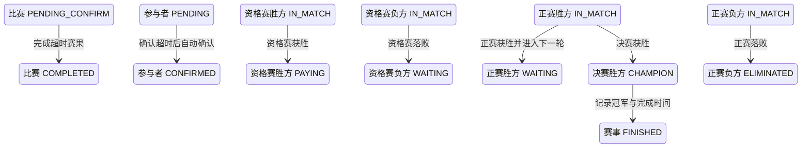

## 一句话价值

自动确认超时赛果、完成比赛并推进轮次；决赛超时确认完成时产生冠军并结束赛事。

## 核心概念

- 自办赛事  由业务方配置规则、接受报名、组织匹配并推进比赛的竞赛活动。
- 赛事报名  用户参加自办赛事的资格与进度载体，记录参赛编号、阶段、轮次、状态和偏好。
- 参赛编号  一支参赛单元的编号；单打通常对应一人，双打队友共享同一编号。
- 资格赛  自办赛事进入正赛前的筛选阶段，胜者可能先进入待支付。
- 正赛  自办赛事锁定席位后的淘汰阶段，胜者按轮次继续晋级。
- 赛事比赛  自办赛事中一次由若干参赛单元完成的对阵，经历匹配、订场、确认、比赛和赛果确认。
- 赛果  赛事比赛提交的胜方结论，需要其他参赛者确认或由超时规则完成确认。
- 待支付报名  资格赛晋级后尚未锁定正赛席位的赛事报名；它与支付单的待支付状态是两个对象。

## 业务对象

### 赛事比赛

| 业务名称 | 描述 | 取值说明 |
|---|---|---|
| 比赛编号 | 唯一标识本次超时确认赛果的赛事比赛。 | — |
| 比赛轮次 | 本场比赛所属轮次。 | 资格赛、64 强、32 强、16 强、8 强、半决赛、决赛。 |
| 胜方参赛编号 | 已提交赛果认定的获胜参赛单元。 | — |
| 比赛状态 | 全员确认后由待确认赛果推进为已完成。 | 已匹配：已完成对阵编排，等待选定订场人；订场中：已选定订场人，等待提交赛约；待确认赛约：已提交赛约，等待参与者确认；待比赛：赛约已确认，等待比赛；待确认赛果：已提交赛果，等待参与者确认；已完成：赛果已确认；已终止：比赛被拒绝或取消。 |

### 比赛参与确认

| 业务名称 | 描述 | 取值说明 |
|---|---|---|
| 参与者 | 本场比赛的参赛者；超时后将尚未确认的参与者视为已确认。 | — |
| 参赛编号 | 用于区分胜方与负方的参赛单元编号。 | — |
| 赛果确认状态 | 记录每名参与者对当前赛果的确认结果。 | 待确认：尚未确认赛果；已确认：接受当前赛果；已拒绝：拒绝当前赛果。 |

### 赛事报名

| 业务名称 | 描述 | 取值说明 |
|---|---|---|
| 参赛编号 | 报名所属参赛单元，用于确定胜负去向。 | — |
| 报名阶段 | 决定资格赛胜方或正赛胜负方的后续状态。 | 资格赛：胜方进入待支付；正赛：胜方进入下一轮，负方被淘汰。 |
| 报名状态 | 赛果完成后按胜负和阶段更新。 | 等待匹配：处于赛事当前轮次匹配池；冠军：赢得已完成决赛；已冻结：暂时离开匹配池；比赛中：已编入尚未结束的比赛；待支付：资格赛晋级后等待支付；已淘汰：止步当前赛事；已退赛：退出赛事。 |
| 当前轮次 | 正赛非决赛胜方推进到下一轮。 | 资格赛、64 强、32 强、16 强、8 强、半决赛、决赛。 |

### 自办赛事

| 业务名称 | 描述 | 取值说明 |
|---|---|---|
| 赛事编号 | 本场比赛归属的自办赛事。 | — |
| 正赛签位 | 正赛计划容纳的参赛席位数。 | — |
| 已锁定席位 | 已支付报名费并锁定的正赛席位数。 | — |
| 当前轮次 | 按各轮比赛完成情况向后推进，不会倒退。 | 资格赛、64 强、32 强、16 强、8 强、半决赛、决赛。 |
| 赛事状态 | 决赛超时确认完成后进入已结束。 | 草稿、已激活、已结束、已废弃。 |
| 冠军参赛编号 | 决赛胜方的参赛编号；双打时对应冠军队伍。 | 未结束时为空。 |

## 交付内容

类型: 批处理类

一次处理主流程界定的一批业务对象；处理范围、成功失败统计、部分成功口径与失败对象的收场方式，以本节下列规则及分支与异常为准。

| 当前状态 | 触发操作 | 新状态 | 前置条件 | 谁能触发 |
|---|---|---|---|---|
| 比赛 `PENDING_CONFIRM`，且赛果提交已超过确认时限 | 处理确认超时 | 比赛 `COMPLETED`；所有 `PENDING` 参与者改为 `CONFIRMED` | 已记录有效胜方参赛编号，所有参与者均有对应赛事报名 | 定时任务 |
| 资格赛报名 `IN_MATCH` | 完成资格赛比赛 | 胜方 `PAYING`；负方 `WAITING` | 报名对应本场比赛参与者 | 定时任务 |
| 正赛报名 `IN_MATCH` | 完成正赛比赛 | 胜方 `WAITING` 并进入下一轮；负方 `ELIMINATED` | 报名对应本场比赛参与者 | 定时任务 |
| 决赛报名 `IN_MATCH` | 完成超时决赛 | 胜方 `CHAMPION`；负方 `ELIMINATED`；赛事 `FINISHED` | 决赛已记录胜方；赛事仍为 `ACTIVE` | 定时任务 |
| 赛事处于当前轮次 | 评估已完成场数 | 保持原轮次或推进到更晚轮次 | 已完成场数达到相应轮次要求；资格赛结束后还需正赛席位已全部锁定才能进入正赛 | 定时任务 |

## 主流程

触发源：定时任务；终态：超时赛果已自动确认，比赛完成，报名已结算，赛事轮次已评估推进。

1. 找出仍处于 `PENDING_CONFIRM` 且赛果提交时间早于确认时限的赛事比赛。
2. 逐场重新确认比赛仍在等待赛果确认，并取得其全部比赛参与者。
3. 将尚处于 `PENDING` 的参与者自动记为 `CONFIRMED`，并记录统一的确认时间；保留已有的其他确认状态。
4. 将比赛改为 `COMPLETED`，记录完成时间，并保留已提交的胜方参赛编号。
5. 按胜方参赛编号识别胜负方，为每名参与者找到对应赛事报名。
6. 资格赛胜方进入 `PAYING`，资格赛负方回到 `WAITING`；非决赛正赛胜方进入下一轮 `WAITING`，正赛负方进入 `ELIMINATED`；决赛胜方进入 `CHAMPION`。
7. 已完成比赛自身的轮次为 `FINAL` 时，将赛事更新为 `FINISHED` 并写入冠军参赛编号和比赛完成时间；否则根据赛事各轮已完成比赛数、正赛总签位及已锁定席位推进轮次。
8. 继续处理其他符合条件的比赛；单场处理失败不阻断其余超时比赛。

## 分支与异常

| 什么情况 | 怎么处理 | 对外提示 | 做了一半的怎么收场 |
|---|---|---|---|
| 没有符合确认超时条件的比赛 | 本轮不做变更 | 无，定时任务正常结束 | 无数据变化。 |
| 扫描后比赛已不再是 `PENDING_CONFIRM` | 跳过该场比赛 | 无 | 保留该场最新状态，不重复完成。 |
| 扫描出的比赛在处理时已不存在 | 该场处理失败，继续处理其他比赛 | 无，仅记录失败 | 该场不交付本次处理结果。 |
| 比赛缺少 `winner_entry_no` | 该场处理失败，继续处理其他比赛 | 无，仅记录失败 | 该场比赛、参与者、报名和赛事轮次保持本次处理前状态。 |
| 任一比赛参与者没有对应赛事报名 | 该场处理失败，继续处理其他比赛 | 无，仅记录失败 | 该场比赛、参与者、报名和赛事轮次保持本次处理前状态。 |
| 比赛所属自办赛事不存在 | 该场处理失败，继续处理其他比赛 | 无，仅记录失败 | 该场比赛、参与者、报名和赛事轮次保持本次处理前状态。 |
| 保存比赛前已被其他操作改变 | 该场处理失败，继续处理其他比赛 | 无，仅记录失败 | 不覆盖先发生的比赛变化，该场不交付部分完成结果。 |
| 单场比赛、参与关系、报名或赛事轮次未能完整保存 | 该场处理失败，继续处理其他比赛 | 无，仅记录失败 | 该场各对象保持本次处理前状态，不影响已独立完成的其他比赛。 |

## 业务边界

- 本服务从赛果已提交但长期未获全员确认开始，到自动补齐待确认状态、完成比赛、结算参赛报名并评估赛事轮次为止。
- 本服务只处理已经进入 `PENDING_CONFIRM` 的赛果，不负责提交、人工确认或拒绝赛果，也不允许改选胜方。
- 本服务按每一名比赛参与者处理确认状态；双打同队共享参赛编号，但每名队员仍有独立的赛果确认状态。
- 本服务完成普通比赛后只推进报名与赛事轮次，不直接编排或创建下一轮比赛；完成决赛后产生冠军并结束赛事。
- 本服务不记录盘分、局分或单分，不修改赛约的时间、场地与参与关系。
- 本服务不累计拒赛次数，不发起报名费支付，也不占用正赛席位；资格赛胜方只进入待支付报名。
- 本服务没有面向用户的同步返回，也不向参赛者发送比赛完成或晋级通知。

## 遗留与待定

| 等级 | 待定的是什么 | 要谁来定 |
|---|---|---|
| P2 | 当前确认时限固定为赛果提交后 48 小时，且默认每两小时扫描一次；时限、扫描频率及是否按赛事单独配置需赛事产品与运营负责人确定。 | 产品与赛事运营负责人 |
| P1 | 超时只按 `submitted_time` 判定；该字段为空的 `PENDING_CONFIRM` 比赛不会被处理，存量异常数据的处置规则需赛事产品与数据负责人确定。 | 产品与赛事运营负责人 |
| P1 | 本服务只把 `PENDING` 改为 `CONFIRMED`，但即使参与者保留 `REJECTED` 也会将比赛完成；不一致确认状态的处置规则需赛事产品负责人确定。 | 产品与赛事运营负责人 |
| P1 | 当前不校验比赛参与者或对应报名是否仍为 `IN_MATCH`，会按胜负直接覆盖报名状态；冻结、待支付、已淘汰或已退赛等异常状态能否被结算需赛事产品与数据负责人确定。 | 产品与赛事运营负责人 |
| P1 | 资格赛胜方进入 `PAYING` 时不写 `qualified_time`；该字段应在比赛完成、支付发起还是支付成功时记录，需赛事产品与数据负责人确定。 | 产品与赛事运营负责人 |
| P2 | 资格赛负方会回到 `WAITING` 并保留原轮次，是否可不限次数重新进入资格赛匹配池，需赛事产品负责人确定。 | 产品与赛事运营负责人 |
| P1 | 胜方报名按每人的 `stage` 决定去向，负方报名按比赛 `round` 决定去向；若同场参与者的报名阶段与比赛轮次不一致，结算结果可能不一致，需赛事产品与数据负责人确定一致性约束。 | 产品与赛事运营负责人 |
| P2 | 赛事轮次以已完成比赛场数判定：资格赛要求完成场数达到 `total_slots`，正赛每轮要求完成该轮签位数的一半；轮空、三人资格赛及撤销重赛是否应改变应完成场数，需赛事产品负责人确定。 | 产品与赛事运营负责人 |
| P1 | `rally_tournament_match.status` 的建表说明未列出实际使用的 `PENDING_PLAY`；比赛状态数据字典需赛事产品与数据负责人统一。 | 产品与赛事运营负责人 |
| P2 | `rally_tournament_entry.current_round` 的建表说明未列出实际支持的 `ROUND_64`；报名轮次数据字典需赛事产品与数据负责人统一。 | 产品与赛事运营负责人 |
| P1 | 当前逐场独立处理，单场失败不会阻断同批其他比赛，也不会自动再次处理已经改变状态的数据；失败比赛的告警、补偿和人工介入规则需运营与技术负责人确定。 | 产品与赛事运营负责人 |
