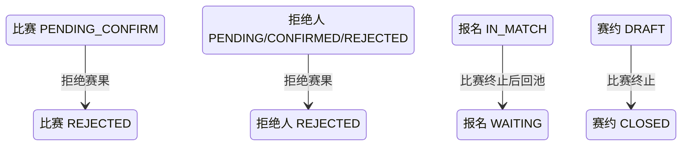

## 一句话价值

拒绝已报赛果、终止比赛并让参赛者回池。

## 核心概念

- 自办赛事  由业务方配置规则、接受报名、组织匹配并推进比赛的竞赛活动。
- 赛事报名  用户参加自办赛事的资格与进度载体，记录参赛编号、阶段、轮次、状态和偏好。
- 参赛编号  一支参赛单元的编号；单打通常对应一人，双打队友共享同一编号。
- 资格赛  自办赛事进入正赛前的筛选阶段，胜者可能先进入待支付。
- 正赛  自办赛事锁定席位后的淘汰阶段，胜者按轮次继续晋级。
- 匹配池  当前轮次中处于等待匹配、可被编入新比赛的参赛单元集合。
- 赛事比赛  自办赛事中一次由若干参赛单元完成的对阵，经历匹配、订场、确认、比赛和赛果确认。
- 赛果  赛事比赛提交的胜方结论，需要其他参赛者确认或由超时规则完成确认。
- 拒赛  终止当前赛事比赛并把仍有效的参赛者送回当前轮次匹配池；部分场景会累计拒绝次数。

## 业务对象

### 赛事比赛

| 业务名称 | 描述 | 取值说明 |
|---|---|---|
| 比赛编号 | 唯一标识本次拒绝赛果的赛事比赛。 | — |
| 比赛轮次 | 本场比赛所属轮次，拒绝后保持不变。 | 资格赛、64 强、32 强、16 强、8 强、半决赛、决赛。 |
| 关联赛约 | 承载本场比赛安排的赛约。 | — |
| 已提交胜方 | 原赛果认定的胜方参赛编号，拒绝后保留。 | — |
| 赛果拒绝理由 | 记录参赛者拒绝当前赛果的原因。 | 不服再战：希望重新比赛；对手水平不符：认为对手明显超出赛事等级；结果不正确：认为提交结果与实际不符。 |
| 比赛状态 | 拒绝成功后由待确认赛果改为已终止。 | 已匹配：已完成对阵编排，等待选定订场人；订场中：已选定订场人，等待提交赛约；待确认赛约：已提交赛约，等待参与者确认；待比赛：赛约已确认，等待比赛；待确认赛果：已提交赛果，等待参与者确认；已完成：赛果已确认；已终止：比赛被拒绝或取消。 |

### 比赛参与确认

| 业务名称 | 描述 | 取值说明 |
|---|---|---|
| 参与者 | 本场比赛的参赛者；拒绝人的赛果确认结果被更新。 | — |
| 参赛编号 | 参与者所属参赛单元的编号。 | — |
| 赛果确认状态 | 拒绝人进入已拒绝，其他参与者保持原结果。 | 待确认：尚未确认赛果；已确认：接受当前赛果；已拒绝：拒绝当前赛果。 |

### 赛事报名

| 业务名称 | 描述 | 取值说明 |
|---|---|---|
| 参赛编号 | 报名所属参赛单元的编号。 | — |
| 报名阶段 | 决定累计资格赛或正赛拒绝次数。 | 资格赛：尚在正赛资格争夺阶段；正赛：已经进入正式淘汰阶段。 |
| 报名状态 | 比赛终止后，仍在比赛中的报名回到等待匹配。 | 等待匹配：处于当前轮次匹配池；已冻结：暂时离开匹配池；比赛中：已编入尚未结束的比赛；待支付：资格赛晋级后等待支付；已淘汰：止步当前赛事；已退赛：退出赛事。 |
| 当前轮次 | 回到匹配池时保持原轮次。 | 资格赛、64 强、32 强、16 强、8 强、半决赛、决赛。 |
| 拒绝次数 | 分别记录资格赛和正赛的累计赛果拒绝次数。 | — |

### 关联赛约

| 业务名称 | 描述 | 取值说明 |
|---|---|---|
| 赛约编号 | 唯一标识本场比赛已有的赛约。 | — |
| 赛约状态 | 拒绝赛果后，仍为草稿的赛约关闭。 | 草稿：等待比赛参与者确认；开放：赛约已获确认；进行中：活动正在进行；已关闭：活动被终止；已结束：活动正常结束。 |

## 状态机

| 当前状态 | 触发操作 | 新状态 | 前置条件 | 谁能触发 |
|---|---|---|---|---|
| 比赛 `PENDING_CONFIRM`，本人赛果确认状态为 `PENDING`、`CONFIRMED` 或 `REJECTED` | 拒绝当前赛果 | 本人赛果确认状态 `REJECTED`，比赛 `REJECTED` | 比赛、所属赛事和本人赛事报名存在；本人属于该场比赛；提供有效理由；当前阶段累计次数未达上限 | 该场比赛参赛者 |
| 同场参与者的报名 `IN_MATCH` | 赛果被拒绝 | `WAITING` | 报名人属于被终止比赛 | 拒绝赛果间接触发 |
| 关联赛约 `DRAFT` | 赛果被拒绝 | `CLOSED` | 比赛已关联该赛约 | 拒绝赛果间接触发 |

## 主流程

触发源：参赛者发起 HTTP 赛果确认并选择拒绝；终态：比赛为 `REJECTED`，拒绝人赛果确认为 `REJECTED`，仍在比赛中的报名回到原轮次 `WAITING`。

1. 识别当前已登录参赛者，接收比赛编号、拒绝选择、拒绝理由与本次已授权的微信赛事通知场景。
2. 找到该场赛事比赛及其全部参与者，确认比赛正处于 `PENDING_CONFIRM`，所属赛事、本人赛事报名和本人比赛参与关系均存在。
3. 根据本人报名的 `stage` 选择资格赛或正赛拒绝上限，确认当前累计次数尚未达到上限，并接受一个有效的赛果拒绝理由。
4. 将本人的赛果确认状态记为 `REJECTED` 并记录拒绝时间，将比赛置为 `REJECTED`，同时保存拒绝理由编码。
5. 将本人当前阶段的累计拒绝次数增加一；另一阶段的累计次数保持不变。
6. 若比赛关联的赛约仍为 `DRAFT`，将其改为 `CLOSED`；未关联赛约或赛约已是其他状态时不修改。
7. 逐一处理同场参与者的赛事报名，将仍为 `IN_MATCH` 的报名改为 `WAITING`；参赛编号、阶段和当前轮次保持不变。
8. 为拒绝人本次有效的赛事通知授权分别登记一份未使用额度；没有授权或授权登记失败不改变赛果拒绝结果。
9. 向同场除拒绝人以外的参与者发起 `TOURNAMENT_REJECTED` 微信订阅消息，消息包含赛事名称和固定的拒绝提示。
10. 向拒绝人返回处理成功；授权登记或微信订阅消息是否成功不改变比赛终止和报名回池的结果。

## 分支与异常

| 什么情况 | 怎么处理 | 对外提示 | 做了一半的怎么收场 |
|---|---|---|---|
| 未登录、登录凭据缺失或失效 | 拒绝处理 | 登录已过期或登录凭证无效 | 不读取或修改比赛。 |
| 未提供比赛编号，或只提供空白字符 | 拒绝处理 | `matchId: 比赛ID不能为空` | 不修改任何赛事数据。 |
| 未提供确认选择 | 拒绝处理 | `confirm: 确认状态不能为空` | 不修改任何赛事数据。 |
| 确认选择为 `true` | 按赛果确认规则处理 | 确认成功或对应失败提示 | 不进入赛果拒绝分支。 |
| 未提供赛果拒绝理由 | 拒绝处理 | 无效的拒绝理由 | 不修改比赛、参与关系、报名或赛约。 |
| 指定赛事比赛不存在 | 拒绝处理 | 报名记录不存在 | 不补建比赛或参与关系。 |
| 比赛所属自办赛事不存在 | 拒绝处理 | 赛事不存在 | 比赛和参与关系保持原状。 |
| 当前用户的赛事报名不存在 | 拒绝处理 | 报名记录不存在 | 比赛和参与关系保持原状。 |
| 比赛不是 `PENDING_CONFIRM` | 拒绝处理 | 当前状态不允许确认结果 | 比赛、参与关系、报名和赛约保持原状。 |
| 当前用户不属于该场比赛 | 拒绝处理 | 报名记录不存在 | 比赛和既有参与关系保持原状。 |
| 本人当前阶段的累计拒绝次数已达赛事上限 | 拒绝处理 | 已达拒绝次数上限 | 不增加拒绝次数，不终止比赛。 |
| 同一场比赛在保存前已被其他操作改变 | 拒绝失败并要求刷新 | 比赛状态已变更，请刷新后重试 | 不确认本次拒绝，以先保存的比赛结果为准。 |
| 某位比赛参与者没有对应的赛事报名 | 拒绝失败 | 报名记录不存在 | 不交付部分回池结果，本次比赛、参与关系、报名、拒绝次数和赛约均保持处理前状态。 |
| 某位参与者的报名不是 `IN_MATCH` | 保留该报名现有状态，继续完成拒绝 | 拒绝成功 | 不强制覆盖 `WAITING`、`FROZEN`、`PAYING`、`ELIMINATED` 或 `WITHDRAWN`。 |
| 比赛未关联赛约、关联赛约不存在或赛约不是 `DRAFT` | 继续终止比赛并让符合条件的报名回池 | 拒绝成功 | 不创建赛约，也不修改非草稿活动。 |
| 本次授权场景重复或混入非赛事场景 | 去重有效赛事场景，忽略其他值后继续 | 拒绝成功 | 只为去重后的有效赛事场景登记授权额度。 |
| 微信通知授权额度登记失败 | 保留赛果拒绝、比赛终止和报名回池结果 | 拒绝成功 | 本次授权额度可能没有登记，参赛者不会收到单独失败提示。 |
| 其他参与者没有可用的 `TOURNAMENT_REJECTED` 微信订阅授权 | 跳过该参与者的通知 | 拒绝成功 | 比赛、报名和赛约终态不变，该参与者的授权状态不变。 |
| 通知接收人没有微信小程序身份，或微信订阅消息发送失败 | 保留拒绝结果并记录通知失败 | 拒绝成功 | 不撤销比赛终止、报名回池或赛约关闭。 |
| 比赛、参与关系、报名、拒绝次数或草稿赛约未能完整保存 | 拒绝失败 | 系统异常，请稍后重试 | 不交付部分拒绝结果，各对象保持本次处理前状态。 |

## 业务边界

- 本服务从赛事比赛已有待确认赛果开始，到拒绝人确认状态与比赛进入 `REJECTED`、累计拒绝人当前阶段的拒绝次数、仍在比赛中的报名回到原轮次匹配池，并向其他参与者发起拒绝通知为止。
- 本服务只处理赛果确认选择为 `false` 的分支；选择 `true` 的赛果确认是独立业务服务。
- 本服务不改写原已提交的胜方参赛编号、提交人或提交时间，也不接收比分明细或允许重报赛果。
- 本服务终止当前比赛后不在同一次调用内重新编排；报名回池后的新对阵由“当前轮次匹配”服务另行触发。
- 本服务不结算胜负方报名，不淘汰败方，不让胜方晋级或进入待支付，也不推进赛事轮次。
- 本服务不处理赛约阶段拒赛、退赛、未订场比赛撤销或超时确认赛果；这些服务有各自的触发和终态。
- 本服务只修改拒绝人的赛果确认状态；同场其他参与者的赛果确认状态保持原值。
- 本服务不改变报名的参赛编号、阶段、当前轮次、搭档、偏好或订场能力。
- 本服务不保证微信订阅消息送达，不为其他参与者补建拒绝通知授权，通知失败也不改变拒绝终态。
- 本服务只返回处理成功或失败，不交付更新后的比赛、报名、累计次数或通知结果详情。

## 遗留与待定

- 当前不要求拒绝人的 `result_confirm_status` 必须为 `PENDING`；赛果提交人或已确认的参赛者仍可拒绝赛果，若异常数据中比赛仍为 `PENDING_CONFIRM` 而本人已为 `REJECTED`，也会再次进入拒绝逻辑。允许范围与幂等口径需赛事产品负责人确定。
- 当前只要拒绝人存在赛事报名即可继续，不校验报名的 `status`、`current_round` 与比赛的关系，并以报名 `stage` 选择拒绝上限和累计字段。可拒绝资格与阶段一致性需赛事产品负责人确定。
- 双打队友共享 `entry_no`，但拒绝次数按拒绝人各自的报名累计；拒绝额度应按个人还是按参赛单元计算，需赛事产品负责人确定。
- 赛果拒绝保留 `winner_entry_no`、`submitted_by` 和 `submitted_time`，且比赛进入 `REJECTED` 后没有重报赛果路径；这些已拒绝数据的展示、追溯与后续处置规则需赛事运营负责人确定。
- 比赛表已有 `reject_phase`、`rejected_by`、`rejected_time`，但当前流程只写 `reject_reason_code`；赛果拒绝阶段、拒绝人和发生时间的审计口径需赛事运营与数据负责人确定。
- 赛果拒绝终止比赛时不写 `completed_time`；是否需要统一的终止时间需赛事运营与数据负责人确定。
- 赛果拒绝只把仍为 `IN_MATCH` 的同场报名改为 `WAITING`；其他状态原样保留，终止比赛后可能出现同场报名去向不一致。异常状态的处置规则需赛事产品负责人确定。
- 赛约在全员确认后已通常从 `DRAFT` 转为 `OPEN`，而本服务只关闭 `DRAFT`；因此正常赛果被拒绝后，关联赛约仍可能保持 `OPEN` 或更后续状态。比赛终止后赛约的正式终态需赛事与约球产品负责人共同确定。
- 拒绝通知固定表达为“对手使用拒绝比赛机会”，不展示本次 `reject_reason_code`，三人资格赛也沿用“对手”单数；通知文案与理由披露范围需赛事运营负责人确定。
- 拒绝人在本次操作新授权的 `TOURNAMENT_REJECTED` 额度不会用于本人，因为本次拒绝通知只面向其他参与者；该授权的后续用途需通知产品负责人确定。
- `rally_tournament_match.status` 的建表说明未列出实际使用的 `PENDING_PLAY`；比赛状态数据字典需赛事产品与数据负责人统一。
- `rally_tournament_entry.current_round` 的建表说明未列出实际支持的 `ROUND_64`；报名轮次数据字典需赛事产品与数据负责人统一。
- `user_notify_subscribe` 的建表说明仍只描述约球业务与原四种通知场景，但本服务实际读写 `TOURNAMENT` 及三种赛事通知场景；需通知与数据负责人更新数据字典。
- `rally_meetup.status` 的建表缺省值和说明使用小写，当前赛约业务读写使用大写枚举；正式存储取值与历史数据兼容方式需赛事与约球数据负责人确定。
