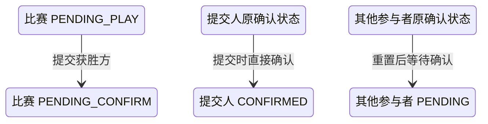

## 一句话价值

让参赛者记录获胜方并将比赛交给其他参赛者确认。

## 核心概念

- 自办赛事  由业务方配置规则、接受报名、组织匹配并推进比赛的竞赛活动。
- 赛事报名  用户参加自办赛事的资格与进度载体，记录参赛编号、阶段、轮次、状态和偏好。
- 参赛编号  一支参赛单元的编号；单打通常对应一人，双打队友共享同一编号。
- 赛事比赛  自办赛事中一次由若干参赛单元完成的对阵，经历匹配、订场、确认、比赛和赛果确认。
- 赛果  赛事比赛提交的胜方结论，需要其他参赛者确认或由超时规则完成确认。

## 业务对象

### 赛事比赛

| 业务名称 | 描述 | 取值说明 |
|---|---|---|
| 比赛编号 | 唯一标识本次提交赛果的赛事比赛。 | — |
| 所属赛事 | 本场比赛归属的自办赛事。 | — |
| 胜方参赛编号 | 本次赛果认定的获胜参赛单元。 | — |
| 赛果提交人 | 提交本次比赛结果的参赛者。 | — |
| 比赛状态 | 提交成功后由待比赛推进为待确认赛果。 | 已匹配：已完成对阵编排，等待选定订场人；订场中：已选定订场人，等待提交赛约；待确认赛约：已提交赛约，等待参与者确认；待比赛：赛约已确认，等待比赛；待确认赛果：已提交赛果，等待参与者确认；已完成：赛果已确认；已终止：比赛被拒绝或取消。 |

### 比赛参与确认

| 业务名称 | 描述 | 取值说明 |
|---|---|---|
| 参与者 | 本场比赛的全部参赛者。 | — |
| 参赛编号 | 用于确认提交的胜方属于本场比赛。 | — |
| 赛果确认状态 | 提交人直接确认，其他参与者重新进入待确认。 | 待确认：尚未确认赛果；已确认：接受当前赛果；已拒绝：拒绝当前赛果。 |

## 交付内容

类型: 变更类

成功后按主流程改写或撤销既有业务事实；允许变更的内容、前置状态、对外可见结果与原值留痕，以本节下列规则、业务对象及分支与异常为准。

| 当前状态 | 触发操作 | 新状态 | 前置条件 | 谁能触发 |
|---|---|---|---|---|
| 比赛 `PENDING_PLAY`，各参与者有赛果确认状态 | 提交获胜方 | 比赛 `PENDING_CONFIRM`；提交人 `CONFIRMED`；其他参与者 `PENDING` | 当前用户属于本场比赛；获胜方参赛编号属于本场比赛 | 该场任一比赛参与者 |

## 主流程

触发源：参赛者发起 HTTP 提交；终态：获胜方已记录，比赛为 `PENDING_CONFIRM`，提交人已确认而其他参赛者待确认。

1. 识别当前登录参赛者，取得要提交的比赛编号和获胜方参赛编号。
2. 找到赛事比赛及其全部比赛参与者，确认比赛正在等待开赛。
3. 确认提交人属于本场比赛，且获胜方参赛编号属于本场已编入的参赛单元。
4. 记录获胜方、提交人和提交时间，将比赛推进为 `PENDING_CONFIRM`。
5. 将提交人的赛果确认状态记为 `CONFIRMED` 并记录时间；将其他参与者记为 `PENDING` 并清空原确认时间。
6. 向提交人返回提交成功；本次不交付更新后的比赛详情，也不发送通知。

## 分支与异常

| 什么情况 | 怎么处理 | 对外提示 | 做了一半的怎么收场 |
|---|---|---|---|
| 未登录、登录凭据缺失或失效 | 拒绝提交 | 登录已过期或登录凭证无效 | 不读取或修改比赛与参与关系。 |
| 未提供比赛编号，或只提供空白字符 | 拒绝提交 | `matchId: 比赛ID不能为空` | 不修改比赛或参与关系。 |
| 未提供获胜方参赛编号 | 拒绝提交 | `winnerEntryNo: 获胜方不能为空` | 不修改比赛或参与关系。 |
| 指定的赛事比赛不存在 | 拒绝提交 | 报名记录不存在 | 不修改任何赛事数据。 |
| 比赛不是 `PENDING_PLAY` | 拒绝提交 | 当前状态不允许提交结果 | 比赛和参与关系均保持原状。 |
| 当前用户不属于该场比赛 | 拒绝提交 | 报名记录不存在 | 比赛和已有参与关系保持原状。 |
| 获胜方参赛编号不属于该场比赛 | 拒绝提交 | 请选择获胜方 | 比赛和参与关系保持原状。 |
| 同一场比赛在保存前已被其他操作改变 | 提交失败并要求刷新 | 比赛状态已变更，请刷新后重试 | 不交付本次赛果，以先完成的比赛变化为准。 |
| 比赛或参与关系未能完整保存 | 提交失败 | 系统异常，请稍后重试 | 不交付部分赛果，比赛和参与关系保持本次操作前状态。 |

## 业务边界

- 本服务从参赛者申报本场获胜方开始，到比赛进入待赛果确认为止。
- 本服务只记录获胜方参赛编号，不记录盘分、局分或单分。
- 本服务将提交人视为已确认，不等待提交人再次确认；其他参赛者的确认、拒绝和确认超时均是独立业务服务。
- 本服务不将比赛改为 `COMPLETED`，不判定淘汰或晋级，不修改任何赛事报名的阶段、轮次或状态，也不推进赛事轮次。
- 本服务不验证赛约活动、比赛时间或场地，也不修改赛约。
- 本服务不发送通知。
- 本服务只返回提交成功或失败，不交付更新后的比赛、参与者或报名详情。

## 遗留与待定

| 等级 | 待定的是什么 | 要谁来定 |
|---|---|---|
| P2 | 当前任一比赛参与者都能提交赛果，不限定订场人、队长或特定一方；提交人资格需赛事产品负责人确定。 | 产品与赛事运营负责人 |
| P1 | 当前只要比赛为 `PENDING_PLAY` 即可提交，不校验已约定的比赛时间是否已过；赛果可提交时点需赛事产品负责人确定。 | 产品与赛事运营负责人 |
| P1 | 当前不查看赛事报名状态；已冻结、待支付、已淘汰或已退赛的报名若仍留在比赛参与关系中，仍可能提交赛果；提交资格与存量数据处理规则需赛事产品和运营负责人确定。 | 产品与赛事运营负责人 |
| P1 | 当前提交时会把提交人之外的所有参与者赛果确认状态重置为 `PENDING` 并清空确认时间，不校验原状态；存量确认记录的覆盖规则需赛事产品和数据负责人确定。 | 产品与赛事运营负责人 |
| P1 | `rally_tournament_match.status` 的建表说明未列出代码实际使用的 `PENDING_PLAY`；比赛状态数据字典需赛事产品与数据负责人统一。 | 产品与赛事运营负责人 |
| P2 | 赛事比赛不存在或提交人不属于比赛时，对外提示为“报名记录不存在”；比赛与报名概念的错误口径需赛事产品负责人统一。 | 产品与赛事运营负责人 |
