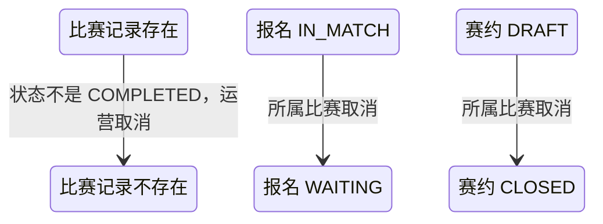

## 一句话价值

让运营按赛事编号和比赛序号精确撤销一场尚未完成的比赛，并释放仍在比赛中的参赛单元。

## 核心概念

- 自办赛事  由业务方配置规则、接受报名、组织匹配并推进比赛的竞赛活动。
- 赛事比赛  自办赛事中一次由若干参赛单元完成的对阵，经历匹配、订场、确认、比赛和赛果确认。
- 比赛序号  一场比赛在所属赛事内的展示编号；与赛事编号共同唯一定位比赛。
- 未完成比赛  当前状态不是 `COMPLETED` 的比赛；包括已经进入 `REJECTED` 的终止比赛。
- 运营取消  由后台运营发起的纠错操作；物理删除比赛及参与关系，不产生新的比赛终态。
- 赛事报名  用户参加自办赛事的资格与进度载体，记录参赛编号、阶段、轮次、状态和偏好。
- 匹配池  当前轮次中处于等待匹配、可被编入新比赛的参赛单元集合。
- 赛约  为一场赛事比赛建立的时间与场地安排，以专属约球承载。

## 业务对象

### 赛事比赛

| 业务名称 | 描述 | 取值说明 |
|---|---|---|
| 所属赛事 | 本次运营取消所针对的自办赛事。 | 由 `tournamentId` 指定。 |
| 比赛序号 | 赛事内用于展示和运营定位的顺序编号。 | 由 `matchNo` 指定；必须为正整数，与所属赛事共同唯一。 |
| 比赛编号 | 系统内部唯一标识比赛；定位成功后用于处理参与关系和关联对象。 | — |
| 比赛轮次 | 本场比赛所属轮次，取消后随比赛记录一并移除。 | 资格赛、64 强、32 强、16 强、8 强、半决赛、决赛。 |
| 关联赛约 | 比赛已提交时间和场地后关联的专属约球。 | 没有关联时为空。 |
| 已提交赛果 | 待确认赛果比赛中保存的胜方、提交人和提交时间。 | 比赛取消后随比赛记录一并移除，不产生胜负结算。 |
| 比赛状态 | 除已完成外均可由运营取消。 | 已匹配 `MATCHED`；订场中 `BOOKING`；待确认赛约 `SCHEDULED`；待比赛 `PENDING_PLAY`；待确认赛果 `PENDING_CONFIRM`；已完成 `COMPLETED`；已终止 `REJECTED`。 |

### 比赛参与者

| 业务名称 | 描述 | 取值说明 |
|---|---|---|
| 所属比赛 | 参与关系归属的目标比赛。 | — |
| 参与者 | 被编入目标比赛的参赛者。 | — |
| 参赛编号 | 参与者所属参赛单元的编号。 | — |
| 赛约确认 | 参与者对赛约的确认结果和时间。 | 取消后随参与关系一并移除。 |
| 赛果确认 | 参与者对赛果的确认结果和时间。 | 取消后随参与关系一并移除。 |

### 赛事报名

| 业务名称 | 描述 | 取值说明 |
|---|---|---|
| 参赛编号 | 报名所属参赛单元的编号。 | — |
| 报名状态 | 取消比赛后，仍处于比赛中的报名回到等待匹配。 | 等待匹配 `WAITING`；已冻结 `FROZEN`；比赛中 `IN_MATCH`；待支付 `PAYING`；冠军 `CHAMPION`；已淘汰 `ELIMINATED`；已退赛 `WITHDRAWN`。 |
| 报名阶段 | 取消比赛后保持不变。 | 资格赛、正赛。 |
| 当前轮次 | 取消比赛后保持不变，用于重新进入原轮次匹配池。 | 资格赛、64 强、32 强、16 强、8 强、半决赛、决赛。 |

### 关联赛约

| 业务名称 | 描述 | 取值说明 |
|---|---|---|
| 赛约编号 | 目标比赛可能关联的专属约球编号。 | — |
| 赛约状态 | 目标比赛取消时，仍为草稿的赛约关闭；其他状态暂不修改。 | 草稿 `DRAFT`；开放 `OPEN`；进行中 `ONGOING`；已关闭 `CLOSED`；已结束 `FINISHED`。 |

## 交付内容

类型: 变更类

成功后按主流程撤销既有业务事实；允许取消的状态、联动范围、并发保护与原值留存，以本节下列规则、业务对象及分支与异常为准。

| 当前状态 | 触发操作 | 新状态 | 前置条件 | 谁能触发 |
|---|---|---|---|---|
| 比赛为 `MATCHED`、`BOOKING`、`SCHEDULED`、`PENDING_PLAY` 或 `PENDING_CONFIRM` | 取消指定比赛 | 比赛及其参与关系被物理删除 | `(tournamentId, matchNo)` 唯一定位到该比赛，执行删除时比赛仍未完成 | 运营人员 |
| 比赛为 `REJECTED` | 取消指定比赛 | 比赛及其参与关系被物理删除 | `(tournamentId, matchNo)` 唯一定位到该比赛；已终止不等于已完成 | 运营人员 |
| 报名为 `IN_MATCH` | 所属比赛被取消 | `WAITING` | 报名仍存在，且属于被取消比赛的参与者 | 运营人员间接触发 |
| 关联赛约为 `DRAFT` | 所属比赛被取消 | `CLOSED` | 赛约仍存在且当前仍为草稿 | 运营人员间接触发 |
| 比赛为 `COMPLETED` | 尝试取消指定比赛 | 保持 `COMPLETED` | 已完成比赛不可取消 | 运营人员请求被拒绝 |

## 主流程

触发源：HTTP（运营后台）；终态：由 `(tournamentId, matchNo)` 指定的一场未完成比赛及其参与关系被删除，仍为 `IN_MATCH` 的参与者报名按原阶段和原轮次回到 `WAITING`，关联的草稿赛约被关闭。

1. 运营人员提交非空赛事编号和正整数比赛序号，并通过运营后台访问校验。
2. 确认指定自办赛事存在，再按 `(tournamentId, matchNo)` 查找唯一赛事比赛；不允许只按 `matchNo` 跨赛事查找。
3. 加载目标比赛及全部参与关系，确认比赛当前状态不是 `COMPLETED`。
4. 保留本次联动所需的参与者和关联赛约快照，以“目标仍为同一场未完成比赛”为条件物理删除比赛及全部参与关系。
5. 若比赛关联的赛约仍为 `DRAFT`，将其改为 `CLOSED`；赛约缺失或已经不是 `DRAFT` 时不阻断比赛取消。
6. 逐个处理原比赛参与者的赛事报名：仍为 `IN_MATCH` 的报名改为 `WAITING`；报名阶段、当前轮次、参赛编号、搭档关系、偏好和拒赛次数保持不变。
7. 在一个事务中提交比赛、参与关系、草稿赛约和报名变更；任一必须落库的变更失败时不确认取消成功。
8. 向运营人员确认指定比赛取消完成；本服务不自动触发重新匹配。

## 分支与异常

| 什么情况 | 怎么处理 | 对外提示 | 做了一半的怎么收场 |
|---|---|---|---|
| 运营访问凭据未配置、未提供或不匹配 | 拒绝取消 | 无权限访问 | 不读取或修改赛事、比赛、报名和赛约。 |
| 未提供赛事编号 | 拒绝取消 | `tournamentId: 赛事ID不能为空` | 不读取或修改任何业务对象。 |
| 比赛序号未提供、不是整数或小于 1 | 拒绝取消 | `matchNo: 比赛序号必须为正整数` | 不读取或修改任何业务对象。 |
| 指定赛事不存在 | 拒绝取消 | 赛事不存在 | 不删除比赛或参与关系，不修改报名和赛约。 |
| 指定赛事下不存在该比赛序号 | 拒绝取消 | 比赛不存在 | 不补建比赛，不修改其他比赛、报名和赛约。 |
| 相同 `matchNo` 存在于其他赛事 | 只按本次 `tournamentId` 范围定位 | 比赛不存在或正常取消本赛事内目标比赛 | 其他赛事的同序号比赛保持不变。 |
| 目标比赛为 `COMPLETED` | 拒绝取消 | 已完成比赛不能取消 | 已完成比赛、参与关系、报名、赛约和赛果保持原状。 |
| 目标比赛在处理期间被完成 | 拒绝取消并要求刷新后重试 | 比赛状态已变更，请刷新后重试 | 不删除已完成比赛；本次报名和赛约联动不生效。 |
| 目标比赛在处理期间被其他操作删除 | 拒绝取消并要求刷新后重试 | 比赛状态已变更，请刷新后重试 | 不重复修改报名或赛约，以先完成的操作为准。 |
| 目标比赛变为另一种非完成状态 | 仍可取消，但必须基于最新比赛数据执行 | 取消成功 | 以最终被删除比赛的参与者和关联赛约为联动依据。 |
| 目标比赛为 `REJECTED` | 允许取消 | 取消成功 | 已终止比赛及其拒绝参与历史被删除；通常已回池的报名保持现状。 |
| 关联赛约为空或记录不存在 | 继续取消比赛并处理报名 | 取消成功 | 不创建或补建赛约。 |
| 关联赛约不是 `DRAFT` | 保留赛约现状，继续取消比赛并处理报名 | 取消成功 | 不强制关闭 `OPEN`、`ONGOING`、`CLOSED` 或 `FINISHED` 赛约。 |
| 原参与者对应的赛事报名不存在 | 跳过该参与者，继续处理其他参与者 | 取消成功 | 不补建报名；比赛及参与关系仍被删除。 |
| 原参与者报名不再是 `IN_MATCH` | 保留该报名当前状态 | 取消成功 | 不覆盖 `WAITING`、`FROZEN`、`PAYING`、`CHAMPION`、`ELIMINATED` 或 `WITHDRAWN`。 |
| 比赛删除、参与关系删除、草稿赛约关闭或报名回池未能完整保存 | 取消失败 | 系统异常，请稍后重试 | 不确认取消成功，本次事务内的变更全部回滚。 |

## 业务边界

- 本服务只处理由 `(tournamentId, matchNo)` 唯一指定的一场比赛，不批量取消同赛事其他比赛，也不支持只取消部分参与者或参赛单元。
- 本服务将“未完成”严格定义为比赛状态不等于 `COMPLETED`；因此 `REJECTED` 虽已终止，仍属于可取消范围。
- 本服务沿用现有运营取消语义，物理删除比赛及参与关系，不新增 `CANCELLED` 状态，也不保留该场比赛已有的订场、确认、拒绝或待确认赛果字段。
- 本服务只关闭关联的 `DRAFT` 赛约，不删除赛约及其报名、聊天、费用或其他附属记录，也不修改非草稿赛约。
- 本服务只把原参与者中仍为 `IN_MATCH` 的报名改回 `WAITING`，不改变报名阶段、当前轮次、参赛编号、搭档关系、偏好、拒赛次数和支付事实。
- 本服务不要求目标比赛属于赛事当前轮次，也不因赛事为草稿、激活、结束或废弃而额外限制；是否存在目标赛事及目标比赛是基础前置条件。
- 本服务不结算胜负、不推进赛事轮次、不回退已推进轮次、不调整正赛席位或支付结果，也不自动执行下一次匹配。
- 本服务不向参赛者发送取消通知，不提供影响预览、取消原因录入或恢复已取消比赛的能力。

## 遗留与待定

| 等级 | 待定的是什么 | 要谁来定 |
|---|---|---|
| P1 | 运营取消采用物理删除，且请求只有 `tournamentId` 与 `matchNo`，没有取消原因、操作人、取消时间或比赛快照；后台审计、纠纷追溯和误操作恢复是否要求单独留痕，需赛事运营与数据负责人确定。 | 产品与赛事运营负责人 |
| P1 | “未完成”按字面包含 `REJECTED`；删除已终止比赛会同时删除拒绝参与历史，并可能使原对阵不再被历史拒绝规则排除。是否确实允许取消 `REJECTED`，需赛事产品负责人确认。 | 产品与赛事运营负责人 |
| P1 | `PENDING_CONFIRM` 表示比赛可能已经实际打完并已提交胜方，只差确认；允许运营直接删除会撤销赛果且把仍为 `IN_MATCH` 的参赛者重新投入匹配。是否需要更严格的二次确认、取消原因或阶段限制，需赛事运营负责人确认。 | 产品与赛事运营负责人 |
| P1 | `PENDING_PLAY`、`PENDING_CONFIRM` 通常关联已经开放、进行中或已结束的赛约；当前只关闭 `DRAFT`，可能形成比赛已删除但赛约及费用、聊天和活动记录继续存在。各赛约状态的取消、退款和数据保留规则需赛事与约球产品负责人共同确定。 | 产品与赛事运营负责人 |
| P1 | 当前不限制赛事状态、赛事当前轮次或比赛轮次；运营可以取消结束赛事、废弃赛事或历史轮次中的未完成比赛。正式可操作范围需赛事产品负责人确认。 | 产品与赛事运营负责人 |
| P1 | 报名缺失或已不是 `IN_MATCH` 时仍允许比赛取消成功，可能保留比赛已删除但报名状态异常的数据；后台纠错场景下应跳过、阻断还是生成数据告警，需赛事与数据负责人确定。 | 产品与赛事运营负责人 |
| P1 | 双打按每位参与者逐条回池；如果同一参赛编号下只有部分报名仍为 `IN_MATCH`，可能产生不完整参赛单元。是否应按完整参赛编号校验并统一回池，需赛事产品负责人确认。 | 产品与赛事运营负责人 |
| P2 | 新比赛序号按赛事当前剩余比赛的最大 `matchNo` 加一分配；取消赛事内最大序号后，后续比赛可能复用该序号。运营展示、外部引用和审计是否允许编号复用，需赛事运营与数据负责人确定。 | 产品与赛事运营负责人 |
| P2 | 取消成功后不通知搭档、对手或其他参与者，也不自动重新匹配；通知对象、文案、渠道和重新匹配时机需赛事运营负责人确定。 | 产品与赛事运营负责人 |
