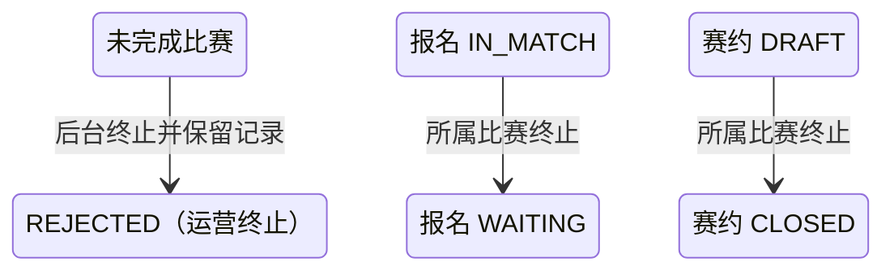

## 一句话价值

让后台运营按赛事编号和比赛序号终止一场尚未完成的比赛，同时保留完整比赛历史并释放仍在比赛中的报名。

## 核心概念

- 指定比赛  由 `tournamentId + matchNo` 在一个自办赛事内唯一定位的比赛。
- 未完成比赛  当前状态不是 `COMPLETED` 的比赛。
- 运营终止  复用现有比赛终态 `REJECTED`，不新增状态，不物理删除比赛或参与者。
- 联动快照  终止前读取的比赛编号、关联赛约和全部参与者身份，用于同事务关闭草稿赛约和释放报名。

## 业务对象

### 赛事比赛

| 业务名称 | 描述 | 取值说明 |
|---|---|---|
| 所属赛事 | 运营终止所针对的赛事。 | `tournamentId`，非空。 |
| 比赛序号 | 赛事内展示编号。 | `matchNo`，正整数；与赛事编号共同唯一。 |
| 比赛状态 | 终止前必须不是已完成；终止后复用现有拒绝终态。 | `MATCHED/BOOKING/SCHEDULED/PENDING_PLAY/PENDING_CONFIRM/REJECTED` → `REJECTED`；`COMPLETED` 不允许。 |
| 比赛历史 | 订场人、赛约、确认、赛果草稿、拒绝与重订字段。 | 运营终止后全部保留，不清空，不写 `completedTime`。 |
| 版本 | 保护终止与比赛推进的并发竞争。 | 首次终止成功递增；已是 `REJECTED` 的重复请求不重复递增。 |

### 比赛参与者

| 业务名称 | 描述 | 终止后处理 |
|---|---|---|
| 参与关系 | 用户、entryNo 与比赛的关系。 | 全部保留。 |
| 赛约确认 | 确认状态与时间。 | 原值保留。 |
| 赛果确认 | 确认状态与时间。 | 原值保留。 |

### 赛事报名与关联赛约

| 业务名称 | 描述 | 终止后处理 |
|---|---|---|
| 赛事报名 | 比赛参与者在赛事中的报名。 | 仅仍为 `IN_MATCH` 的报名改为 `WAITING`；其他状态保持。 |
| 报名上下文 | 阶段、当前轮次、entryNo、搭档、偏好和拒绝次数。 | 原值保持。 |
| 关联赛约 | 比赛可能关联的专属约球。 | 仅仍为 `DRAFT` 时改为 `CLOSED`；缺失或其他状态跳过。 |

## 交付内容

类型: 变更类

| 当前状态 | 触发操作 | 新状态 | 说明 |
|---|---|---|---|
| `MATCHED/BOOKING/SCHEDULED/PENDING_PLAY/PENDING_CONFIRM` | 终止指定比赛 | `REJECTED` | 保留比赛和参与者，递增版本。 |
| `REJECTED` | 重复终止 | `REJECTED` | 幂等成功；继续安全重试赛约和报名联动。 |
| `COMPLETED` | 尝试终止 | `COMPLETED` | 拒绝请求，不执行任何联动。 |
| 报名 `IN_MATCH` | 所属比赛终止 | `WAITING` | 仅处理原比赛参与者。 |
| 赛约 `DRAFT` | 所属比赛终止 | `CLOSED` | 非草稿赛约保持原状。 |

## 主流程

触发源：`POST /tournament/admin/match/cancel/single`；请求为 `tournamentId + matchNo`。

1. 校验赛事编号非空、比赛序号为正整数，并确认赛事存在。
2. 按 `tournamentId + matchNo` 锁定读取最新比赛根和全部参与者；首次不存在返回比赛不存在。
3. 若最新状态为 `COMPLETED`，拒绝终止；若已为 `REJECTED`，按幂等成功继续联动。
4. 对其他状态生成联动快照，并以比赛业务编号、最新版本及非完成状态为条件，把状态更新为 `REJECTED`；保留比赛其他字段和全部参与者。
5. 关联赛约仍为 `DRAFT` 时关闭；不存在或不是草稿时跳过。
6. 对快照参与者逐人查找赛事报名，仅把仍为 `IN_MATCH` 的报名释放为 `WAITING`。
7. 比赛终止、赛约关闭和报名释放在同一事务内提交；任一必要写入失败则全部回滚。
8. 返回成功，不自动重新匹配，不删除任何比赛历史。

## 分支与异常

| 什么情况 | 怎么处理 | 对外提示 | 事务结果 |
|---|---|---|---|
| 请求参数非法或运营凭据无效 | 拒绝 | 参数提示／无权限 | 不读取或修改业务数据。 |
| 赛事不存在 | 拒绝 | 赛事不存在 | 不修改。 |
| 指定比赛不存在 | 拒绝 | 比赛不存在 | 不补建。 |
| 比赛为 `COMPLETED` | 拒绝 | 已完成比赛不能终止 | 比赛、参与者、报名、赛约保持原状。 |
| 比赛已为 `REJECTED` | 幂等继续 | 终止成功 | 不重复更新比赛版本；联动按当前状态安全重试。 |
| 锁定后版本或状态并发变化 | 条件更新失败 | 比赛状态已变化，请刷新后重试 | 整个事务回滚。 |
| 关联赛约缺失或非 `DRAFT` | 跳过赛约 | 终止成功 | 保留赛约现状。 |
| 参与者报名缺失或非 `IN_MATCH` | 跳过该报名 | 终止成功 | 不补建、不覆盖其他报名状态。 |
| 任一必要写入失败 | 失败 | 系统异常，请稍后重试 | 整个事务回滚。 |

## 业务边界

- 本能力只处理一场指定比赛；现有按赛事批量删除 `MATCHED/BOOKING` 比赛的旧入口保持不变。
- 运营终止复用 `REJECTED`，因此仅靠顶层状态不能区分人工拒绝、超时、退赛终止与后台运营终止；本次不新增原因、操作人或终止时间字段。
- 比赛根、参与者以及已有订场、确认、拒绝、重订和赛果草稿字段全部保留。
- 终止不会产生冠军或完成结算，不填写 `completedTime`，不发送通知，也不自动重新匹配。

## 待决策项

| 优先级 | 待决策项 | 决策角色 |
|---|---|---|
| P1 | 是否需要新增运营终止原因、操作人和时间，以区分 `REJECTED` 的不同来源。 | 产品与数据负责人 |
| P1 | 已提交赛果但未完成确认的比赛被终止后，是否需要更严格二次确认或独立审计。 | 赛事运营负责人 |
| P2 | 终止后是否通知参赛者，或提供显式重赛能力。 | 赛事产品负责人 |
