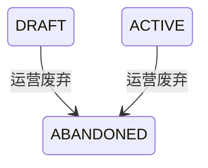

## 一句话价值

将未废弃的自办赛事终止为已废弃。

## 核心概念

- 自办赛事  由业务方配置规则、接受报名、组织匹配并推进比赛的竞赛活动。

## 业务对象

### 自办赛事

| 业务名称 | 描述 | 取值说明 |
|---|---|---|
| 赛事编号 | 唯一标识本次废弃的自办赛事。 | — |
| 赛事状态 | 废弃成功后进入已废弃，不能再次废弃。 | 草稿：尚未激活，可废弃；已激活：正在运营，可废弃；已废弃：赛事已终止。 |

## 交付内容

类型: 变更类

成功后按主流程改写或撤销既有业务事实；允许变更的内容、前置状态、对外可见结果与原值留痕，以本节下列规则、业务对象及分支与异常为准。

| 当前状态 | 触发操作 | 新状态 | 前置条件 | 谁能触发 |
|---|---|---|---|---|
| `DRAFT` | 废弃赛事 | `ABANDONED` | 赛事存在且运营访问有效 | 运营人员 |
| `ACTIVE` | 废弃赛事 | `ABANDONED` | 赛事存在且运营访问有效 | 运营人员 |

## 主流程

触发源：运营接口；终态：指定自办赛事由 `DRAFT` 或 `ACTIVE` 变为 `ABANDONED`。

1. 运营人员提交要废弃的赛事编号，可同时填写废弃原因。
2. 取得指定赛事，确认其尚未处于 `ABANDONED`。
3. 将赛事状态改为 `ABANDONED` 并保存，其他赛事配置和运营进度保持不变。
4. 向运营人员确认赛事废弃完成。

## 分支与异常

| 什么情况 | 怎么处理 | 对外提示 | 做了一半的怎么收场 |
|---|---|---|---|
| 运营访问凭据未配置、未提供或不匹配 | 拒绝废弃 | 无权限访问 | 赛事不变 |
| 未提供赛事编号 | 拒绝废弃 | 赛事ID不能为空 | 赛事不变 |
| 指定赛事不存在 | 拒绝废弃 | 赛事不存在 | 无可更改的赛事 |
| 赛事已经是 `ABANDONED` | 拒绝重复废弃 | 赛事当前状态不允许该操作 | 赛事保持 `ABANDONED` |
| 废弃状态未能完整保存 | 废弃失败 | 系统异常，请稍后重试 | 撤回本次状态变更，赛事保持原状态 |

## 业务边界

- 本服务只负责将指定赛事从 `DRAFT` 或 `ACTIVE` 改为 `ABANDONED`，不删除赛事记录，也不修改赛事配置。
- 本服务不写入赛事结束时间，不处理已有赛事报名、比赛、赛约、线下赛活动或支付单，也不发起退款或通知。
- 本服务不交付更新后的赛事详情，只确认废弃请求完成。
- 已废弃赛事不可由本服务恢复；如需恢复，应另行定义业务服务和恢复规则。

## 遗留与待定

| 等级 | 待定的是什么 | 要谁来定 |
|---|---|---|
| P2 | 废弃请求可以提交原因，但当前既不保存也不使用；是否必须填写、保存位置、允许格式及是否向参赛者展示，需赛事产品负责人确认。 | 产品与赛事运营负责人 |
| P1 | `ACTIVE` 赛事可直接废弃，且不核对是否已有报名、在途比赛、赛约、线下赛活动或支付单；这些关联对象如何终止、退款或保留，需赛事产品、运营和财务负责人共同确定。 | 产品与赛事运营负责人 |
| P2 | 废弃不会写入 `rally_tournament.end_time`；赛事废弃是否应同时形成业务终止时间，需赛事产品负责人确认。 | 产品与赛事运营负责人 |
| P2 | 当前没有记录废弃操作人的业务字段；是否需要保存操作人及审计信息，需赛事运营负责人确认。 | 产品与赛事运营负责人 |
