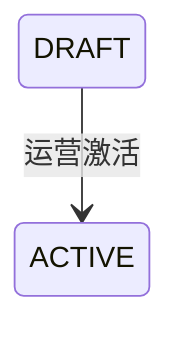

## 一句话价值

将配置完整的赛事草稿开放为有效赛事。

## 核心概念

- 自办赛事  由业务方配置规则、接受报名、组织匹配并推进比赛的竞赛活动。

## 业务对象

### 自办赛事

| 业务名称 | 描述 | 取值说明 |
|---|---|---|
| 赛事编号 | 唯一标识本次激活的自办赛事。 | — |
| 报名开始时间 | 开放报名的起始时间，必须早于资格赛开始时间。 | — |
| 资格赛开始时间 | 资格赛正式开始的时间。 | — |
| 赛事状态 | 激活成功后由草稿进入已激活。 | 草稿：尚未激活，可执行激活；已激活：赛事已经生效；已废弃：赛事已终止，不可激活。 |

## 交付内容

类型: 变更类

成功后按主流程改写或撤销既有业务事实；允许变更的内容、前置状态、对外可见结果与原值留痕，以本节下列规则、业务对象及分支与异常为准。

| 当前状态 | 触发操作 | 新状态 | 前置条件 | 谁能触发 |
|---|---|---|---|---|
| `DRAFT` | 激活赛事 | `ACTIVE` | 报名开始时间和资格赛开始时间均已配置，且前者早于后者 | 运营人员 |

## 主流程

触发源：运营接口；终态：指定自办赛事由 `DRAFT` 变为 `ACTIVE`。

1. 运营人员提交要激活的赛事编号。
2. 取得指定赛事，确认其当前状态为 `DRAFT`。
3. 确认报名开始时间和资格赛开始时间均已配置，且报名开始时间早于资格赛开始时间。
4. 将赛事状态改为 `ACTIVE` 并保存，其他赛事配置和运营进度保持不变。

## 分支与异常

| 什么情况 | 怎么处理 | 对外提示 | 做了一半的怎么收场 |
|---|---|---|---|
| 未提供赛事编号 | 拒绝激活 | 赛事ID不能为空 | 赛事不变 |
| 指定赛事不存在 | 拒绝激活 | 赛事不存在 | 无可更改的赛事 |
| 赛事当前不是 `DRAFT` | 拒绝激活 | 赛事当前状态不允许该操作 | 赛事不变 |
| 报名开始时间或资格赛开始时间未配置 | 拒绝激活 | 赛事配置不完整 | 赛事保持 `DRAFT` |
| 报名开始时间不早于资格赛开始时间 | 拒绝激活 | 赛事时间点设置不合法 | 赛事保持 `DRAFT` |

## 业务边界

- 本服务只负责将指定赛事从 `DRAFT` 改为 `ACTIVE`，不创建、修改或废弃赛事。
- 本服务不开始报名、不创建赛事报名，也不组织比赛匹配；这些由各自的业务服务按时间和条件承接。
- 本服务不交付更新后的赛事详情，只确认激活请求完成。

## 遗留与待定

| 等级 | 待定的是什么 | 要谁来定 |
|---|---|---|
| P2 | 当前激活所谓的“配置完整”只单独核对报名开始时间和资格赛开始时间；激活前是否需要重新核对名称、比赛类型、城市、NTRP、签位、报名费等其他必备配置，需赛事产品负责人确认。 | 产品与赛事运营负责人 |
| P1 | 激活时只校验报名开始时间早于资格赛开始时间，不重新校验报名截止时间、资格赛截止时间，也不校验各时间点与当前时间的关系；激活可接受的完整时间边界需赛事产品负责人确认。 | 产品与赛事运营负责人 |
