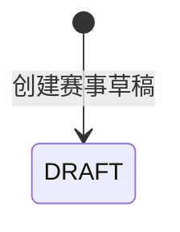

## 一句话价值

建立可继续配置的赛事草稿。

## 核心概念

- NTRP  用于描述网球水平的等级值，既用于个人展示，也用于约球和赛事准入。
- 自办赛事  由业务方配置规则、接受报名、组织匹配并推进比赛的竞赛活动。
- 资格赛  自办赛事进入正赛前的筛选阶段，胜者可能先进入待支付。
- 正赛  自办赛事锁定席位后的淘汰阶段，胜者按轮次继续晋级。

## 业务对象

### 自办赛事

| 业务名称 | 描述 | 取值说明 |
|---|---|---|
| 赛事编号 | 唯一标识自办赛事。 | — |
| 赛事名称 | 赛事对外展示名称。 | — |
| 赛事图片 | 包含活动海报、规则海报和微信群二维码。 | — |
| 页面主题 | 包含主操作按钮颜色和页面背景色。 | — |
| 比赛形式 | 赛事采用的对局形式。 | 单打：单打赛事；双打：双打赛事；拉球：拉球形式。 |
| 城市 | 赛事举办城市。 | — |
| NTRP 等级 | 赛事要求的参赛水平等级。 | — |
| 性别限制 | 赛事对报名者性别的要求。 | 不限性别：男性和女性均可；仅限男性：只有男性可报名；仅限女性：只有女性可报名。 |
| 正赛签位 | 正赛可容纳的参赛席位数。 | 仅可为 2、4、8、16、32 或 64。 |
| 线下承接轮次 | 从该轮开始由统一线下活动承接。 | 资格赛、64 强、32 强、16 强、8 强、半决赛、决赛。 |
| 资格赛分组人数 | 资格赛每场包含的参赛单元数量。 | — |
| 报名费 | 参赛者锁定正赛席位所需费用，单位为分。 | — |
| 奖金 | 按名次排列的奖金金额，单位为分。 | — |
| 报名时间 | 包含报名开始时间和可选的截止时间。 | — |
| 资格赛时间 | 包含资格赛开始时间和可选的截止时间。 | — |
| 拒赛次数上限 | 分别限制资格赛和正赛允许累计的拒赛次数。 | — |
| 比赛规则 | 赛事的文字规则说明。 | — |
| 赛事状态 | 草稿创建完成时尚未激活。 | 草稿：赛事已经保存，等待后续配置或激活；已激活：赛事已经生效；已废弃：赛事已终止。 |
| 当前轮次 | 草稿创建完成时从资格赛开始。 | 资格赛、64 强、32 强、16 强、8 强、半决赛、决赛。 |

## 状态机

| 当前状态 | 触发操作 | 新状态 | 前置条件 | 谁能触发 |
|---|---|---|---|---|
| 不存在 | 创建赛事草稿 | `DRAFT` | 运营访问有效；创建内容通过字段、签位、轮次、费用和时间校验；城市编码能取得城市名称 | 运营人员 |

## 主流程

触发源：运营人员发起 HTTP 创建；终态：赛事以 `DRAFT` 建立并交付赛事编号。

1. 确认发起者具备运营访问资格，并接收赛事名称、海报、主题、参赛限制、签位、费用、奖金、时间和规则等配置。
2. 校验必填项、字段格式和长度，以及资格赛每组人数与拒赛次数上限。
3. 确认正赛签位数是 2～64 范围内的 2 次方，并确认转线下轮次早于该赛事的正赛签位规模。
4. 确认报名费非负，报名开始早于资格赛开始，两个截止时间分别不早于对应开始时间。
5. 按城市编码取得城市名称，为赛事生成唯一编号。
6. 建立状态为 `DRAFT` 的自办赛事，将已锁定正赛席位数置为 `0`，当前轮次置为 `QUALIFIER`，赛事结束时间和线下赛活动编号留空。
7. 交付新赛事编号，供运营人员继续修改配置或另行激活赛事。

## 分支与异常

| 什么情况 | 怎么处理 | 对外提示 | 做了一半的怎么收场 |
|---|---|---|---|
| 运营访问凭据未配置、未提供或不匹配 | 拒绝创建 | 无权限访问 | 不创建赛事草稿。 |
| 赛事名称为空或超过 128 个字符 | 拒绝创建 | `tournamentName: 请填写赛事名称` 或 `tournamentName: 赛事名称不超过128字符` | 不创建赛事草稿。 |
| 比赛类型、城市编码、NTRP 等级、性别限制、正赛签位数、转线下轮次、资格赛每组人数、报名费、报名开始时间、资格赛开始时间或两个拒赛上限缺失 | 拒绝创建 | 返回首个无效字段及其校验说明 | 不创建赛事草稿。 |
| 提交了主题，但按钮颜色或背景色为空、不是以 `#` 开头的 3、4、6 或 8 位十六进制颜色 | 拒绝创建 | 返回对应主题颜色字段及格式说明 | 不创建赛事草稿。 |
| 资格赛每组人数小于 2 | 拒绝创建 | `qualifierGroupSize: 资格赛组人数至少2人` | 不创建赛事草稿。 |
| 报名费为负，或资格赛、正赛拒赛次数上限为负 | 拒绝创建 | 返回对应字段的非负校验提示 | 不创建赛事草稿。 |
| 奖金配置不是一个或多个以英文逗号分隔的非负整数 | 拒绝创建 | `prizeMoney: 奖金格式不正确，应为逗号分隔的数字` | 不创建赛事草稿。 |
| 比赛规则描述超过 5000 个字符 | 拒绝创建 | `matchRuleDescription: 比赛规则描述不超过5000字符` | 不创建赛事草稿。 |
| 正赛签位数不是 `2`、`4`、`8`、`16`、`32`、`64` 之一 | 拒绝创建 | 正赛签位数只能是2到64的2次方 | 不创建赛事草稿。 |
| 转线下轮次的签位数大于或等于正赛签位数 | 拒绝创建 | 转线下轮次必须小于正赛签位数 | 不创建赛事草稿。 |
| 报名开始时间不早于资格赛开始时间 | 拒绝创建 | 报名开始时间必须早于资格赛开始时间 | 不创建赛事草稿。 |
| 报名截止时间早于报名开始时间 | 拒绝创建 | 报名截止时间不能早于报名开始时间 | 不创建赛事草稿。 |
| 资格赛截止时间早于资格赛开始时间 | 拒绝创建 | 资格赛截止时间不能早于资格赛开始时间 | 不创建赛事草稿。 |
| 提交的枚举文字无法识别 | 创建失败 | 系统异常，请稍后重试 | 不创建赛事草稿。 |
| 城市编码在城市名录中找不到对应城市 | 创建失败 | 系统异常，请稍后重试 | 不创建赛事草稿。 |
| 赛事草稿未能完整保存 | 创建失败 | 系统异常，请稍后重试 | 撤回本次创建，不交付赛事编号。 |

## 业务边界

- 本服务负责校验创建内容、补充城市名称、建立 `DRAFT` 自办赛事并交付赛事编号，到草稿成功保存为止。
- 本服务不校验赛事名称是否重复，也不为赛事名称保留唯一性。
- 本服务只记录图片标识，不负责上传、生成或验证海报与微信群二维码文件。
- 本服务不激活赛事，不开放用户报名，也不创建赛事报名、比赛、赛约、支付单或线下赛活动。
- 本服务不修改既有赛事；后续配置修改、激活和废弃由各自业务服务负责。

## 遗留与待定

- 创建规则实际接受 `RALLY`，但 `rally_tournament.match_type` 的表注释只列出 `SINGLE`、`DOUBLE`；自办赛事是否允许拉球类型应由产品确认。
- 创建规则接受 `2`、`4`、`8`、`16`、`32`、`64` 六种正赛签位数，但 `rally_tournament.total_slots` 的表注释只列出 `16`、`32`、`64`；对外支持范围应由赛事产品确认。
- 转线下轮次实际使用完整赛事轮次枚举并仅比较签位数，因而可能接受 `QUALIFIER`、`ROUND_32` 或 `FINAL` 等值；表注释只举出 `ROUND_4`、`ROUND_8`、`ROUND_16`，允许的线下起始轮次应由赛事产品确认。
- `ntrpLevel` 只校验非空，没有校验为数值、0.5 步长或允许范围；合法 NTRP 赛事等级应由赛事产品确认。
- `cityCode` 只校验非空，没有先校验城市是否存在或已开通；无效编码会以系统异常结束，城市准入范围及可理解的失败提示应由赛事产品与运营确认。
- `registrationEndTime` 没有限制必须早于或不晚于资格赛开始时间，报名与资格赛是否允许重叠应由赛事产品确认。
- `qualifierGroupSize` 只有最小值 2，没有最大人数或允许值集合；资格赛分组规模应由赛事产品确认。
- `prizeMoney` 只限制逗号分隔的数字格式，没有名次数量、单项金额上限、总奖金上限或与签位数的对应规则；奖金规则应由赛事产品与财务负责人确定。
- 海报、规则海报和微信群二维码标识没有输入长度校验，主题以外的图片标识也不验证文件是否存在；图片资料的有效规则应由赛事产品确认。
- 赛事名称没有唯一性规则；是否允许同城、同时段或全局重名赛事应由赛事产品确认。
- 运营访问只证明持有共享访问凭据，赛事记录没有创建人字段；是否需要记录具体运营人员及审计信息应由赛事运营负责人确认。
