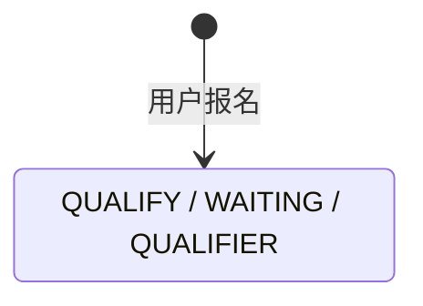

## 一句话价值

为合格用户建立等待匹配的参赛报名。

## 核心概念

- NTRP  用于描述网球水平的等级值，既用于个人展示，也用于约球和赛事准入。
- 个人档案  用户基础资料与网球资料的组合，包含 NTRP、自评状态、评分和展示视频。
- 自办赛事  由业务方配置规则、接受报名、组织匹配并推进比赛的竞赛活动。
- 赛事报名  用户参加自办赛事的资格与进度载体，记录参赛编号、阶段、轮次、状态和偏好。
- 参赛编号  一支参赛单元的编号；单打通常对应一人，双打队友共享同一编号。
- 资格赛  自办赛事进入正赛前的筛选阶段，胜者可能先进入待支付。
- 匹配池  当前轮次中处于等待匹配、可被编入新比赛的参赛单元集合。

## 业务对象

### 赛事报名

| 业务名称 | 描述 | 取值说明 |
|---|---|---|
| 报名编号 | 唯一标识本次建立的赛事报名。 | — |
| 所属赛事 | 报名归属的自办赛事。 | — |
| 报名者 | 参加赛事的当前用户。 | — |
| 双打搭档 | 报名者选择的双打搭档；有既有搭档报名时共享参赛编号。 | — |
| 参赛编号 | 赛事内标识参赛单元的编号；双打队友共享编号。 | — |
| 场地区域偏好 | 报名者愿意参加比赛的活动区域。 | — |
| 订场能力 | 报名者能否承担订场职责。 | 可以订场：能够承担订场；不能订场：不能承担订场。 |
| 可比赛时间 | 报名者可以参加比赛的时间。 | — |
| 报名阶段 | 创建时处于资格赛阶段。 | 资格赛：尚在正赛资格争夺阶段；正赛：已经进入正式淘汰阶段。 |
| 报名状态 | 创建时进入等待匹配。 | 等待匹配：处于当前轮次匹配池；已冻结：暂时离开匹配池；比赛中：已编入尚未结束的比赛；待支付：资格赛晋级后等待支付；已淘汰：止步当前赛事；已退赛：退出赛事。 |
| 当前轮次 | 创建时处于资格赛。 | 资格赛、64 强、32 强、16 强、8 强、半决赛、决赛。 |
| 拒赛次数 | 分别记录资格赛和正赛的累计拒赛次数，创建时均为零。 | — |

## 状态机

| 当前状态 | 触发操作 | 新状态 | 前置条件 | 谁能触发 |
|---|---|---|---|---|
| 无报名记录 | 报名赛事 | `stage=QUALIFY`、`status=WAITING`、`current_round=QUALIFIER` | 用户资料完整、已绑手机号，赛事已激活且处于报名窗口，性别和 NTRP 符合，搭档关系可建立 | 当前登录用户 |

## 主流程

触发源：用户 HTTP 请求；终态：报名者取得 `QUALIFY / WAITING / QUALIFIER` 的赛事报名并进入赛事讨论。

1. 用户选择一个自办赛事，提交活动区域、订场能力、可比赛时间，可选填双打搭档和本次已授权的微信赛事通知场景。
2. 确认报名者账户存在、昵称和头像已脱离默认值、个人档案已完善且手机号已绑定。
3. 确认赛事为 `ACTIVE`，当前时间位于包含起止时刻的报名窗口内，并确认报名者性别和 NTRP 符合赛事要求。
4. 确认报名者在该赛事中尚无任何赛事报名记录。
5. 没有搭档时分配新的参赛编号；有搭档但搭档尚未报名时也分配新编号；搭档已有可配对报名时复用其参赛编号，并在需要时补齐搭档的反向关系。
6. 建立报名者的赛事报名，阶段置为 `QUALIFY`、状态置为 `WAITING`、当前轮次置为 `QUALIFIER`，两类拒赛次数均从 `0` 开始。
7. 让报名者成为赛事讨论成员，初始未读数为 `0`。
8. 对本次有效且已授权的赛事通知场景分别登记一份未使用的微信订阅额度；没有授权或授权登记失败不改变报名结果。
9. 向报名者交付新报名的编号、参赛编号、搭档、偏好、阶段、状态和当前轮次。

## 分支与异常

| 什么情况 | 怎么处理 | 对外提示 | 做了一半的怎么收场 |
|---|---|---|---|
| 报名内容缺少赛事编号、活动区域、订场能力或可比赛时间，或枚举值不可识别 | 拒绝报名 | 对应必填项提示或参数错误 | 不建立赛事报名、讨论成员和通知授权 |
| 登录身份无对应用户 | 拒绝报名 | 登录已失效 | 不建立赛事报名 |
| 昵称或头像仍为默认值，同时个人档案也未完善 | 拒绝报名 | 请先完善个人信息和网球档案 | 不建立赛事报名 |
| 昵称或头像仍为默认值 | 拒绝报名 | 请先完善用户信息，设置头像和昵称 | 不建立赛事报名 |
| 没有个人档案或档案仍为 `TBC` | 拒绝报名 | 请先完善网球档案 | 不建立赛事报名 |
| 指定赛事不存在 | 拒绝报名 | 赛事不存在 | 不建立赛事报名 |
| 赛事不是 `ACTIVE` | 拒绝报名 | 赛事当前状态不允许该操作 | 不建立赛事报名 |
| 尚未到报名开始时间，或已晚于报名截止时间 | 拒绝报名 | 报名未开放或已截止 | 不建立赛事报名 |
| 报名者尚未绑定手机号 | 拒绝报名 | 请先绑定手机号 | 不建立赛事报名 |
| 报名者性别不符合赛事限制 | 拒绝报名 | 性别不符合该约球要求 | 不建立赛事报名 |
| 报名者没有 NTRP，或 NTRP 与赛事要求不相等 | 拒绝报名 | 您的 NTRP 等级不符合赛事要求 | 不建立赛事报名 |
| 报名者在该赛事已有任意状态的报名记录 | 拒绝重复报名 | 您已报名该赛事 | 既有报名保持不变 |
| 所选搭档已有报名，且已与其他用户配对 | 拒绝报名 | 该队友已与他人组队，无法选择 | 报名者和搭档的赛事报名均保持原样 |
| 报名者在该赛事已有讨论成员记录，但没有赛事报名记录 | 拒绝加入赛事讨论，因此不确认报名完成 | 你已加入该聊天 | 不保留本次新报名，既有讨论成员记录不变 |
| 有效微信通知授权场景重复或混入非赛事场景 | 去重有效赛事场景，忽略其他场景后继续 | 报名成功 | 只为去重后的有效赛事场景登记授权额度 |
| 微信通知授权额度登记失败 | 保留报名和赛事讨论成员关系 | 报名成功 | 本次授权额度可能没有登记，报名者不会收到单独失败提示 |
| 赛事、个人档案或报名数据无法正确读取或保存 | 终止报名 | 系统异常，请稍后重试 | 不确认报名成功，不留下本次未完整建立的报名关系 |

## 业务边界

- 本服务负责从报名资格校验开始，到建立资格赛等待匹配报名、加入赛事讨论并交付报名概要为止。
- 本服务只为当前登录用户建立报名；填写搭档不会代替搭档建立报名，也不会直接确认搭档具备参赛资格。
- 本服务不冻结、解冻、修改偏好或办理退赛，也不发起报名费支付；这些是独立业务服务。
- 本服务不组织比赛、不选择订场人、不建立赛约、不处理赛果，也不推进资格赛或正赛轮次。
- 本服务不占用正赛签位，不改变 `current_filled_slots`，也不因正赛签位已满而拒绝初始报名。
- 本服务登记的微信订阅额度只供后续赛事事件使用，不在报名时发送匹配、订场或拒绝通知。

## 遗留与待定

- `match_type` 为 `SINGLE`、`DOUBLE` 或 `RALLY` 时，当前均允许任意填写或不填写 `partnerId`；各比赛类型的搭档必填、禁填及人数规则需赛事产品负责人确定。
- 当前不核对 `partnerId` 是否为真实用户、是否等于报名者本人，也不预先核对搭档的资料完整度、手机号、性别或 NTRP；搭档选择的有效性规则需赛事产品负责人确定。
- 已有 `WITHDRAWN` 或 `ELIMINATED` 报名也会永久阻止同一用户再次报名；退赛后重报及重新参赛规则需赛事产品负责人确定。
- 限性别赛事中，资料里的 `gender` 为空会通过限制，而明确保存为 `UNDISCLOSED` 会被拒绝；未知性别的统一准入口径需赛事产品负责人确定。
- 基础资料完整度只按昵称是否等于“球员”、头像是否等于 `default/avatar.jpeg` 判断；`user.nickname` 与 `user.avatar_url` 均允许为空，空值是否应视为未完善需个人档案产品负责人确定。
- `preferredDistricts` 和 `availableTimes` 只要求列表非空，不校验列表项是否为空、区域是否属于赛事城市、时间格式或是否落在赛事周期内；偏好数据规则需赛事产品负责人确定。
- 初始报名不检查 `total_slots` 或 `current_filled_slots`。这可能是允许不限量参加资格赛，也可能遗漏了报名上限；需赛事产品负责人明确资格赛容量规则。
- 参赛编号按赛事当前最大编号加一生成，但赛事内没有参赛编号唯一约束；同时报名时能否出现重复编号、出现后如何处理，需赛事产品与数据负责人确定。
- 报名所用赛事 NTRP 是自由格式字符串，当前会直接按十进制数解析；非数字配置的处置规则和配置约束需赛事产品负责人确定。
- `user_tennis_profile.status` 的建表说明和默认值使用小写 `tbc/normal/under_review`，当前报名读取只识别大写 `TBC/NORMAL/UNDER_REVIEW`；需产品与数据负责人统一存储口径并确认历史数据兼容方式。
- `rally_tournament_entry.current_round` 的建表说明没有列出业务枚举支持的 `ROUND_64`；需赛事产品与数据负责人统一字段取值说明。
- 已存在赛事讨论成员但没有赛事报名时，用户会因“已加入该聊天”无法报名；讨论成员与报名关系的修复及报名准入口径需赛事产品负责人确定。
- 微信通知授权登记失败不会影响报名成功，报名者也拿不到失败信息；是否需要补登记或向用户展示授权结果需赛事产品负责人确定。
- `user_notify_subscribe` 的建表注释仍只描述约球业务和值域，但本服务实际写入 `TOURNAMENT` 及三种赛事通知场景；需产品与数据负责人更新并统一数据字典。
