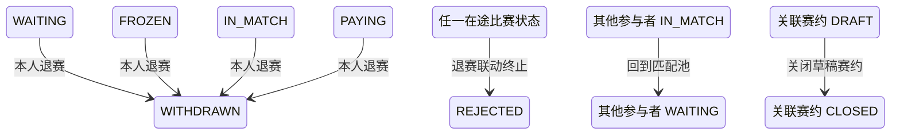

## 一句话价值

将本人报名置为已退赛并关闭在途比赛。

## 核心概念

- 自办赛事  由业务方配置规则、接受报名、组织匹配并推进比赛的竞赛活动。
- 赛事报名  用户参加自办赛事的资格与进度载体，记录参赛编号、阶段、轮次、状态和偏好。
- 参赛编号  一支参赛单元的编号；单打通常对应一人，双打队友共享同一编号。
- 资格赛  自办赛事进入正赛前的筛选阶段，胜者可能先进入待支付。
- 正赛  自办赛事锁定席位后的淘汰阶段，胜者按轮次继续晋级。
- 匹配池  当前轮次中处于等待匹配、可被编入新比赛的参赛单元集合。
- 赛事比赛  自办赛事中一次由若干参赛单元完成的对阵，经历匹配、订场、确认、比赛和赛果确认。
- 赛约  为一场赛事比赛建立的时间与场地安排，以专属约球承载；全员确认前可重订或拒绝。

## 业务对象

### 赛事报名

| 业务名称 | 描述 | 取值说明 |
|---|---|---|
| 报名编号 | 唯一标识本人退出的赛事报名。 | — |
| 所属赛事 | 报名归属的自办赛事。 | — |
| 报名者 | 发起退赛的当前参赛者。 | — |
| 双打搭档 | 报名者已有的双打搭档；本服务不直接修改搭档报名。 | — |
| 参赛编号 | 报名所属参赛单元的编号。 | — |
| 报名阶段 | 退赛后仍保留原阶段。 | 资格赛：尚在正赛资格争夺阶段；正赛：已经进入正式淘汰阶段。 |
| 报名状态 | 除已淘汰和已退赛外，可改为已退赛。 | 等待匹配：处于当前轮次匹配池；已冻结：暂时离开匹配池；比赛中：已编入尚未结束的比赛；待支付：资格赛晋级后等待支付；已淘汰：止步当前赛事；已退赛：退出赛事。 |
| 当前轮次 | 退赛后仍保留原轮次。 | 资格赛、64 强、32 强、16 强、8 强、半决赛、决赛。 |
| 是否触发退款 | 表示本次是否已经发起正赛报名费退款；当前固定为否。 | 是：已发起退款；否：未发起退款。 |

### 在途赛事比赛

| 业务名称 | 描述 | 取值说明 |
|---|---|---|
| 比赛编号 | 退赛者正在参与且尚未结束的赛事比赛。 | — |
| 关联赛约 | 本场比赛已有的时间与场地安排。 | — |
| 比赛轮次 | 本场比赛所属轮次，终止后保持不变。 | 资格赛、64 强、32 强、16 强、8 强、半决赛、决赛。 |
| 比赛状态 | 退赛会将尚未完成的在途比赛终止。 | 已匹配：已完成对阵编排，等待选定订场人；订场中：已选定订场人，等待提交赛约；待确认赛约：已提交赛约，等待参与者确认；待比赛：赛约已确认，等待比赛；待确认赛果：已提交赛果，等待参与者确认；已完成：赛果已确认；已终止：比赛被拒绝或取消。 |

### 关联赛约

| 业务名称 | 描述 | 取值说明 |
|---|---|---|
| 赛约编号 | 在途比赛可能关联的赛约。 | — |
| 赛约状态 | 退赛联动终止比赛时，仍为草稿的赛约关闭。 | 草稿：等待比赛参与者确认；开放：赛约已获确认；进行中：活动正在进行；已关闭：活动被终止；已结束：活动正常结束。 |

### 赛事讨论成员

| 业务名称 | 描述 | 取值说明 |
|---|---|---|
| 所属赛事 | 退赛者退出讨论的自办赛事。 | — |
| 成员 | 退赛后被移出赛事讨论的当前参赛者。 | — |

## 状态机

| 当前状态 | 触发操作 | 新状态 | 前置条件 | 谁能触发 |
|---|---|---|---|---|
| 报名为 `WAITING`、`FROZEN`、`IN_MATCH` 或 `PAYING` | 退出赛事 | `WITHDRAWN` | 当前登录用户在指定赛事有本人报名 | 报名本人 |
| 比赛为 `MATCHED`、`BOOKING`、`SCHEDULED`、`PENDING_PLAY` 或 `PENDING_CONFIRM` | 报名本人退赛 | `REJECTED` | 退赛者是该场比赛参与者，且找到的比赛尚未完成或终止 | 报名本人间接触发 |
| 同场其他报名为 `IN_MATCH` | 在途比赛因退赛终止 | `WAITING` | 该参与者属于被终止比赛且自身没有退赛 | 报名本人间接触发 |
| 关联赛约活动为 `DRAFT` | 在途比赛因退赛终止 | `CLOSED` | 被终止比赛已关联该赛约活动 | 报名本人间接触发 |

## 主流程

触发源：HTTP（参赛者）；终态：本人报名为 `WITHDRAWN`，退出赛事讨论；若有在途比赛则比赛为 `REJECTED`，同场其他仍在比赛中的参与者回到匹配池。

1. 识别当前已登录参赛者，并接收要退出的自办赛事编号。
2. 按赛事编号和当前参赛者找到其本人唯一的赛事报名，确认报名尚未退赛或淘汰。
3. 将本人报名状态改为 `WITHDRAWN`；报名阶段、当前轮次、参赛编号、搭档关系、偏好和拒赛次数保持不变。
4. 将当前参赛者移出该赛事的讨论成员名录，既有赛事评论保留。
5. 查找当前参赛者在该赛事中的一场在途比赛；没有在途比赛时直接完成退赛。
6. 找到在途比赛时将其状态改为 `REJECTED`，退赛不累计拒赛次数。
7. 若该比赛关联的赛约活动仍为 `DRAFT`，将赛约活动改为 `CLOSED`。
8. 将该场比赛中其他仍为 `IN_MATCH` 的参与者报名改为 `WAITING`，使其按原阶段和原轮次回到匹配池；退赛者本人保持 `WITHDRAWN`。
9. 向参赛者交付退赛结果；当前结果固定表示没有触发退款。

## 分支与异常

| 什么情况 | 怎么处理 | 对外提示 | 做了一半的怎么收场 |
|---|---|---|---|
| 未登录、登录凭据缺失或失效 | 拒绝退赛 | 登录已过期或登录凭证无效 | 不读取或修改赛事报名。 |
| 未提供赛事编号 | 拒绝退赛 | `tournamentId: 赛事ID不能为空` | 不读取或修改赛事报名。 |
| 指定赛事下没有当前参赛者本人的报名 | 拒绝退赛 | 报名记录不存在 | 不创建报名，也不修改比赛、赛约和讨论成员。 |
| 本人报名已为 `WITHDRAWN` 或 `ELIMINATED` | 拒绝退赛 | 报名当前状态不允许该操作 | 报名及所有关联对象保持原状。 |
| 本人没有在途比赛 | 完成本人报名退赛并退出赛事讨论，不处理比赛或赛约 | 退赛成功，`refundTriggered=false` | 报名保持 `WITHDRAWN`。 |
| 在途比赛已被他人改变，无法按当前版本终止 | 退赛失败并提示刷新后重试 | 比赛状态已变更，请刷新后重试 | 不确认退赛成功，本次报名、讨论成员、比赛、赛约及其他参与者状态均保持修改前结果。 |
| 在途比赛没有关联赛约活动，或关联活动不存在 | 继续终止比赛并回收其他参与者 | 退赛成功，`refundTriggered=false` | 不创建或补建赛约活动。 |
| 关联赛约活动不是 `DRAFT` | 保留该活动状态，继续终止比赛并回收其他参与者 | 退赛成功，`refundTriggered=false` | 关联活动不变。 |
| 同场某参与者报名不是 `IN_MATCH` | 保留其现有报名状态 | 退赛成功，`refundTriggered=false` | 不强制覆盖该参与者状态。 |
| 报名、讨论成员、比赛、赛约或其他参与者状态未能完整保存 | 退赛失败 | 系统异常，请稍后重试 | 不确认退赛成功，本次涉及的业务对象保持修改前结果。 |

## 业务边界

- 本服务负责将当前参赛者本人的可退报名置为 `WITHDRAWN`、移出赛事讨论，并收口其一场在途比赛及相关草稿赛约和其他参与者报名。
- 本服务不改变退赛者的报名阶段、当前轮次、参赛编号、搭档关系、匹配偏好、支付时间或拒赛次数。
- 本服务不删除赛事报名、比赛、比赛参与者、赛约活动或历史评论，只删除退赛者的赛事讨论成员关系。
- 本服务不修改自办赛事状态、正赛已占席位数或参赛编号，也不重新执行比赛匹配和轮次推进。
- 本服务不处理报名费退款、支付单关闭或退款回执；当前只交付“未触发退款”的结果。
- 本服务不代替其他参赛者退赛；同场其他 `IN_MATCH` 参与者只恢复为 `WAITING`。

## 遗留与待定

- 正赛阶段可能已有 `paid_time`，返回对象也专门声明是否触发退款，但当前资格赛和正赛退赛都不办理退款，`refundTriggered` 固定为 `false`；正赛退赛的退款、支付单和正赛席位回收规则需赛事与支付产品负责人确定。
- 双打报名共享参赛编号，但当前只把发起人的报名置为 `WITHDRAWN`；没有在途比赛时搭档保持原状态，有在途比赛时搭档若为 `IN_MATCH` 会与对手一起回到 `WAITING`。双打退赛应拆队、整队退赛还是允许更换搭档，需赛事产品负责人确定。
- 当前只查找并终止一场在途比赛，且没有明确选择顺序；同一用户因异常数据存在多场在途比赛时，其余比赛会继续存在，需赛事产品与数据负责人确定清理规则。
- 退赛终止比赛时只写 `status=REJECTED`，不写 `reject_phase`、`reject_reason_code`、`rejected_by` 或 `rejected_time`；退赛终止原因与审计信息的记录口径需赛事运营负责人确定。
- 只有 `DRAFT` 赛约会关闭；已经 `OPEN`、`ONGOING` 或 `FINISHED` 的关联活动会保持原状态，即使赛事比赛已被终止。赛约确认后退赛如何收口活动、报名和费用，需赛事产品负责人确定。
- 关闭关联活动时不核对 `meetup_type` 是否为 `TOURNAMENT`；异常关联到普通约球时也可能被关闭，关联活动的类型校验与数据修复规则需赛事与约球负责人确定。
- 当前不检查自办赛事是否存在、是否已激活、已废弃或已结束；不同赛事状态和时间阶段是否允许退赛，需赛事产品负责人确定。
- `WAITING`、`FROZEN`、`IN_MATCH`、`PAYING` 均允许直接退赛，且没有退赛截止时间或确认步骤；各阶段的退赛限制需赛事产品负责人确定。
- 退赛不会通知搭档、对手或运营人员；是否需要通知、通知对象与通知内容需赛事运营负责人确定。
- `rally_tournament_match.status` 的建表说明没有列出业务流程实际使用的 `PENDING_PLAY`；需赛事产品与数据负责人统一字段取值说明。
- `rally_tournament_entry.current_round` 的建表说明没有列出业务枚举支持的 `ROUND_64`；需赛事产品与数据负责人统一字段取值说明。
- `rally_meetup.status` 的建表缺省值和说明使用小写，而当前业务读写只识别并保存大写枚举；正式存储取值及历史数据兼容方式需产品与数据负责人确定。
