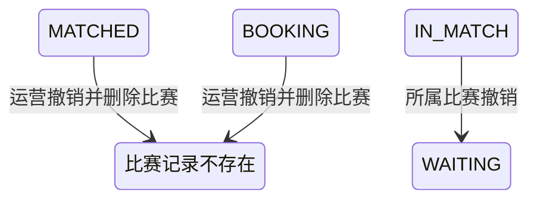

## 一句话价值

撤销未提交订场的比赛并让参赛队回到匹配池。

## 核心概念

- 自办赛事  由业务方配置规则、接受报名、组织匹配并推进比赛的竞赛活动。
- 赛事报名  用户参加自办赛事的资格与进度载体，记录参赛编号、阶段、轮次、状态和偏好。
- 参赛编号  一支参赛单元的编号；单打通常对应一人，双打队友共享同一编号。
- 匹配池  当前轮次中处于等待匹配、可被编入新比赛的参赛单元集合。
- 赛事比赛  自办赛事中一次由若干参赛单元完成的对阵，经历匹配、订场、确认、比赛和赛果确认。
- 订场人  一场赛事比赛中负责提交比赛时间和场地安排的参赛者。
- 赛约  为一场赛事比赛建立的时间与场地安排，以专属约球承载；全员确认前可重订或拒绝。
- 重订  不终止比赛，只打回当前赛约并要求订场人重新提交时间或场地。

## 业务对象

### 赛事比赛

| 业务名称 | 描述 | 取值说明 |
|---|---|---|
| 比赛编号 | 本次被运营撤销的未订场赛事比赛。 | — |
| 所属赛事 | 比赛归属的自办赛事。 | — |
| 比赛序号 | 赛事内用于展示的顺序编号。 | — |
| 比赛轮次 | 本场比赛所属轮次。 | 资格赛、64 强、32 强、16 强、8 强、半决赛、决赛。 |
| 订场人 | 比赛已经认领时保存的订场负责人。 | — |
| 比赛状态 | 只有已匹配或订场中的比赛会被撤销并删除。 | 已匹配：已完成对阵编排，等待选定订场人；订场中：已选定订场人，等待提交赛约；待确认赛约：已提交赛约，等待参与者确认；待比赛：赛约已确认，等待比赛；待确认赛果：已提交赛果，等待参与者确认；已完成：赛果已确认；已终止：比赛被拒绝或取消。 |

### 比赛参与者

| 业务名称 | 描述 | 取值说明 |
|---|---|---|
| 所属比赛 | 参与关系归属的被撤销比赛。 | — |
| 参与者 | 被编入该场比赛的参赛者。 | — |
| 参赛编号 | 参与者所属参赛单元的编号。 | — |
| 赛约确认状态 | 比赛撤销后，相关参与确认关系一并移除。 | 待确认：尚未确认赛约；已确认：接受当前赛约；已拒绝：拒绝当前赛约。 |
| 赛果确认状态 | 比赛撤销后，相关赛果确认关系一并移除。 | 待确认：尚未确认赛果；已确认：接受当前赛果；已拒绝：拒绝当前赛果。 |

### 赛事报名

| 业务名称 | 描述 | 取值说明 |
|---|---|---|
| 参赛编号 | 报名所属参赛单元的编号。 | — |
| 报名阶段 | 撤销比赛后保持不变。 | 资格赛：尚在正赛资格争夺阶段；正赛：已经进入正式淘汰阶段。 |
| 报名状态 | 被撤销比赛中的报名由比赛中回到等待匹配。 | 等待匹配：处于当前轮次匹配池；已冻结：暂时离开匹配池；比赛中：已编入尚未结束的比赛；待支付：资格赛晋级后等待支付；已淘汰：止步当前赛事；已退赛：退出赛事。 |
| 当前轮次 | 回到匹配池时保持原轮次。 | 资格赛、64 强、32 强、16 强、8 强、半决赛、决赛。 |

## 交付内容

类型: 批处理类

一次处理主流程界定的一批业务对象；处理范围、成功失败统计、部分成功口径与失败对象的收场方式，以本节下列规则及分支与异常为准。

| 当前状态 | 触发操作 | 新状态 | 前置条件 | 谁能触发 |
|---|---|---|---|---|
| 比赛为 `MATCHED` | 撤销未订场比赛 | 比赛及其参与记录被删除 | 比赛属于指定赛事，且撤销时状态仍为 `MATCHED` | 运营人员 |
| 比赛为 `BOOKING` | 撤销未订场比赛 | 比赛及其参与记录被删除 | 比赛属于指定赛事，且撤销时状态仍为 `BOOKING` | 运营人员 |
| 报名为 `IN_MATCH` | 所属比赛被撤销 | `WAITING` | 报名仍存在，且按赛事编号和参与者用户编号可定位 | 运营人员间接触发 |

## 主流程

触发源：HTTP（运营）；终态：指定赛事下所有 `MATCHED`、`BOOKING` 比赛及参与记录被删除，仍为 `IN_MATCH` 的参赛者按原轮次回到匹配池。

1. 运营人员提交要处理的自办赛事编号。
2. 确认运营访问有效，并确认该赛事存在且已经确定当前轮次。
3. 找出该赛事下当前为 `MATCHED` 或 `BOOKING` 的全部比赛；其他状态比赛保持不变。
4. 逐场删除比赛及其全部比赛参与记录。
5. 按每位原比赛参与者的赛事编号和用户编号找到赛事报名；仍为 `IN_MATCH` 的报名改为 `WAITING`。
6. 参赛编号、报名阶段、当前轮次、偏好和拒赛次数保持不变，参赛单元重新进入原轮次匹配池。
7. 向运营人员确认本次未订场比赛撤销完成。

## 分支与异常

| 什么情况 | 怎么处理 | 对外提示 | 做了一半的怎么收场 |
|---|---|---|---|
| 运营访问凭据未配置、未提供或不匹配 | 拒绝撤销 | 无权限访问 | 不读取或修改赛事、比赛与报名。 |
| 未提供赛事编号 | 拒绝撤销 | `tournamentId: 赛事ID不能为空` | 不读取或修改赛事、比赛与报名。 |
| 指定赛事不存在 | 拒绝撤销 | 赛事不存在 | 不删除比赛或参与记录，不修改报名。 |
| 赛事尚未确定当前轮次 | 拒绝撤销 | 参数错误 | 不删除比赛或参与记录，不修改报名。 |
| 指定赛事下没有 `MATCHED` 或 `BOOKING` 比赛 | 直接完成，不产生变更 | 撤销成功 | 所有比赛、参与记录和报名保持原状。 |
| 已选出的待撤销比赛在逐场处理前已不存在 | 拒绝本次撤销 | 报名记录不存在 | 本次处理的比赛、参与记录和报名均保持撤销前结果。 |
| 已选出的待撤销比赛在逐场处理前已不再是 `MATCHED` 或 `BOOKING` | 拒绝本次撤销 | 仅未提交订场信息的比赛可以取消 | 本次处理的比赛、参与记录和报名均保持撤销前结果。 |
| 比赛通过状态判断后又被改变，未能按可撤销状态删除 | 拒绝本次撤销 | 比赛状态已变更，请刷新后重试 | 本次处理的比赛、参与记录和报名均保持撤销前结果。 |
| 原比赛参与者对应的赛事报名不存在 | 跳过该参与者的报名回池，继续处理其他参与者 | 撤销成功 | 比赛和参与记录仍被删除，不补建报名。 |
| 原比赛参与者的报名不再是 `IN_MATCH` | 保留该报名现有状态，继续处理其他参与者 | 撤销成功 | 不强制覆盖该报名状态。 |
| 比赛删除、参与记录删除或报名回池未能完整完成 | 撤销失败 | 系统异常，请稍后重试 | 不确认撤销成功，本次涉及的比赛、参与记录和报名均保持撤销前结果。 |

## 业务边界

- 本服务负责批量撤销指定赛事下当前为 `MATCHED` 或 `BOOKING` 的全部比赛，删除相应比赛参与记录，并让仍为 `IN_MATCH` 的参赛者按原轮次回到匹配池。
- 本服务按赛事批量处理，不能由运营指定只撤销其中一场或部分参赛单元。
- 本服务直接删除比赛及参与记录，不保留“运营撤销”终态、撤销原因、操作人或撤销时间。
- 本服务不改变赛事状态或当前轮次，不推进轮次，也不立即重新执行比赛匹配。
- 本服务不改变报名阶段、参赛编号、偏好或拒赛次数，也不修改已经不是 `IN_MATCH` 的报名。
- 本服务不处理 `SCHEDULED`、`PENDING_PLAY`、`PENDING_CONFIRM`、`COMPLETED` 或 `REJECTED` 比赛。
- 本服务不关闭、删除或修改比赛可能关联的赛约活动，也不通知参赛者。

## 遗留与待定

| 等级 | 待定的是什么 | 要谁来定 |
|---|---|---|
| P2 | `BOOKING` 同时表示“首次等待提交赛约”和“赛约被打回后等待重订”。后者可能已经保留 `schedule_submitted_time`、`meetup_id` 和 `DRAFT` 赛约活动；当前服务仍删除比赛及参与记录，却不关闭或删除关联赛约，可能留下无法由比赛继续推进的草稿活动。运营撤销是否应仅限从未提交过赛约的比赛，以及重订中赛约如何收口，需赛事与约球产品负责人确定。 | 产品与赛事运营负责人 |
| P2 | 当前按赛事撤销全部符合条件的比赛，不能预览影响数量、排除指定比赛或只撤销某一轮；运营批量操作的选择范围和二次确认要求需赛事运营负责人确定。 | 产品与赛事运营负责人 |
| P1 | 当前只要求赛事存在且 `current_round` 非空，不检查赛事为 `ACTIVE`、比赛轮次等于赛事当前轮次，也不检查赛事是否已废弃或结束；允许撤销的赛事状态与轮次范围需赛事产品负责人确定。 | 产品与赛事运营负责人 |
| P2 | 比赛与参与记录被直接删除，没有撤销原因、操作人、撤销时间和历史快照；赛事签表、纠纷排查与运营审计是否需要保留撤销记录，需赛事运营与数据负责人确定。 | 产品与赛事运营负责人 |
| P1 | 撤销删除只再次核对比赛仍为 `MATCHED` 或 `BOOKING`，不比较 `rally_tournament_match.version`；比赛在保持同一状态时发生的订场人等资料变化不会阻止删除。哪些并发变化应当阻止运营撤销，需赛事产品负责人确定。 | 产品与赛事运营负责人 |
| P2 | 新比赛编号按赛事当前剩余比赛的最大 `match_no` 加一分配；删除编号最大的比赛后，后续比赛可能复用该展示编号。撤销后是否允许编号复用，需赛事运营与数据负责人确定。 | 产品与赛事运营负责人 |
| P1 | 参赛报名缺失或已不是 `IN_MATCH` 时会保留现状并继续成功，可能形成比赛已删除但参赛单元未回池的状态；异常报名的处置和数据修复规则需赛事与数据负责人确定。 | 产品与赛事运营负责人 |
| P2 | 待撤销比赛在逐场处理前已不存在时，对外提示使用“报名记录不存在”，没有专门的比赛不存在提示；错误口径需赛事产品负责人确定。 | 产品与赛事运营负责人 |
| P1 | 双打按每位比赛参与者逐条回池；如果同一参赛编号下只有部分报名仍为 `IN_MATCH`，可能产生不完整参赛单元，是否应按整个参赛编号统一校验和回池，需赛事产品负责人确定。 | 产品与赛事运营负责人 |
| P2 | 撤销成功后不通知参赛者，也不自动重新匹配；通知对象、通知内容和再次匹配时机需赛事运营负责人确定。 | 产品与赛事运营负责人 |
| P2 | `rally_tournament_match.status` 的建表说明没有列出业务流程实际使用的 `PENDING_PLAY`；需赛事产品与数据负责人统一字段取值说明。 | 产品与赛事运营负责人 |
| P2 | `rally_tournament_entry.current_round` 的建表说明没有列出业务枚举支持的 `ROUND_64`；需赛事产品与数据负责人统一字段取值说明。 | 产品与赛事运营负责人 |
| P2 | `rally_meetup.status` 的建表缺省值和说明使用小写，而当前业务读写使用大写枚举；正式存储取值及历史数据兼容方式需产品与数据负责人确定。 | 产品与赛事运营负责人 |
