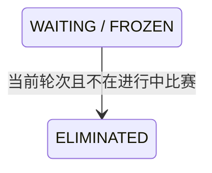

## 一句话价值

让后台运营在赛事详情的参与者行中，按赛事编号和用户编号淘汰一个当前轮次尚未进入比赛的参赛者。

## 核心概念

- 指定参赛者  由 `tournamentId + userId` 唯一定位的一条自办赛事报名。
- 当前轮次  赛事当前正在组织比赛的轮次；目标报名必须处于同一轮次。
- 未入赛  目标用户没有参与当前赛事中状态为 `MATCHED/BOOKING/SCHEDULED/PENDING_PLAY/PENDING_CONFIRM` 的比赛。
- 单人淘汰  只修改指定用户的报名状态；即使是双打，也不联动淘汰搭档。

## 业务对象

### 赛事

| 业务名称 | 描述 | 约束 |
|---|---|---|
| 赛事编号 | 目标自办赛事。 | `tournamentId` 非空且赛事存在。 |
| 赛事状态 | 淘汰操作所属赛事生命周期。 | 必须为 `ACTIVE`。 |
| 当前轮次 | 本次淘汰的轮次边界。 | 必须存在。 |

### 赛事报名

| 业务名称 | 描述 | 约束 |
|---|---|---|
| 用户编号 | 参与者身份。 | `userId` 非空；与赛事编号共同定位报名。 |
| 报名状态 | 目标用户当前参赛状态。 | 仅 `WAITING` 或 `FROZEN` 可转为 `ELIMINATED`。 |
| 当前轮次 | 报名所在轮次。 | 必须等于赛事当前轮次。 |
| 搭档关系 | 双打报名中的 partnerId 与 entryNo。 | 淘汰目标用户时保持原值；搭档报名不修改。 |

### 比赛参与关系

| 业务名称 | 描述 | 约束 |
|---|---|---|
| 进行中比赛 | 尚未完成或拒绝的有效比赛。 | 状态为 `MATCHED/BOOKING/SCHEDULED/PENDING_PLAY/PENDING_CONFIRM`。 |
| 历史比赛 | 已完成或已拒绝比赛。 | `COMPLETED/REJECTED` 不阻止当前操作。 |

## 交付内容

类型: 变更类

| 当前状态 | 触发操作 | 新状态 | 谁受影响 |
|---|---|---|---|
| `WAITING` | 淘汰指定参赛者 | `ELIMINATED` | 仅指定 userId。 |
| `FROZEN` | 淘汰指定参赛者 | `ELIMINATED` | 仅指定 userId。 |
| `IN_MATCH/PAYING/CHAMPION/ELIMINATED/WITHDRAWN` | 尝试淘汰 | 保持原状态 | 请求被拒绝。 |

## 主流程

触发源：`POST /tournament/admin/entry/eliminate-unmatched`；请求从原赛事级批量操作改为 `tournamentId + userId` 单人操作。

1. 校验 `tournamentId` 和 `userId` 均非空。
2. 在与赛事匹配入口共享的同步边界中加载赛事，确认状态为 `ACTIVE` 且当前轮次存在。
3. 按 `tournamentId + userId` 锁定目标报名；不存在则返回报名不存在。
4. 确认报名当前轮次等于赛事当前轮次，状态为 `WAITING` 或 `FROZEN`。
5. 确认该用户没有参与本赛事任何进行中比赛；历史 `COMPLETED/REJECTED` 比赛不阻止淘汰。
6. 以报名业务编号、预期轮次和允许状态为条件，把目标报名更新为 `ELIMINATED`。
7. 单事务提交并返回成功；不修改搭档报名，不删除报名或比赛记录。

## 分支与异常

| 什么情况 | 怎么处理 | 对外提示 | 事务结果 |
|---|---|---|---|
| `tournamentId` 或 `userId` 为空 | 拒绝 | 赛事ID和用户ID不能为空 | 不读取或修改。 |
| 赛事不存在 | 拒绝 | 赛事不存在 | 不修改。 |
| 赛事非 `ACTIVE` 或当前轮次缺失 | 拒绝 | 当前赛事不能淘汰未入赛参赛者 | 不修改。 |
| 报名不存在 | 拒绝 | 参赛者报名不存在 | 不补建。 |
| 报名不在赛事当前轮次 | 拒绝 | 参赛者不在当前轮次 | 不修改。 |
| 报名状态不是 `WAITING/FROZEN` | 拒绝 | 当前报名状态不能淘汰 | 不修改。 |
| 用户仍在进行中比赛 | 拒绝 | 参赛者仍在比赛中，不能淘汰 | 不修改报名或比赛。 |
| 校验后报名被匹配或状态变化 | 条件更新失败 | 参赛者状态已变化，请刷新后重试 | 整个事务回滚。 |

## 业务边界

- 本能力一次只处理一个 `userId`，不再扫描或批量淘汰赛事内其他参赛者。
- 双打按用户维度淘汰，不联动搭档；搭档可能成为不完整队伍，由后续运营另行处理。
- 只允许当前轮次的 `WAITING/FROZEN` 报名；`PAYING`、`IN_MATCH` 和所有终态不在范围内。
- 不删除报名、比赛或参与关系，不调整拒绝次数，不触发匹配、通知或退款。
- 赛事匹配与单人淘汰必须共享同一同步边界，数据库条件更新作为最终并发保护。

## 后台交互要求

- 操作入口放在自办赛事详情页“参与者”表格每个用户行的最后一列。
- 仅目标行满足当前轮次且状态为 `WAITING/FROZEN` 时显示可用的“淘汰”按钮；其他状态显示不可操作原因。
- 确认提示必须写明只淘汰当前用户，双打不联动搭档。

## 待决策项

| 优先级 | 待决策项 | 决策角色 |
|---|---|---|
| P1 | 双打单人淘汰后是否需要自动通知或冻结剩余搭档。 | 赛事产品负责人 |
| P2 | 是否需要记录运营淘汰原因、操作人和时间。 | 产品与数据负责人 |
