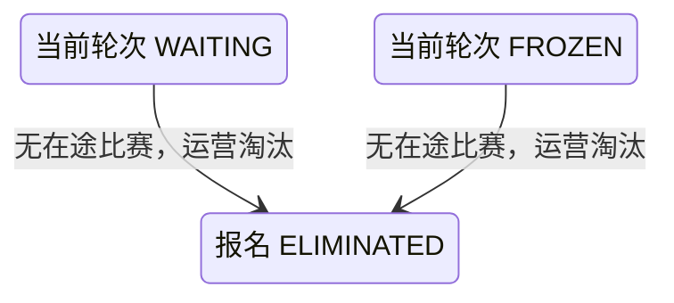

## 一句话价值

让运营批量淘汰指定赛事当前轮次中未进入任何在途比赛的参赛单元。

## 核心概念

- 自办赛事  由业务方配置规则、接受报名、组织匹配并推进比赛的竞赛活动。
- 赛事报名  用户参加自办赛事的资格与进度载体，记录参赛编号、阶段、轮次、状态和偏好。
- 参赛编号  一个参赛单元在赛事内的编号；单打通常对应一人，双打队友共享同一编号。
- 赛事当前轮次  赛事当前正在组织和结算的轮次，是本次批量淘汰的范围边界。
- 在途比赛  状态为 `MATCHED`、`BOOKING`、`SCHEDULED`、`PENDING_PLAY` 或 `PENDING_CONFIRM` 的赛事比赛。
- 未入赛参赛单元  当前轮次中成员完整、全部处于 `WAITING` 或 `FROZEN`，且该参赛编号下没有任何成员参加在途比赛的参赛单元。
- 淘汰  将报名置为终态 `ELIMINATED`；淘汰后不能再匹配、解冻、退赛或重新报名。

## 业务对象

### 自办赛事

| 业务名称 | 描述 | 取值说明 |
|---|---|---|
| 赛事编号 | 本次运营批量淘汰所针对的赛事。 | 由 `tournamentId` 指定。 |
| 赛事状态 | 只有激活中的赛事允许执行本次淘汰。 | 草稿 `DRAFT`；激活 `ACTIVE`；已结束 `FINISHED`；已废弃 `ABANDONED`。 |
| 当前轮次 | 限定本次候选报名的轮次；其他轮次报名不受影响。 | 资格赛、64 强、32 强、16 强、8 强、半决赛、决赛。 |

### 赛事报名

| 业务名称 | 描述 | 取值说明 |
|---|---|---|
| 所属赛事 | 报名归属的指定自办赛事。 | — |
| 参赛者 | 本次可能被淘汰的报名用户。 | — |
| 参赛编号 | 用于按完整参赛单元判断和变更；共享编号的双打成员同成同败。 | 正整数。 |
| 报名阶段 | 淘汰后保持不变。 | 资格赛 `QUALIFY`；正赛 `MAIN`。 |
| 当前轮次 | 必须等于赛事当前轮次才纳入本次处理。 | 资格赛、64 强、32 强、16 强、8 强、半决赛、决赛。 |
| 报名状态 | 只有等待匹配或已冻结报名可能被本服务淘汰。 | 等待匹配 `WAITING`；已冻结 `FROZEN`；比赛中 `IN_MATCH`；待支付 `PAYING`；冠军 `CHAMPION`；已淘汰 `ELIMINATED`；已退赛 `WITHDRAWN`。 |

### 在途比赛参与关系

| 业务名称 | 描述 | 取值说明 |
|---|---|---|
| 所属比赛 | 用于证明参赛者当前已经进入一场尚未结束的比赛。 | 已完成和已终止比赛不属于在途比赛。 |
| 所属赛事 | 必须与本次指定赛事一致。 | — |
| 参与者 | 与赛事报名的用户编号对应。 | — |
| 参赛编号 | 同一参赛单元任一成员进入在途比赛，整个参赛单元均不得被淘汰。 | — |

## 交付内容

类型: 批处理类

一次处理指定赛事当前轮次中全部符合条件的参赛单元；候选范围、整队口径、并发保护和失败收场方式，以本节下列规则及分支与异常为准。

| 当前状态 | 触发操作 | 新状态 | 前置条件 | 谁能触发 |
|---|---|---|---|---|
| 当前轮次报名为 `WAITING` | 淘汰未入赛参赛者 | `ELIMINATED` | 所属参赛单元成员完整，全部为 `WAITING/FROZEN`，且没有任何成员参加指定赛事的在途比赛 | 运营人员 |
| 当前轮次报名为 `FROZEN` | 淘汰未入赛参赛者 | `ELIMINATED` | 所属参赛单元成员完整，全部为 `WAITING/FROZEN`，且没有任何成员参加指定赛事的在途比赛 | 运营人员 |
| 报名为 `IN_MATCH` | 淘汰未入赛参赛者 | 保持 `IN_MATCH` | 报名状态表明已锁入比赛，不由本批服务直接淘汰 | 运营人员请求不作用于该报名 |
| 报名为 `PAYING`、`CHAMPION`、`ELIMINATED` 或 `WITHDRAWN` | 淘汰未入赛参赛者 | 保持原状态 | 待支付或终态报名不属于候选 | 运营人员请求不作用于该报名 |

## 主流程

触发源：HTTP（运营后台）；终态：指定激活赛事当前轮次中，没有任何成员参加在途比赛的 `WAITING/FROZEN` 参赛单元全部进入 `ELIMINATED`。

1. 运营人员提交非空赛事编号，并通过运营后台访问校验。
2. 确认指定赛事存在、状态为 `ACTIVE`，且已经设置当前轮次。
3. 读取该赛事当前轮次的全部报名，按 `entryNo` 汇总为参赛单元；其他轮次报名不纳入候选。
4. 读取该赛事全部在途比赛及参与关系；`COMPLETED`、`REJECTED` 或已经物理取消的比赛不证明参赛者仍在比赛中。
5. 按赛事单打或双打类型检查参赛单元成员完整性；只有成员完整、全部成员状态均为 `WAITING` 或 `FROZEN`，并且没有任何成员出现在任一在途比赛中时，该参赛单元才可淘汰。
6. 再次确认赛事当前轮次没有变化、候选报名仍为 `WAITING/FROZEN`，且没有并发形成新的在途比赛。
7. 将每个候选参赛单元下的全部报名状态改为 `ELIMINATED`；阶段、当前轮次、参赛编号、搭档关系、偏好、拒赛次数和时间字段保持不变。
8. 所有候选单元在一个事务中完成；没有候选时直接成功，不产生数据变更。
9. 向运营人员确认淘汰完成；本服务不自动推进轮次或创建新比赛。

## 分支与异常

| 什么情况 | 怎么处理 | 对外提示 | 做了一半的怎么收场 |
|---|---|---|---|
| 运营访问凭据未配置、未提供或不匹配 | 拒绝淘汰 | 无权限访问 | 不读取或修改赛事、报名和比赛。 |
| 未提供赛事编号 | 拒绝淘汰 | `tournamentId: 赛事ID不能为空` | 不读取或修改任何业务对象。 |
| 指定赛事不存在 | 拒绝淘汰 | 赛事不存在 | 不修改任何报名。 |
| 指定赛事不是 `ACTIVE` | 拒绝淘汰 | 赛事当前状态不允许该操作 | 不修改任何报名。 |
| 指定赛事尚未设置当前轮次 | 拒绝淘汰 | 参数错误 | 不修改任何报名。 |
| 当前轮次没有报名 | 直接完成 | 淘汰成功 | 不产生数据变更。 |
| 当前轮次没有符合条件的 `WAITING/FROZEN` 参赛单元 | 直接完成 | 淘汰成功 | 所有报名保持原状。 |
| 某参赛单元任一成员参加在途比赛 | 排除整个参赛单元 | 淘汰成功 | 该参赛单元全部成员保持原状态。 |
| 某参赛单元任一成员状态不是 `WAITING/FROZEN` | 排除整个参赛单元 | 淘汰成功 | 不部分淘汰同一 `entryNo` 下的其他成员。 |
| 参赛单元成员缺失、双打搭档关系不对称或共享编号异常 | 视为异常数据并排除整个参赛单元 | 淘汰成功 | 不淘汰现存的部分成员，也不补建报名。 |
| 报名为 `IN_MATCH`，但没有找到对应在途比赛 | 视为异常数据并跳过 | 淘汰成功 | 保留 `IN_MATCH`，不以批量淘汰掩盖比赛关联异常。 |
| `WAITING/FROZEN` 报名仍出现在一场在途比赛的参与关系中 | 以在途比赛关系为准，排除整个参赛单元 | 淘汰成功 | 报名保持原状态，避免淘汰正在比赛的参赛者。 |
| 报名轮次晚于或早于赛事当前轮次 | 不纳入本批候选 | 淘汰成功 | 已晋级或历史轮次报名保持原状态。 |
| 筛选后赛事当前轮次被其他流程推进 | 拒绝本次淘汰并要求刷新后重试 | 赛事状态已变更，请刷新后重试 | 本次候选报名均保持处理前状态。 |
| 候选报名在保存前进入比赛、待支付或其他状态 | 拒绝本次淘汰并要求刷新后重试 | 报名状态已变更，请刷新后重试 | 不覆盖并发流程已经产生的状态；本次批量变更全部回滚。 |
| 候选参赛单元在保存前进入一场新建的在途比赛 | 拒绝本次淘汰并要求刷新后重试 | 报名状态已变更，请刷新后重试 | 不淘汰新比赛参与者；本次批量变更全部回滚。 |
| 任一候选单元未能整组保存 | 淘汰失败 | 系统异常，请稍后重试 | 不确认部分成功，本次所有报名变更全部回滚。 |

## 业务边界

- 本服务按 `tournamentId` 批量处理一个赛事当前轮次，不支持指定单个用户、单个参赛编号、部分名单或其他轮次。
- “没有在比赛中”同时要求报名为 `WAITING/FROZEN`，并且同一参赛编号下没有任何成员参加在途比赛；不使用单一状态或任意历史参与关系作为唯一判断依据。
- 本服务按参赛编号整组淘汰；双打搭档共享编号时必须同成同败，不允许只淘汰其中一人。
- 本服务不淘汰 `IN_MATCH` 或 `PAYING` 报名，也不覆盖 `CHAMPION`、`ELIMINATED`、`WITHDRAWN` 终态。
- 本服务只修改报名状态，不删除报名，不改变阶段、当前轮次、参赛编号、搭档、偏好、拒绝次数、支付或访问时间。
- 本服务不创建、取消、终止或修改任何比赛及参与关系，不关闭赛约，也不处理支付单或退款。
- 本服务不推进赛事轮次、不结束赛事、不产生冠军，也不自动重新匹配剩余报名。
- 淘汰是不可逆终态；本服务不提供恢复报名、撤销淘汰、影响预览、淘汰原因或参赛者通知能力。

## 遗留与待定

| 等级 | 待定的是什么 | 要谁来定 |
|---|---|---|
| P1 | 本文将“未在比赛中”收敛为当前轮次的 `WAITING/FROZEN` 且无在途比赛，而不是所有 `status != IN_MATCH` 的报名；是否还要覆盖待支付、其他轮次或异常 `IN_MATCH` 报名，需赛事产品负责人确认。 | 产品与赛事运营负责人 |
| P1 | 当前报名领域只允许 `QUALIFY/WAITING` 通过“正赛席位已满”进入 `ELIMINATED`；本服务新增 `FROZEN→ELIMINATED`，且允许正赛 `WAITING/FROZEN` 被运营淘汰。不同阶段和状态的正式迁移规则需赛事产品负责人确认。 | 产品与赛事运营负责人 |
| P1 | 运营淘汰是不可恢复的批量终态变更，但请求只有 `tournamentId`，没有预览名单、二次确认、淘汰原因、操作人或时间快照。后台防误操作与审计要求需赛事运营和数据负责人确定。 | 产品与赛事运营负责人 |
| P1 | 筛选候选与赛事匹配可能并发执行；实现必须以报名条件更新、赛事轮次校验和匹配互斥共同保证不会出现“报名已淘汰但比赛刚创建”。采用事务锁、串行入口还是其他并发策略需技术方案明确。 | 产品与赛事运营负责人 |
| P1 | `IN_MATCH` 但没有在途比赛属于存量异常，本文选择跳过而不是淘汰；是否需要独立的数据修复服务将其恢复、淘汰或补齐比赛关系，需赛事与数据负责人确定。 | 产品与赛事运营负责人 |
| P1 | 双打参赛编号下只有一条报名、搭档关系不对称或成员状态不一致时，本文按整组排除而不部分淘汰；异常参赛单元的修复和后续淘汰规则需赛事与数据负责人确定。 | 产品与赛事运营负责人 |
| P2 | 本服务没有成功淘汰数量、跳过数量和名单的返回结果，运营只能收到成功或失败；是否需要结果明细和可下载记录，需赛事运营负责人确定。 | 产品与赛事运营负责人 |
| P2 | 淘汰成功后不通知参赛者，也不移出赛事讨论；通知对象、通知文案及已淘汰者的评论权限需赛事运营负责人确定。 | 产品与赛事运营负责人 |
