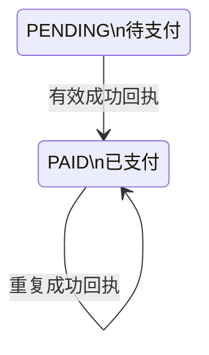
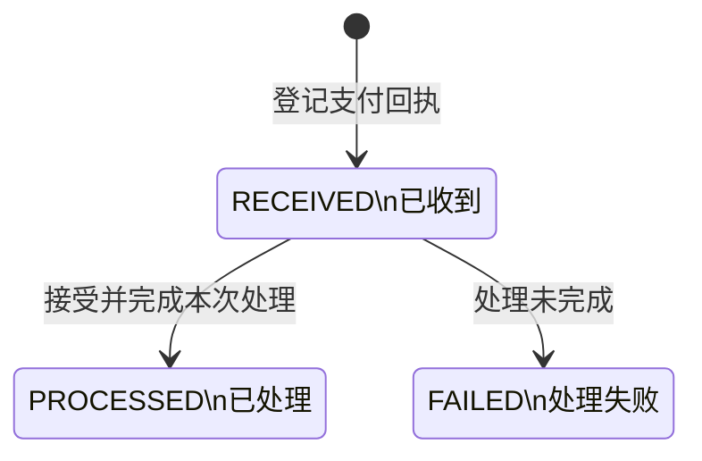
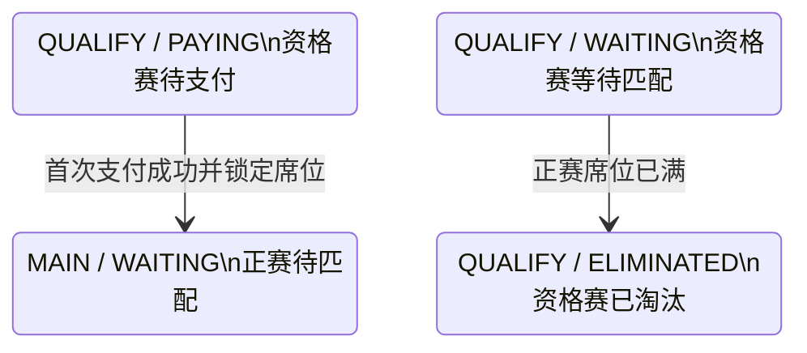

## 一句话价值

接收微信付款结果并推进支付单及关联赛事报名。

## 核心概念

- 支付单  针对一次业务费用建立的付款记录，独立经历待支付、已支付、已关闭或已失败。
- 待支付报名  资格赛晋级后尚未锁定正赛席位的赛事报名；它与支付单的待支付状态是两个对象。
- 支付回执  付款完成后异步到达的结果通知；收到并处理后才推进支付单和关联报名。
- 资格赛  自办赛事进入正赛前的筛选阶段，胜者可能先进入待支付。
- 正赛  自办赛事锁定席位后的淘汰阶段，胜者按轮次继续晋级。

## 业务对象

### 支付回执

| 业务名称 | 描述 | 取值说明 |
|---|---|---|
| 商户支付单号 | 标识本次付款对应的平台支付单。 | — |
| 渠道支付流水号 | 标识支付渠道完成的付款交易。 | — |
| 付款结果 | 支付渠道通知的本次交易状态。 | 支付成功：付款已经完成；其他结果：不按成功付款推进。 |
| 回执处理结果 | 表示平台是否接受并完成本次回执处理。 | 成功：回执已接受；失败：回执内容无效或处理未完成。 |

### 支付单

| 业务名称 | 描述 | 取值说明 |
|---|---|---|
| 支付单号 | 唯一标识本次业务费用的付款记录。 | — |
| 费用类型 | 表示本次付款对应的业务费用。 | 赛事报名费：资格赛晋级者锁定正赛席位所需费用。 |
| 关联业务 | 本支付单对应的赛事报名。 | — |
| 付款人 | 承担本次费用的用户。 | — |
| 金额 | 包含应收本金、手续费和实付总额。 | — |
| 支付状态 | 支付成功回执处理后变为已支付。 | 待支付：等待付款；已支付：付款已确认；已关闭：不再接受付款；已失败：付款处理失败。 |
| 渠道支付流水号 | 支付成功后记录的渠道交易标识。 | — |
| 支付时间 | 平台确认付款完成的时间。 | — |

### 赛事报名

| 业务名称 | 描述 | 取值说明 |
|---|---|---|
| 报名编号 | 唯一标识付款对应的赛事报名。 | — |
| 所属赛事 | 报名参加的自办赛事。 | — |
| 参赛阶段 | 支付推进后进入正赛阶段。 | 资格赛：进入正赛前的筛选阶段；正赛：锁定席位后的淘汰阶段。 |
| 报名状态 | 支付推进后由待支付变为等待匹配。 | 等待匹配：等待本轮比赛编排；冻结：暂时不能参与匹配；比赛中：已经进入比赛；待支付：等待锁定正赛席位；已淘汰：不再晋级；已退赛：退出赛事。 |
| 当前轮次 | 支付推进后进入赛事正赛首轮。 | 资格赛；六十四强；三十二强；十六强；八强；半决赛；决赛。 |

## 交付内容

类型: 变更类

成功后按主流程改写或撤销既有业务事实；允许变更的内容、前置状态、对外可见结果与原值留痕，以本节下列规则、业务对象及分支与异常为准。

| 当前状态 | 触发操作 | 新状态 | 前置条件 | 谁能触发 |
|---|---|---|---|---|
| 支付单 `PENDING` | 处理支付成功回执 | 支付单 `PAID`；关联报名 `MAIN / WAITING` | 回执通过微信支付真实性校验；`trade_state = SUCCESS`；订单号存在；支付单及关联赛事资料存在；报名状态为 `PAYING`；正赛尚有席位 | 微信支付 |
| 支付单 `PAID` | 再次处理同一成功结果 | 支付单仍为 `PAID`，不再次推进报名或席位 | 回执通过真实性校验且订单号对应已支付单 | 微信支付 |
| 回执留痕 `RECEIVED` | 本次处理完成 | `PROCESSED` | 回执被接受；可能已经推进付款，也可能是不需推进的事件或交易状态 | 本服务 |
| 回执留痕 `RECEIVED` | 本次处理失败 | `FAILED` | 支付单或关联业务无法完成推进 | 本服务 |
| 其他报名 `QUALIFY / WAITING` | 最后一个正赛席位被锁定 | `QUALIFY / ELIMINATED` | `current_filled_slots` 达到 `total_slots` | 本服务 |

支付成功后，如果资格赛所需比赛均已完成且 `current_filled_slots` 已达到 `total_slots`，赛事 `current_round` 同时推进到对应签位规模的正赛首轮。

## 主流程

触发源：微信支付在付款完成后发起 HTTP 回调；终态：支付单为 `PAID`，关联赛事报名为 `MAIN / WAITING`，支付回执为 `PROCESSED`。

1. 微信支付送达一份付款结果回执。
2. 确认回执确由微信支付签发并取得其中的交易事件、商户订单号、微信支付流水号和交易状态。
3. 为本次回执建立 `CALLBACK / RECEIVED` 留痕，保存取得的付款结果。
4. 对 `trade_state = SUCCESS` 且商户订单号非空的交易事件，找到对应待支付单，将其确认为 `PAID`，记录微信支付流水号和本地支付时间。
5. 支付单属于赛事报名费时，找到其关联赛事报名和自办赛事，为该报名锁定一个尚未占用的正赛席位。
6. 将关联赛事报名改为 `MAIN / WAITING`，记录报名支付时间，并把报名当前轮次设为该赛事的正赛首轮。
7. 按已完成的资格赛比赛数和已锁定正赛席位数重新判断赛事进度；条件齐备时将赛事当前轮次推进到正赛首轮。正赛席位已满时，将仍处于 `QUALIFY / WAITING` 的报名置为 `ELIMINATED`。
8. 将本次支付回执标为 `PROCESSED`，向微信支付确认处理成功。

## 分支与异常

| 什么情况 | 怎么处理 | 对外提示 | 做了一半的怎么收场 |
|---|---|---|---|
| 交易事件的回执签名无法确认、内容无法解密或微信支付配置不可用 | 拒绝本次回执 | 向微信支付返回 `FAIL / 处理失败` 和失败状态 | 不建立回执留痕，不改变支付单或赛事资料；等待微信支付重试。 |
| 回执留痕无法建立 | 本次处理失败 | 返回失败状态，由微信支付重试 | 不确认本次回执已处理；是否已有其他变化需按实际失败位置核对。 |
| `event_type` 不是以 `TRANSACTION` 开头的交易事件 | 不推进支付单，将回执标为 `PROCESSED` | 向微信支付返回 `SUCCESS / 成功` | 支付单和赛事资料保持不变。 |
| 交易状态不是 `SUCCESS` | 不推进支付单，将回执标为 `PROCESSED` | 向微信支付返回 `SUCCESS / 成功` | 支付单和赛事资料保持不变。 |
| 成功交易缺少 `out_trade_no` | 不推进支付单，将回执标为 `PROCESSED` | 向微信支付返回 `SUCCESS / 成功` | 无法关联支付单，赛事资料保持不变。 |
| `out_trade_no` 找不到支付单 | 将回执标为 `FAILED` | 向微信支付返回 `FAIL / 处理失败` 和失败状态 | 不推进赛事报名；等待重试或人工核对。 |
| 支付单已是 `PAID` | 接受为重复成功回执，不再次推进关联业务 | 向微信支付返回 `SUCCESS / 成功` | 支付单和赛事资料保持已有结果。 |
| 支付单为 `CLOSED` 或 `FAILED` | 拒绝从当前状态改为已支付，将回执标为 `FAILED` | 向微信支付返回 `FAIL / 处理失败` 和失败状态 | 支付单保持原状态；晚到付款的资金处理需另行核对。 |
| 关联赛事报名或自办赛事不存在 | 支付结果无法完成关联业务推进，将回执标为 `FAILED` | 向微信支付返回 `FAIL / 处理失败` 和失败状态 | 当前实现可能已经保留支付单的 `PAID` 结果，赛事资料不一定完成推进，需核对并补偿。 |
| 赛事正赛席位已经满员 | 不再增加席位，关联业务推进失败，将回执标为 `FAILED` | 向微信支付返回 `FAIL / 处理失败` 和失败状态 | 当前实现可能已经保留支付单的 `PAID` 结果，报名仍可能停在 `PAYING`，需核对付款去向。 |
| 关联赛事报名状态不是 `PAYING` | 不把报名推进到正赛，将回执标为 `FAILED` | 向微信支付返回 `FAIL / 处理失败` 和失败状态 | 当前实现可能已保留支付单 `PAID` 或席位数量变化，报名保持原状态，需核对并补偿。 |
| 赛事签位数不能对应受支持的正赛首轮 | 关联业务推进失败，将回执标为 `FAILED` | 向微信支付返回 `FAIL / 处理失败` 和失败状态 | 当前实现可能已保留此前的支付或席位变化，需人工核对。 |
| 支付单、回执留痕、报名、席位或赛事轮次任一资料保存失败 | 本次处理失败，将能更新的回执留痕标为 `FAILED` | 向微信支付返回 `FAIL / 处理失败` 和失败状态 | 当前实现没有可靠保证所有已发生变更均被撤回，需按支付单、报名和赛事逐项核对。 |

## 业务边界

- 本服务负责接受微信支付回执、对交易事件确认来源真实性、取得付款结果并留下回执记录，到首次成功付款的支付单和关联赛事报名完成推进并向微信支付应答为止。
- 本服务当前只接受 `WECHAT` 渠道，并只为 `TOURNAMENT_ENTRY_FEE` 推进赛事报名、正赛席位和赛事轮次。
- 本服务不创建支付单、不交付微信付款参数，也不向付款人同步返回支付结果；这些分别属于支付发起和支付状态同步。
- 本服务不主动查询微信支付，不处理回执漏处理补偿、超时支付关单、退款、撤销或对账差异。
- 本服务不向参赛者发送支付成功通知，也不创建或编排后续赛事比赛。
- 向微信支付返回 `SUCCESS` 表示本次回执已被接受；对未知事件或非成功交易返回 `SUCCESS` 并不表示支付单已付款。

## 遗留与待定

| 等级 | 待定的是什么 | 要谁来定 |
|---|---|---|
| P1 | 未知事件不会校验微信支付签名；未知事件、非 `SUCCESS` 交易以及缺少 `out_trade_no` 的成功交易都会被标为 `PROCESSED` 并向微信支付返回 `SUCCESS`，之后不会进入回执补偿。这些回执应当忽略、失败还是保留待核对，需支付产品、财务与安全负责人确定。 | 支付产品与财务负责人 |
| P1 | 当前只确认微信支付回执的签名和加密内容，不核对 `appid`、`mchid`、`amount.total`、付款身份或币种是否与本地支付单一致；支付成功的业务核对项需支付产品与财务负责人确定。 | 支付产品与财务负责人 |
| P1 | `payment_order.pay_time` 和 `rally_tournament_entry.paid_time` 都采用本地处理时刻，没有采用微信支付 `success_time`；财务记账和赛事席位锁定应以哪个时间为准，需支付产品与赛事产品负责人确定。 | 支付产品与财务负责人 |
| P1 | `trade_state = SUCCESS` 时没有要求 `transaction_id` 非空；缺少微信支付流水号是否允许把支付单置为 `PAID`，需财务负责人确定。 | 支付产品与财务负责人 |
| P1 | 首次付款判断发生在支付单写入之前，且支付单状态变更是否真正成功没有参与后续判断；并发到达的重复成功回执可能重复推进赛事席位，支付回执的并发唯一性规则需支付技术负责人确认。 | 支付产品与财务负责人 |
| P1 | 关联赛事推进失败后，当前处理会返回失败但不明确保证此前已经产生的支付单、席位或报名变更全部撤回；后续重复回执又可能因支付单已是 `PAID` 而跳过关联业务推进。支付与赛事报名的一致性、可重放条件和人工补偿口径需支付及赛事负责人共同确定。 | 支付产品与财务负责人 |
| P1 | 微信付款成功但正赛已经满员、报名不存在或报名状态不再是 `PAYING` 时，没有退款、候补或资金挂账规则；已付款但未取得席位的处置需赛事产品与财务负责人确定。 | 支付产品与财务负责人 |
| P1 | 推进报名时只要求 `status = PAYING`，不要求原 `stage = QUALIFY`；异常数据中的 `MAIN / PAYING` 也会被重写为正赛待匹配，阶段与状态的联合约束需赛事产品负责人确定。 | 支付产品与财务负责人 |
| P1 | 最后一个正赛席位锁定后，所有仍为 `QUALIFY / WAITING` 的报名都会直接变为 `ELIMINATED`；是否需要区分候补、已获资格但尚未支付或仍可继续资格赛的人群，需赛事产品负责人确定。 | 支付产品与财务负责人 |
| P1 | 回执解密后的完整微信支付交易内容保存在 `payment_log.raw_body`，目前没有看到保存期限、访问范围或敏感字段处理约定；留存规则需财务、合规与安全负责人确定。 | 支付产品与财务负责人 |
| P1 | 当前没有支付退款业务；付款后退赛、重复扣款、超卖或晚到付款产生的退款责任与处理时限需支付产品和财务负责人确定。 | 支付产品与财务负责人 |
