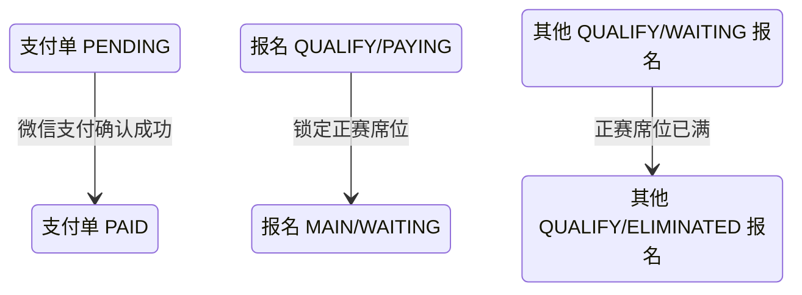

## 一句话价值

让付款人核实付款结果并取得已推进的最新支付状态。

## 核心概念

- 支付单  针对一次业务费用建立的付款记录，独立经历待支付、已支付、已关闭或已失败。
- 待支付报名  资格赛晋级后尚未锁定正赛席位的赛事报名；它与支付单的待支付状态是两个对象。
- 支付回执  付款完成后异步到达的结果通知；收到并处理后才推进支付单和关联报名。本服务不处理回执，而是由付款人主动核实。
- 正赛席位  赛事报名费核实已付后占用的正赛参赛名额。

## 业务对象

### 支付单

| 业务名称 | 描述 | 取值说明 |
|---|---|---|
| 支付单号 | 唯一标识本次核实的付款记录。 | — |
| 关联业务 | 本支付单对应的赛事报名。 | — |
| 付款人 | 发起状态核实并承担费用的用户。 | — |
| 金额 | 包含应收本金、手续费和实付总额。 | — |
| 支付状态 | 交付核实并推进后的最新状态。 | 待支付：尚未确认付款；已支付：付款已确认；已关闭：支付单已关闭或支付失败。 |
| 渠道支付流水号 | 核实已付后记录的渠道交易标识。 | — |
| 支付时间 | 平台确认付款完成的时间。 | — |

### 赛事报名

| 业务名称 | 描述 | 取值说明 |
|---|---|---|
| 报名编号 | 唯一标识付款对应的赛事报名。 | — |
| 所属赛事 | 报名参加的自办赛事。 | — |
| 参赛阶段 | 核实已付并推进成功后进入正赛阶段。 | 资格赛：进入正赛前的筛选阶段；正赛：锁定席位后的淘汰阶段。 |
| 报名状态 | 核实已付并推进成功后由待支付变为等待匹配。 | 等待匹配：等待本轮比赛编排；冻结：暂时不能参与匹配；比赛中：已经进入比赛；待支付：等待锁定正赛席位；已淘汰：不再晋级；已退赛：退出赛事。 |
| 当前轮次 | 核实已付并推进成功后进入赛事正赛首轮。 | 资格赛；六十四强；三十二强；十六强；八强；半决赛；决赛。 |

## 交付内容

类型: 变更类

成功后按主流程改写或撤销既有业务事实；允许变更的内容、前置状态、对外可见结果与原值留痕，以本节下列规则、业务对象及分支与异常为准。

| 当前状态 | 触发操作 | 新状态 | 前置条件 | 谁能触发 |
|---|---|---|---|---|
| 支付单 `PENDING` | 主动核实支付结果 | 支付单 `PAID` | 微信支付返回 `SUCCESS`，且支付单属于当前付款人 | 付款人 |
| 报名 `QUALIFY/PAYING` | 推进已付报名 | 报名 `MAIN/WAITING`，轮次变为正赛首轮 | 支付单首次变为 `PAID`，赛事仍有正赛席位 | 付款人，由支付核实结果带动 |
| 其他报名 `QUALIFY/WAITING` | 清理未锁位资格赛报名 | 报名 `QUALIFY/ELIMINATED` | 本次付款后正赛席位达到总签位数 | 付款人，由支付核实结果带动 |

## 主流程

触发源：付款人 HTTP 请求；终态：返回最新支付摘要，核实已付时同步锁定正赛席位并推进报名。

1. 付款人提交支付单号，服务取得支付单并确认其付款人身份。
2. 若支付单仍为 `PENDING`，以其商户订单号向微信支付核实付款结果。
3. 微信支付返回 `SUCCESS` 时，支付单变为 `PAID`，记录微信支付流水号和付款确认时间。
4. 赛事报名费支付单首次变为 `PAID` 后，为对应自办赛事锁定一个正赛席位。
5. 对应报名从资格赛 `PAYING` 推进为正赛 `WAITING`，写入席位锁定时间，并按总签位数进入正赛首轮。
6. 根据各轮已完成比赛数和正赛席位数推进赛事当前轮次；席位已满时，将仍在资格赛等待匹配的报名置为 `ELIMINATED`。
7. 返回支付单号、关联业务、付款人、各项金额及对外支付状态组成的最新摘要。

## 分支与异常

| 什么情况 | 怎么处理 | 对外提示 | 做了一半的怎么收场 |
|---|---|---|---|
| 支付单已是 `PAID` | 不再查询微信支付，直接返回 `PAID` 摘要 | 无 | 不重复推进关联报名 |
| 支付单为 `CLOSED` 或 `FAILED` | 不再查询微信支付，统一返回 `CLOSED` 摘要 | 无 | 支付单和关联报名均不改变 |
| 微信支付未返回 `SUCCESS` | 支付单保持 `PENDING`，返回 `UNPAID` 摘要 | 无 | 不推进赛事报名与席位 |
| 微信支付查单失败 | 当前按未支付处理，支付单保持 `PENDING` | 无，返回 `UNPAID` 摘要 | 不推进赛事报名与席位 |
| 支付单不存在 | 拒绝同步 | 支付单不存在 | 无变更 |
| 当前用户不是付款人 | 拒绝同步 | 无权操作该支付单 | 无变更 |
| 支付渠道不可用或配置不完整 | 无法核实付款结果 | 暂不支持该支付渠道 | 支付单和关联报名均不改变 |
| 微信支付已确认付款，但关联报名或赛事不存在 | 拒绝本次本地推进 | 报名记录不存在或赛事不存在 | 本次本地状态变更不保留；微信支付的付款事实仍存在 |
| 微信支付已确认付款，但报名不再是 `QUALIFY/PAYING` | 拒绝本次本地推进 | 报名状态不允许该操作 | 本次本地状态变更不保留；微信支付的付款事实仍存在 |
| 微信支付已确认付款，但正赛席位已满 | 拒绝本次本地推进 | 正赛席位已满，暂无法支付 | 本次本地状态变更不保留；微信支付的付款事实仍存在 |

## 业务边界

本服务负责由付款人主动核实一笔属于本人的支付单，返回最新支付摘要；当微信支付确认赛事报名费已付时，还负责在同一次调用中完成支付单、赛事报名、正赛席位及赛事轮次的推进。它不负责创建支付单、拉起付款、接收异步支付回执、扫描漏处理回执、关闭超时支付单、退款或对账。

## 遗留与待定

| 等级 | 待定的是什么 | 要谁来定 |
|---|---|---|
| P1 | 微信支付查单失败与真实未支付当前都对外返回 `UNPAID`，是否需要向付款人区分“暂时无法核实”由产品与支付业务负责人确定。 | 支付产品与财务负责人 |
| P1 | `CLOSED`、`FAILED` 支付单不会再次查询微信支付，发生迟到付款时如何核对和处置由支付业务负责人确定。 | 支付产品与财务负责人 |
| P1 | 已是 `PAID` 的支付单不会重新推进关联报名；支付单已付但报名或席位未推进时的修复入口与责任归属待支付及赛事业务负责人确定。 | 支付产品与财务负责人 |
| P1 | `pay_time` 当前记录本服务确认付款的时间，不是微信支付实际完成付款的时间；业务统计应采用哪一种时间口径待支付业务负责人确定。 | 支付产品与财务负责人 |
| P1 | `FAILED` 状态已经定义，但现有入口中未发现将支付单置为该状态的业务规则，其适用场景由支付业务负责人确定。 | 支付产品与财务负责人 |
