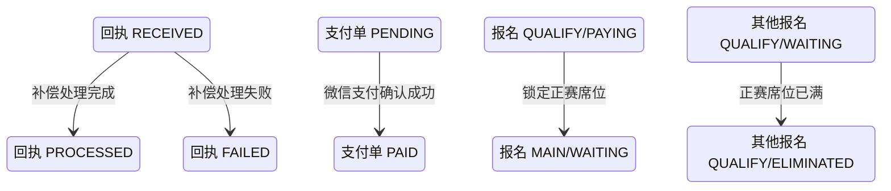

## 一句话价值

重查长期未处理回执并补齐支付结果推进。

## 核心概念

- 支付单  针对一次业务费用建立的付款记录，独立经历待支付、已支付、已关闭或已失败。
- 支付回执  付款完成后异步到达的结果通知；收到并处理后才推进支付单和关联报名。
- 待支付报名  资格赛晋级后尚未锁定正赛席位的赛事报名；它与支付单的待支付状态是两个对象。
- 回执记录  对一次支付回执的接收内容、关联支付单和处理结果所作的留痕；本服务只补偿长期停在待处理状态的记录。
- 正赛席位  赛事报名费确认已付后占用的正赛参赛名额。

## 业务对象

### 回执记录

| 业务名称 | 描述 | 取值说明 |
|---|---|---|
| 回执编号 | 唯一标识一条支付回执处理留痕。 | — |
| 关联支付单 | 本回执对应的支付单。 | — |
| 回执类型 | 表示本记录所留痕的支付环节。 | 收款建单：记录收款创建；支付下单：记录支付发起；支付回执：记录异步付款结果。 |
| 处理状态 | 补偿完成后记录本次处理结果。 | 待处理：回执尚未完成处理；已处理：本次处理已经结束；处理失败：本次处理未能完成。 |
| 失败原因 | 补偿处理失败时记录原因。 | — |

### 支付单

| 业务名称 | 描述 | 取值说明 |
|---|---|---|
| 支付单号 | 唯一标识补偿核实的付款记录。 | — |
| 关联业务 | 本支付单对应的赛事报名。 | — |
| 支付状态 | 补偿确认付款后变为已支付。 | 待支付：等待付款；已支付：付款已确认；已关闭：不再接受付款；已失败：付款处理失败。 |
| 渠道支付流水号 | 补偿确认付款后记录的渠道交易标识。 | — |
| 支付时间 | 平台补偿确认付款完成的时间。 | — |

### 赛事报名

| 业务名称 | 描述 | 取值说明 |
|---|---|---|
| 报名编号 | 唯一标识付款对应的赛事报名。 | — |
| 所属赛事 | 报名参加的自办赛事。 | — |
| 参赛阶段 | 补偿推进后进入正赛阶段。 | 资格赛：进入正赛前的筛选阶段；正赛：锁定席位后的淘汰阶段。 |
| 报名状态 | 补偿推进后由待支付变为等待匹配。 | 等待匹配：等待本轮比赛编排；冻结：暂时不能参与匹配；比赛中：已经进入比赛；待支付：等待锁定正赛席位；已淘汰：不再晋级；已退赛：退出赛事。 |
| 当前轮次 | 补偿推进后进入赛事正赛首轮。 | 资格赛；六十四强；三十二强；十六强；八强；半决赛；决赛。 |

## 状态机

| 当前状态 | 触发操作 | 新状态 | 前置条件 | 谁能触发 |
|---|---|---|---|---|
| 回执记录 `RECEIVED` | 补偿扫描 | `PROCESSED` | 类型为 `CALLBACK`、创建已超过补偿阈值，且本次处理未抛出异常 | 定时任务 |
| 回执记录 `RECEIVED` | 补偿扫描 | `FAILED` | 关联支付单不存在，或本次处理出现异常 | 定时任务 |
| 支付单 `PENDING` | 核实支付结果 | `PAID` | 微信支付返回 `SUCCESS` | 定时任务，由查单结果带动 |
| 报名 `QUALIFY/PAYING` | 推进已付报名 | `MAIN/WAITING`，轮次变为正赛首轮 | 赛事报名费支付单首次变为 `PAID`，赛事仍有正赛席位 | 定时任务，由支付结果带动 |
| 其他报名 `QUALIFY/WAITING` | 清理未锁位报名 | `QUALIFY/ELIMINATED` | 本次付款后正赛席位达到总签位数 | 定时任务，由支付结果带动 |

## 主流程

触发源：每十分钟定时扫描；终态：逾期回执记录完成或失败，已付款业务补齐支付及赛事推进。

1. 找出类型为 `CALLBACK`、状态为 `RECEIVED`，且已收到超过五分钟的支付回执记录。
2. 对关联类型为 `ORDER` 且关联单号有效的记录，取得对应支付单。
3. 支付单仍为 `PENDING` 时，以支付单号向微信支付核实付款结果。
4. 微信支付返回 `SUCCESS` 时，支付单变为 `PAID`，记录微信支付流水号和付款确认时间。
5. 赛事报名费支付单首次变为 `PAID` 后，为对应自办赛事锁定一个正赛席位。
6. 对应报名从资格赛 `PAYING` 推进为正赛 `WAITING`，写入席位锁定时间，并按总签位数进入正赛首轮。
7. 根据各轮已完成比赛数和正赛席位数推进赛事当前轮次；席位已满时，将仍在资格赛等待匹配的报名置为 `ELIMINATED`。
8. 本次未发生处理异常时，将回执记录置为 `PROCESSED`。

## 分支与异常

| 什么情况 | 怎么处理 | 对外提示 | 做了一半的怎么收场 |
|---|---|---|---|
| `ref_type` 不是 `ORDER`，或 `ref_id` 为空 | 不核实支付单，将回执记录置为 `PROCESSED` | 无；定时任务无直接消费者 | 不改变支付单及关联业务 |
| 找不到关联支付单 | 将回执记录置为 `FAILED`，备注 `payment_order_not_found` | 无；定时任务无直接消费者 | 不改变关联业务 |
| 支付单已为 `PAID`、`CLOSED` 或 `FAILED` | 不查询微信支付，将回执记录置为 `PROCESSED` | 无；定时任务无直接消费者 | 不改变支付单及关联业务 |
| 微信支付未返回 `SUCCESS` | 支付单保持 `PENDING`，将回执记录置为 `PROCESSED` | 无；定时任务无直接消费者 | 不推进赛事报名与席位 |
| 微信支付查单返回业务错误 | 当前按未支付处理，支付单保持 `PENDING`，将回执记录置为 `PROCESSED` | 无；定时任务无直接消费者 | 不推进赛事报名与席位 |
| 支付渠道不可用、配置不完整或核实过程异常 | 将回执记录置为 `FAILED` 并记录失败原因 | 无；定时任务无直接消费者 | 已发生的业务变更是否完整保留取决于异常出现位置，现无统一补齐入口 |
| 微信支付已确认付款，但关联报名或赛事不存在 | 本次补偿失败，将回执记录置为 `FAILED` | 无；定时任务无直接消费者 | 支付单可能已变为 `PAID`，关联赛事未推进 |
| 微信支付已确认付款，但报名不再是 `QUALIFY/PAYING` | 本次补偿失败，将回执记录置为 `FAILED` | 无；定时任务无直接消费者 | 支付单可能已变为 `PAID`，报名和席位的已发生变更需人工核对 |
| 微信支付已确认付款，但正赛席位已满 | 本次补偿失败，将回执记录置为 `FAILED` | 无；定时任务无直接消费者 | 支付单可能已变为 `PAID`，未能锁定正赛席位 |

## 业务边界

本服务负责识别长期停在待处理状态的支付回执，以微信支付查单结果补记支付单已付，并在同一次补偿中推进赛事报名、正赛席位及赛事轮次，最后结束该回执记录的处理。它不负责接收或验证支付回执、创建支付单、拉起付款、关闭超时支付单、退款、支付对账，也不修复已经处于 `FAILED` 或 `PROCESSED` 的回执记录。

## 遗留与待定

- 回执记录收到五分钟后才进入补偿的阈值写死在代码中，是否适合微信支付回执时效及能否配置，待支付业务负责人确定。
- 单次扫描没有数量上限和明确顺序，会一次读取全部符合条件的回执记录；批量规模、处理顺序及运行时限待运维与支付业务负责人确定。
- 微信支付未返回 `SUCCESS` 时，回执记录仍变为 `PROCESSED`，之后不会由本服务再次核实；是否应保留待处理、区分真实未付与暂时无法核实，待支付业务负责人确定。
- 微信支付查单的部分业务错误当前被视为未支付并将回执记为 `PROCESSED`，可能失去再次补偿机会；错误分类和重查规则待支付业务负责人确定。
- 回执记录一旦置为 `FAILED` 就不再进入后续扫描，失败后的自动重查次数、间隔及人工修复入口均未定义。
- 支付单变为 `PAID` 后，赛事报名或席位推进若失败，回执会变为 `FAILED`，而后续扫描不会补齐；跨对象部分成功的核对与修复规则待支付及赛事业务负责人确定。
- `pay_time` 记录本服务确认付款的时间，不是微信支付实际完成付款的时间；业务统计采用哪一种时间口径待支付业务负责人确定。
- 默认每十分钟执行一次，但执行频率可由运行配置覆盖；产品期望的补偿时效尚未形成明确承诺。
