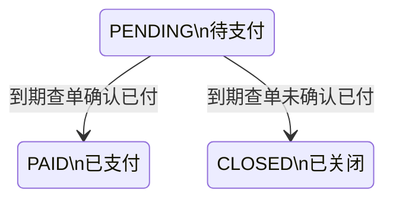
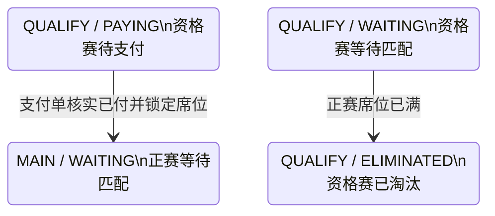

## 一句话价值

核实到期支付单并补记已付或关闭未付单。

## 核心概念

- 支付单  针对一次业务费用建立的付款记录，独立经历待支付、已支付、已关闭或已失败。
- 待支付报名  资格赛晋级后尚未锁定正赛席位的赛事报名；它与支付单的待支付状态是两个对象。
- 正赛席位  赛事报名费确认已付后占用的正赛参赛名额。

## 业务对象

### 支付单

| 业务名称 | 描述 | 取值说明 |
|---|---|---|
| 支付单号 | 唯一标识本次到期核实的付款记录。 | — |
| 关联业务 | 本支付单对应的赛事报名。 | — |
| 付款人 | 承担本次费用的用户。 | — |
| 到期时间 | 支付单超过该时刻后进入本服务。 | — |
| 支付状态 | 核实已付时变为已支付，未确认付款时变为已关闭。 | 待支付：等待付款；已支付：付款已确认；已关闭：不再接受付款；已失败：付款处理失败。 |
| 渠道支付流水号 | 核实已付后记录的渠道交易标识。 | — |
| 支付时间 | 平台确认付款完成的时间。 | — |

### 赛事报名

| 业务名称 | 描述 | 取值说明 |
|---|---|---|
| 报名编号 | 唯一标识付款对应的赛事报名。 | — |
| 所属赛事 | 报名参加的自办赛事。 | — |
| 参赛阶段 | 到期核实已付并推进成功后进入正赛阶段。 | 资格赛：进入正赛前的筛选阶段；正赛：锁定席位后的淘汰阶段。 |
| 报名状态 | 到期核实已付并推进成功后由待支付变为等待匹配。 | 等待匹配：等待本轮比赛编排；冻结：暂时不能参与匹配；比赛中：已经进入比赛；待支付：等待锁定正赛席位；已淘汰：不再晋级；已退赛：退出赛事。 |
| 当前轮次 | 到期核实已付并推进成功后进入赛事正赛首轮。 | 资格赛；六十四强；三十二强；十六强；八强；半决赛；决赛。 |

## 交付内容

类型: 批处理类

一次处理主流程界定的一批业务对象；处理范围、成功失败统计、部分成功口径与失败对象的收场方式，以本节下列规则及分支与异常为准。

| 当前状态 | 触发操作 | 新状态 | 前置条件 | 谁能触发 |
|---|---|---|---|---|
| 支付单 `PENDING` | 到期查单 | 支付单 `PAID`；关联报名 `MAIN / WAITING` | `expire_time` 不为空且早于扫描时刻；微信支付返回 `SUCCESS`；支付单、报名和赛事存在；报名状态为 `PAYING`；赛事仍有正赛席位 | 定时任务，由微信支付查单结果带动 |
| 支付单 `PENDING` | 到期查单 | 支付单 `CLOSED` | `expire_time` 不为空且早于扫描时刻；微信支付未返回 `SUCCESS` | 定时任务 |
| 其他报名 `QUALIFY / WAITING` | 最后一个正赛席位被锁定 | `QUALIFY / ELIMINATED` | `current_filled_slots` 达到 `total_slots` | 定时任务，由已付结果带动 |

支付成功后，如果资格赛所需比赛均已完成且 `current_filled_slots` 已达到 `total_slots`，赛事 `current_round` 同时推进到对应签位规模的正赛首轮。

## 主流程

触发源：每五分钟定时扫描；终态：到期支付单核实为 `PAID` 并推进关联报名，或关闭为 `CLOSED`。

1. 找出 `status = PENDING`、`expire_time` 不为空且早于当前时刻的全部支付单。
2. 逐笔以支付单号向微信支付核实交易状态。
3. 微信支付返回 `SUCCESS` 时，将支付单确认为 `PAID`，记录微信支付流水号和本地付款确认时间。
4. 支付单属于赛事报名费时，为关联报名锁定一个正赛席位，将报名从 `QUALIFY / PAYING` 推进为 `MAIN / WAITING`，记录席位锁定时间，并进入该赛事的正赛首轮。
5. 根据已完成的赛事比赛和已锁定正赛席位重新判断赛事轮次；正赛席位已满时，将仍处于 `QUALIFY / WAITING` 的报名置为 `ELIMINATED`。
6. 微信支付未返回 `SUCCESS` 时，将支付单关闭为 `CLOSED`，清空其活跃支付关系，并要求微信支付关闭对应商户订单；关联赛事报名保持 `QUALIFY / PAYING`。

## 分支与异常

| 什么情况 | 怎么处理 | 对外提示 | 做了一半的怎么收场 |
|---|---|---|---|
| 没有到期且仍待支付的支付单 | 结束本次扫描 | 无；定时任务无直接消费者 | 不改变支付单或关联业务。 |
| 支付渠道不受支持、微信支付配置不完整，或核实过程抛出异常 | 本笔处理失败，继续处理其他到期支付单 | 无；定时任务无直接消费者 | 本笔支付单通常保持 `PENDING`，留待后续扫描再次处理；若异常发生在业务推进途中，需按实际已发生变更核对。 |
| 微信支付查单返回业务错误 | 当前视为未确认付款，关闭本地支付单并尝试关闭微信支付订单 | 无；定时任务无直接消费者 | 支付单变为 `CLOSED`，关联赛事报名保持 `QUALIFY / PAYING`。 |
| 微信支付返回 `REFUND`、`NOTPAY`、`CLOSED`、`REVOKED`、`USERPAYING`、`PAYERROR` 或 `ACCEPT` | 视为未确认付款，关闭本地支付单并尝试关闭微信支付订单 | 无；定时任务无直接消费者 | 支付单变为 `CLOSED`，关联赛事报名保持 `QUALIFY / PAYING`。 |
| 本地支付单已被其他处理改为非 `PENDING` | 本次状态变更可能不生效 | 无；定时任务无直接消费者 | 当前实现仍可能继续推进赛事报名或请求微信支付关单，需核对支付单、报名和渠道订单的最终状态。 |
| 微信支付确认已付，但关联赛事报名或自办赛事不存在 | 本笔处理失败 | 无；定时任务无直接消费者 | 支付单可能已变为 `PAID`，赛事资料未完成推进，且该支付单不再进入本服务。 |
| 微信支付确认已付，但报名不再是 `PAYING`、正赛已满或赛事签位数不受支持 | 本笔处理失败 | 无；定时任务无直接消费者 | 支付单可能已变为 `PAID`，席位、报名和赛事轮次的已发生变更需逐项核对。 |
| 微信支付关单失败 | 保留本地关单结果，本次扫描继续 | 无；定时任务无直接消费者 | 支付单保持 `CLOSED`，不会再被本服务选中；微信支付订单可能仍可付款。 |
| 单笔资料读取或保存失败 | 本笔处理失败，继续处理其他到期支付单 | 无；定时任务无直接消费者 | 已发生变更没有统一撤回或补齐结果，需按支付单与赛事资料逐项核对。 |

## 业务边界

- 本服务负责核实到期且仍待支付的支付单，到补记真实已付款结果并推进关联赛事报名，或关闭未确认付款的支付单及对应微信支付订单为止。
- 本服务当前只处理 `WECHAT` 渠道；已付业务推进当前只覆盖 `TOURNAMENT_ENTRY_FEE`，包括赛事报名、正赛席位及赛事轮次。
- 本服务不创建支付单、不交付付款参数、不接收或验证支付回执，也不处理退款、资金对账或付款人通知。
- `expire_time` 为空、尚未到期以及已为 `PAID`、`CLOSED` 或 `FAILED` 的支付单不属于本服务。
- 关闭支付单不会淘汰或退赛关联赛事报名；报名保持待支付，可由后续支付发起建立新的支付单。

## 遗留与待定

| 等级 | 待定的是什么 | 要谁来定 |
|---|---|---|
| P1 | 生产配置中本定时任务当前默认关闭；何时启用以及停用期间的到期支付单如何补处理，需支付业务与运维负责人确定。 | 支付产品与财务负责人 |
| P1 | 默认每五分钟扫描一次，但执行频率可由运行配置覆盖；超时关单应承诺的处理时效尚未明确，需支付业务负责人确定。 | 支付产品与财务负责人 |
| P1 | 支付单超时时间来自建单时的付款超时配置，默认三十分钟，配置为零时永不超时；不同业务是否共用同一阈值以及允许的配置范围，需支付业务负责人确定。 | 支付产品与财务负责人 |
| P1 | 单次扫描没有数量上限、分页或明确顺序，会一次读取全部到期支付单；批量规模、处理顺序和单次运行时限需支付业务与运维负责人确定。 | 支付产品与财务负责人 |
| P1 | 微信支付查单业务错误当前被视为未付款并直接关单，未区分暂时无法核实与真实未付；错误分类和重查规则需支付业务负责人确定。 | 支付产品与财务负责人 |
| P1 | `USERPAYING` 和 `ACCEPT` 仍可能表示付款正在进行或等待扣款，当前也会直接关单；是否需要宽限期或再次核实，需支付业务与财务负责人确定。 | 支付产品与财务负责人 |
| P1 | 微信支付关单失败不会改变本地 `CLOSED`，且该支付单不再进入后续扫描；渠道关单重试、晚到付款核对及退款规则需支付业务与财务负责人确定。 | 支付产品与财务负责人 |
| P1 | 微信支付确认已付后，支付单状态变更是否真正成功没有参与后续判断；并发的回执、主动同步或补偿可能重复推进赛事席位，需支付与赛事负责人确定并发判定和补偿口径。 | 支付产品与财务负责人 |
| P1 | 支付单已变为 `PAID` 后，关联报名或席位推进失败时不会再被本服务选中；跨对象部分成功的自动修复入口与人工核对规则需支付及赛事负责人共同确定。 | 支付产品与财务负责人 |
| P1 | `payment_order.pay_time` 和 `rally_tournament_entry.paid_time` 采用本地处理时刻，不是微信支付实际完成付款的时间；财务记账与席位锁定采用哪一种时间口径，需支付业务、财务和赛事负责人确定。 | 支付产品与财务负责人 |
| P1 | 当前没有支付单超时、关单或补记成功后的用户通知；是否需要通知付款人及通知内容，需支付产品负责人确定。 | 支付产品与财务负责人 |
