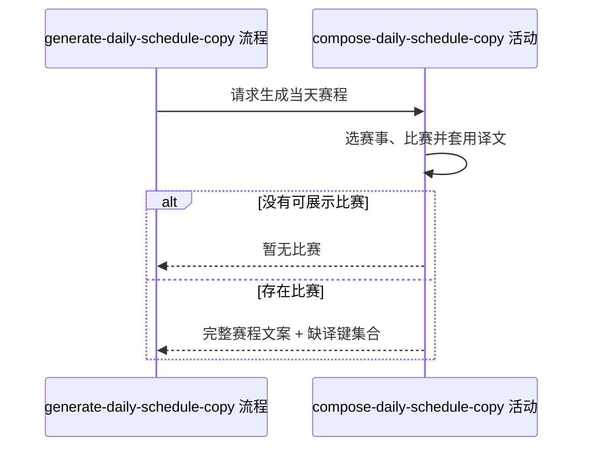

## 概要

生成当天附近职业赛事的完整中文赛程文案。

## 时序图

## 触发条件

内容后台请求生成每日赛程、入口鉴权与参数处理完成后执行。活动以运行时自然日为基准，不接收指定日期或语言；每次均按当时数据重新生成。

## 活动契约

### 入参

无

### 成功返回

| 字段 | 类型 | 必填 | 说明 |
|---|---|---|---|
| `copy` | 纯文本 | 是 | 完整赛程文案；无可展示比赛时固定为“暂无比赛” |
| `missingTranslationKeys` | 翻译键集合 | 是 | 本次遇到的非空缺译赛事名、球场名和球员名，可为空集合 |

## 异常分支

无

## 领域依赖

无

## 业务动作

A1 以运行日为中心选取日期相邻且展示级别合格的赛事，按城市与重叠日期合组并排序
A2 为每组取得未结束比赛及其日期上的已结束比赛，过滤双方均未确定的空签
A3 关联签表、报名和球员资料，按日期、球场与比赛顺序组织展示结构
A4 为赛事名、球场名和球员名套用已有简体中文译文，缺译时保留原文并收集翻译键
A5 生成赛事标题、赛程摘要、分日球场段与比赛行，连同缺译键集合返回

## 详细流程

1. `A1` 以运行日 `D` 查询开始不晚于 `D+1`、结束不早于 `D-1` 的赛事；数字类别只保留不小于 250，空或非数字类别保留。
2. `A1` 把日期区间重叠且城市忽略大小写相同的赛事传递合并；按 `GS、1000、500、250、其他`，再按类别、开始、结束和赛事编号排序。
3. `A2` 先取 `matchDate` 非空且状态不是 `FINISHED` 的比赛，再补这些比赛日期上的 `FINISHED` 比赛；双方编号都为空时跳过。
4. `A3` 先按计划时间升序组成日期组；球场内有胜方的比赛优先，再按计划时间排序，球场组沿用编号场地和最小种子等展示顺序。
5. `A4` 目标语言固定为简体中文；只替换已有非空译文，缺译键按实体类型、原文、语言去重并交给后续登记活动。
6. `A5` 没有赛事、没有日期组或过滤后没有展示赛事时立即返回“暂无比赛”，缺译集合为空，不再生成其余段落。
7. 本活动全程只读，无事务；重复执行按最新职业赛事、比赛和翻译资料重新生成。

## 边界情况

- 只有一方未确定：保留比赛，缺失一方显示“待定”；双方都未确定才跳过。
- 比赛日期为空且未结束：查询层不选入，不形成无日期分组。
- 球场名为空：仍形成空名称球场组，比赛继续展示。
- 日期文本无法解析：原样展示日期键；国家代码无法转为两位旗帜码时不显示旗帜。
- 逐盘比分或状态标签为空：省略对应片段，不影响比赛行。

## 实现提示

保持一次批量读取赛事组、比赛、球员、种子和译文，避免按比赛逐条查询；文案构造使用单一缓冲区并保持现有排序稳定。
