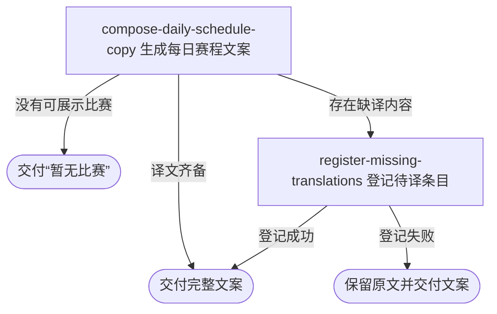

## 概要

为内容人员生成当天职业赛事与比赛汇总文案。

## 触发

内容人员通过内容工具发起，调用方是内容后台。一次请求读取服务运行当天附近的职业赛事与可展示比赛并同步返回一份文案；请求不携带日期或语言。重复请求会按请求时的当前数据重新生成，不复用之前的文案。

## 接口契约

### 请求参数

无

### 成功响应

| 字段 | 类型 | 说明 |
|---|---|---|
| 文案 | 纯文本 | 简体中文优先的赛事标题、日期赛程摘要、场地分组与比赛行；没有可展示比赛时为“暂无比赛” |

## 业务活动

- compose-daily-schedule-copy  选取当天附近的可展示赛事与比赛，套用已有译文并生成完整赛程文案
- register-missing-translations  为本次遇到且尚无译文的赛事名、场地名和球员名登记待译条目

## 流程图

## 详细流程

1. 以服务运行当天为基准，选出当前日期附近且符合展示级别的职业赛事，并把日期范围重叠、举办城市相同的赛事归为一组。
2. 为每个赛事组取得未结束比赛，以及同一比赛日期上的已结束比赛；没有明确对阵双方的空签比赛不展示。
3. 没有符合条件的赛事或所有赛事都没有可展示比赛时，直接交付“暂无比赛”。
4. 取得比赛双方资料、种子、国家或地区、排期、状态和逐盘比分，并按赛事组、比赛日期、场地及比赛顺序完成展示排序。
5. 为赛事名、场地名和球员名套用已有简体中文译文；没有译文时保留原文，并登记为待译内容。待译登记失败不阻断文案交付。
6. 依次生成赛事标题、ATP/WTA 日期摘要、赛事日期段、场地段和比赛行，同步交付完整纯文本文案。

## 异常分支

| 对外失败码 | 触发条件 | 由哪个活动报出 | 补偿动作或超时处理 | 对外提示 |
|---|---|---|---|---|
| 无 | 当前日期附近没有符合条件的赛事，或所有赛事都没有可展示比赛 | compose-daily-schedule-copy | 不写职业赛事与比赛数据，按成功结果收场 | 暂无比赛 |
| 无 | 单场比赛双方都未确定 | compose-daily-schedule-copy | 跳过该场，继续生成其他比赛 | 无 |
| 无 | 翻译条目登记失败 | register-missing-translations | 保留原文并继续交付文案，后续可再次生成触发登记 | 无 |

## 技术线索

- 职业比赛状态字段 `tour_match.status`
- 外部数据口径：ATP、WTA 职业赛事
