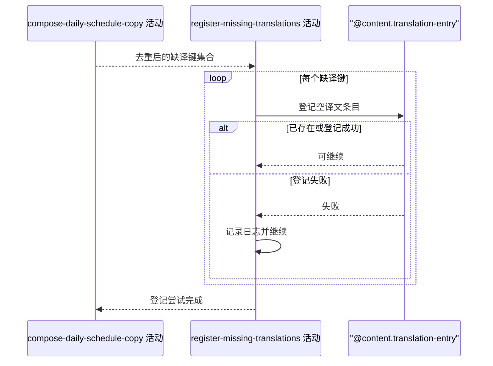

## 概要

尽力登记本次文案遇到的缺失中文译文。

## 时序图

## 触发条件

赛程文案已完成数据组织并发现至少一个非空缺译键时执行。文案已选择原文作为展示回退，登记结果不得改变本次文案内容。

## 活动契约

### 入参

| 字段 | 类型 | 必填 | 约束 |
|---|---|---|---|
| `missingTranslationKeys` | 翻译键集合 | 是 | 可为空；每项含实体类型、非空原文和目标语言 |

### 成功返回

无

## 异常分支

无

## 领域依赖

### @content.translation-entry

- 输入：实体类型 `TOURNAMENT`、`COURT` 或 `PLAYER`，非空原文，目标语言 `ZH_CN`，以及登记空译文的意图
- 输出：已有相同实体类型、原文和语言时保持唯一记录；不存在时形成一条译文为空的待译条目。异常形态：单条登记失败时返回失败，由活动记录后继续下一项

## 业务动作

A1 去除空键并按实体类型、原文和目标语言去重
A2 逐项请求登记待译条目，已有相同条目时按幂等成功处理
A3 单项登记失败时记录失败并继续，不向上游报错

## 详细流程

1. `A1` 只接受赛事名、球场名和球员名三种实体类型，目标语言固定为 `ZH_CN`；空白原文不进入登记。
2. `A2` 每个键独立登记，数据库唯一性由实体类型、原文和语言共同保证；新记录的译文为空。
3. `A3` 不开启覆盖整批的事务，前面已经登记成功的条目不因后续失败回滚。
4. 入参为空集合时直接成功结束；本活动不返回登记数量和失败明细。

## 边界情况

- 同一名称同时作为不同实体类型出现：分别登记，互不合并。
- 同一原文已有非空译文：不新建记录，也不覆盖译文。
- 并发登记同一键触发唯一约束：视为本项已存在，记录冲突但不影响文案。
- 单条原文超过存储上限或数据库不可用：该项失败并记录，其他项继续。

## 实现提示

复用统一翻译查询与缓存键；登记采用逐项容错，避免一项唯一键冲突使整批缺译登记失败。
