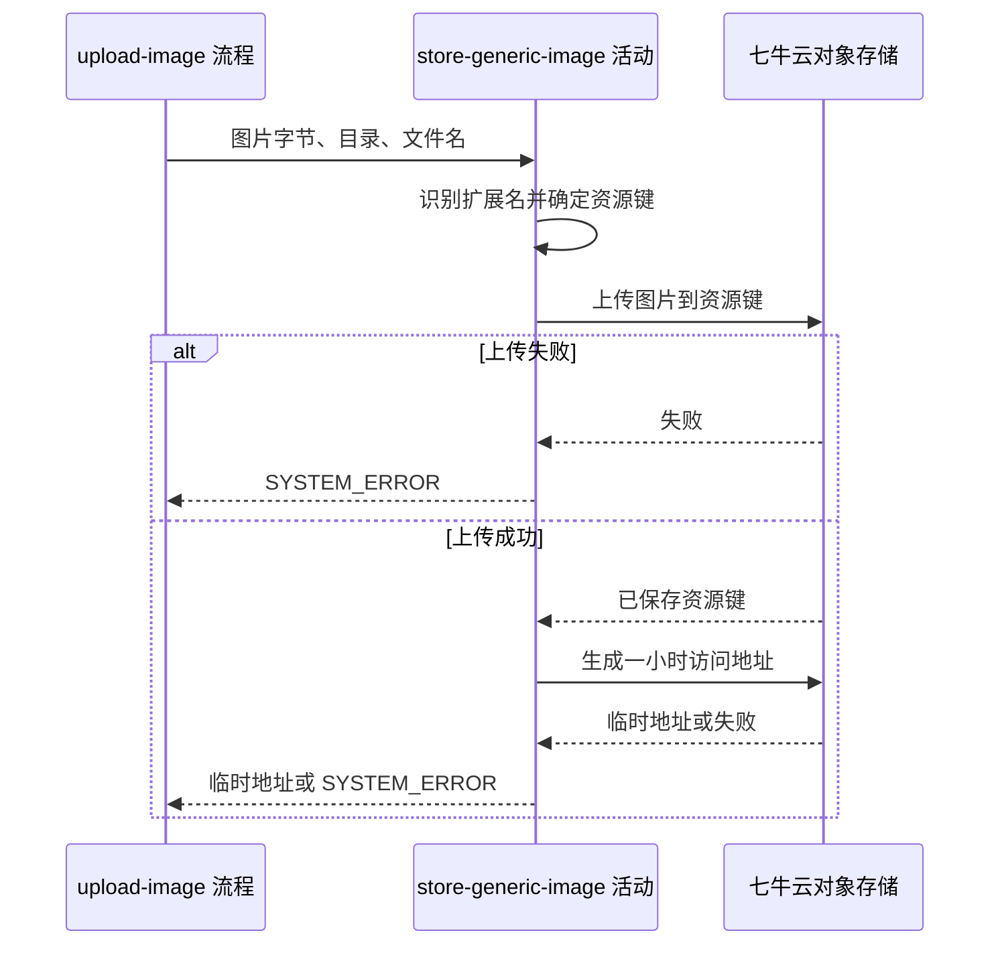

## 概要

把单张图片保存到七牛云并返回临时访问地址。

## 时序图

## 触发条件

图片上传入口已取得单个 multipart 文件并通过请求体大小限制后执行。调用方可不提供目录和文件名；活动不要求用户身份，也不检查本地业务对象。

## 活动契约

### 入参

| 字段 | 类型 | 必填 | 约束 |
|---|---|---|---|
| `fileBytes` | 字节数组 | 是 | 入口承诺文件与整个请求均不超过 5MB；活动允许空数组并按未知图片处理 |
| `dir` | 字符串 | 否 | 首尾斜杠会去除；不限制内部路径字符 |
| `filename` | 字符串 | 否 | 非空白时采用；含任意句点则不追加扩展名 |

### 成功返回

| 字段 | 类型 | 必填 | 说明 |
|---|---|---|---|
| `url` | 字符串 | 是 | 已上传资源的一小时有效七牛访问地址 |

## 异常分支

| 错误标识 | 触发条件 | 来源 |
|---|---|---|
| `SYSTEM_ERROR` | 文件读取、七牛上传或访问地址签发失败，或入口未取得合法文件/请求超限 | upload-image 流程 `SYSTEM_ERROR` 一行 |

## 领域依赖

无

## 业务动作

A1 从图片开头字节识别扩展名，无法识别时使用 `jpg`
A2 采用指定文件名或生成随机文件名，规范化目录后组成资源键
A3 把完整图片字节上传到七牛云目标资源键
A4 为已保存资源键签发一小时访问地址并返回

## 详细流程

1. `A1` 只识别 JPEG、PNG、GIF、WEBP 的固定开头魔数；字节不足或不命中不报错，统一返回 `jpg`。
2. `A2` 指定文件名含任意句点时原样使用，否则追加识别出的扩展名；未指定时生成无连字符 UUID 文件名。
3. `A2` 目录为空时资源键就是文件名；非空时只去掉首尾斜杠，再以一个斜杠连接文件名，不清理内部相对路径。
4. `A3` 不校验 MIME、图片可解码性、尺寸或相同资源键，覆盖和冲突语义由七牛云决定。
5. `A4` 只在上传成功后执行；签名失败时向上游报错，但不补偿删除已经保存的对象。
6. 本活动不写本地数据库，无本地事务；七牛上传与地址签发不是原子操作。

## 边界情况

- 空字节或伪装成图片的任意内容：按 JPG 扩展名尝试上传。
- 文件名为 `.hidden` 或含路径句点：视为已有扩展名，不追加识别结果。
- 目录仅由斜杠组成：规范化后仍可能形成以斜杠开头的资源键，不额外拦截。
- 相同目录与文件名重复提交：不做幂等检查，由七牛云当前上传行为决定最终对象。
- 地址签发失败：客户端收到失败，但对象可能已经存在，需要由存储运维另行清理。

## 实现提示

图片魔数识别保持为小型纯函数；上传与签名异常统一向上抛，由流程映射为系统错误，并在日志中保留资源键以便清理孤立对象。
