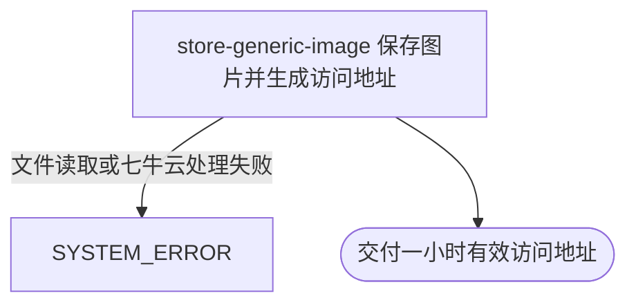

## 概要

为用户将一张图片保存到七牛云并交付临时访问地址。

## 触发

用户通过图片上传入口发起，调用方是前端应用。一次请求只处理一个不超过 5MB 的图片文件，可附带存储目录和文件名。重复提交未指定文件名时会形成不同资源；指定相同资源位置时由七牛云按当前上传结果处理，本流程不另做幂等查重。

## 接口契约

### 请求参数

| 字段 | 类型 | 必填 | 约束 |
|---|---|---|---|
| `file` | 文件 | 是 | 单个图片文件，文件及整个请求均不超过 5MB |
| `dir` | 字符串 | 否 | 存储目录；首尾斜杠会被去除 |
| `filename` | 字符串 | 否 | 指定文件名；没有扩展名时按图片内容补扩展名，不填则生成随机文件名 |

### 成功响应

| 字段 | 类型 | 说明 |
|---|---|---|
| `url` | 字符串 | 已保存图片的一小时有效访问地址 |

## 业务活动

- store-generic-image  识别图片扩展名，确定资源位置，将文件保存到七牛云并生成临时访问地址

## 流程图

## 详细流程

1. 接收一个图片文件，以及可选的存储目录和文件名；没有文件或请求超过 5MB 时拒绝处理。
2. 按图片开头字节识别常见图片扩展名；无法识别时按 JPG 处理。
3. 调用方指定文件名时采用该名称，没有扩展名则补上识别结果；未指定文件名时生成随机文件名。指定目录时去除目录首尾斜杠后与文件名组成资源标识。
4. 将图片内容保存到七牛云的目标资源位置。
5. 为已保存的资源生成一小时有效访问地址并交付给调用方。

## 异常分支

| 对外失败码 | 触发条件 | 由哪个活动报出 | 补偿动作或超时处理 | 对外提示 |
|---|---|---|---|---|
| `SYSTEM_ERROR` | 没有提交图片、图片或请求超过 5MB、图片读取失败、七牛云保存失败或访问地址生成失败 | store-generic-image | 不写本地业务数据；若文件已保存但地址生成失败，不主动删除已保存文件 | 系统异常，请稍后重试 |

## 技术线索

- 外部系统：七牛云对象存储
- 图片访问地址有效期为一小时
