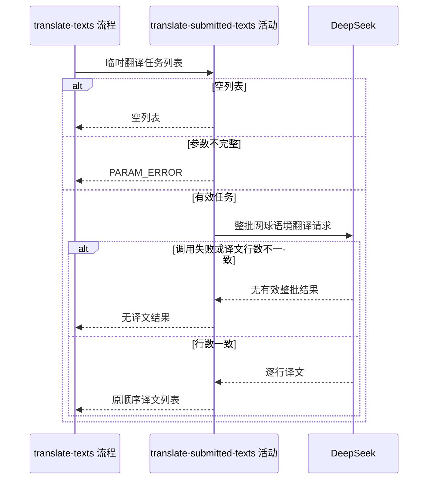

## 概要

整批翻译临时网球文本并按原顺序返回译文。

## 时序图

## 触发条件

内容工具提交临时翻译任务、请求体完成反序列化后执行。活动不要求这些文本已登记到翻译库，相同任务每次重新请求外部模型。

## 活动契约

### 入参

| 字段 | 类型 | 必填 | 约束 |
|---|---|---|---|
| `tasks` | 翻译任务列表 | 是 | 可为空；不拆批且无条数与总字符上限 |
| `tasks[].entityType` | 枚举 | 是 | `COURT`、`PLAYER`、`TOURNAMENT`、`SURFACE`、`CITY` |
| `tasks[].originalText` | 字符串 | 否 | 可为空，按字面空值进入翻译任务 |
| `tasks[].language` | 枚举 | 是 | `ZH_CN`、`ZH_TW`、`EN`、`JA`、`KO` |

### 成功返回

| 字段 | 类型 | 必填 | 说明 |
|---|---|---|---|
| `translations` | 字符串列表 | 否 | 成功时与输入等长且顺序一一对应；空输入为空列表；外部失败或数量不符时为无译文结果 |

## 异常分支

| 错误标识 | 触发条件 | 来源 |
|---|---|---|
| `PARAM_ERROR` | 任务条目为空，或实体类型、目标语言缺失或无法识别 | translate-texts 流程 `PARAM_ERROR` 一行 |

## 领域依赖

无

## 业务动作

A1 校验任务条目和枚举，空任务列表直接返回空列表
A2 按原顺序构造网球领域系统提示和逐行用户任务
A3 把整批任务一次性交给 DeepSeek 翻译
A4 校验译文行数与任务数一致，一致时原顺序返回，否则丢弃整批

## 详细流程

1. `A1` 不限制列表条数、单条长度和总文本量；条目、实体类型或语言不合法时整批报 `PARAM_ERROR`，不调用外部模型。
2. `A2` 每项写成文案、实体中文说明、目标语言中文说明；`PLAYER` 和 `TOURNAMENT` 额外附加官方译名与简洁赛事名提示。
3. `A3` 使用 `deepseek-v4-pro`，开启 thinking、`reasoning_effort=high`、`max_tokens=4096`、`temperature=1`；不拆批、不查历史译文、不自动重试。
4. `A4` 以换行拆分首个候选内容；调用异常、无候选、内容不可用或行数不等时返回无译文结果，不交付部分行。
5. 行数一致时不裁剪译文，保留空白行并按输入位置返回；本活动不写翻译库，无事务。

## 边界情况

- 空列表：不调用 DeepSeek，返回空列表。
- 原文为空：仍生成含空值的任务行，由模型决定对应译文。
- 输出包含序号或解释但行数刚好一致：当前仍按逐行译文接受，不做内容语义校验。
- 输出末尾空行：底层按换行拆分时可能不保留末尾空项，进而触发行数不一致并丢弃整批。
- 大批量请求超过模型上下文或 4096 输出 token：按外部失败或行数不符收场，无自动拆批。

## 实现提示

外部 RPC snapshot 当前缺失；实现继续把提示词构造集中在单一构造器，并把外部异常统一转换为无译文结果，避免泄露供应商错误。
