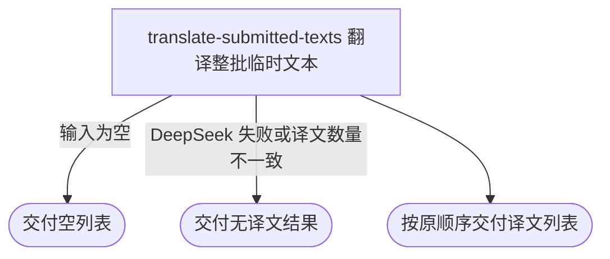

## 概要

为内容人员同步翻译一批网球业务文本并按原顺序交付译文。

## 触发

内容人员提交一批临时翻译任务发起，调用方是内容工具。一次请求把整批任务交给 DeepSeek，不拆批，也不限制条数或文本总量。相同请求重复到达会重新翻译，不查询或复用历史译文，也不保存本次结果。

## 接口契约

### 请求参数

请求体为翻译任务列表：

| 字段 | 类型 | 必填 | 约束 |
|---|---|---|---|
| `entityType` | 枚举 | 是 | `COURT`、`PLAYER`、`TOURNAMENT`、`SURFACE` 或 `CITY` |
| `originalText` | 字符串 | 否 | 原文；缺失时仍按字面空值内容参与翻译 |
| `language` | 枚举 | 是 | `ZH_CN`、`ZH_TW`、`EN`、`JA` 或 `KO` |

### 成功响应

| 字段 | 类型 | 说明 |
|---|---|---|
| 译文列表 | 字符串列表 | 数量与输入任务一致，顺序一一对应；输入为空时为空列表 |

## 业务活动

- translate-submitted-texts  按业务语境构造整批翻译要求，调用 DeepSeek 并校验逐行译文数量

## 流程图

## 详细流程

1. 接收一批临时翻译任务；列表为空时不调用外部翻译，直接交付空列表。
2. 按每条任务的业务对象类型和目标语言构造网球领域翻译要求；球员与职业赛事使用额外的官方译名和简洁名称提示。
3. 将整批任务按原顺序一次性交给 DeepSeek，要求逐行返回且不附加序号、解释或其他文本。
4. DeepSeek 没有返回有效结果、调用失败或返回行数与输入条数不一致时，丢弃整批结果并交付无译文结果。
5. 数量一致时保留空白译文，按输入顺序同步交付译文列表；本流程不登记翻译条目，也不保存结果。

## 异常分支

| 对外失败码 | 触发条件 | 由哪个活动报出 | 补偿动作或超时处理 | 对外提示 |
|---|---|---|---|---|
| `PARAM_ERROR` | 任务条目为空，或业务对象类型、目标语言缺失或无法识别 | translate-submitted-texts | 不调用 DeepSeek，不保存任何内容 | 参数不正确 |
| 无 | DeepSeek 调用失败、返回空结果或译文数量与输入数量不一致 | translate-submitted-texts | 丢弃整批结果，不保存部分译文；调用方可重新发起 | 无译文结果 |

## 技术线索

- 外部系统：DeepSeek，模型 `deepseek-v4-pro`
