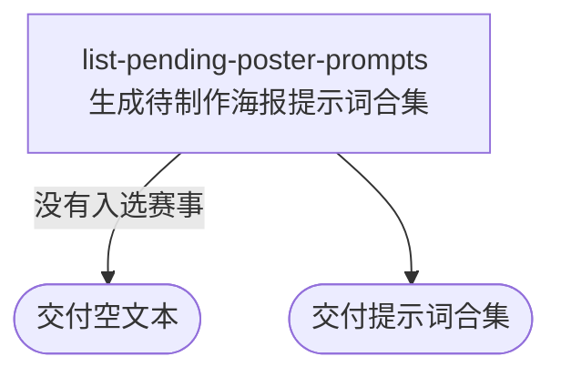

## 概要

为内容人员汇总近期缺少背景图的职业赛事海报提示词。

## 触发

内容人员打开待制作海报名单时发起，调用方是内容工具。一次请求查询服务运行当天前后各一个月内的全部候选赛事，不分页。重复请求按当时的赛事图片绑定情况重新生成，不保存名单或提示词。

## 接口契约

### 请求参数

无

### 成功响应

| 字段 | 类型 | 说明 |
|---|---|---|
| 提示词合集 | 纯文本 | 按赛事开始日期升序排列的提示词块，以分隔线连接；没有入选赛事时为空文本 |

## 业务活动

- list-pending-poster-prompts  筛选近期缺少背景图且级别符合条件的赛事，逐场生成并拼接海报提示词

## 流程图

## 详细流程

1. 以服务运行当天为基准，确定向前一个月到向后一个月的赛事窗口。
2. 查出日期区间与窗口相交、尚未绑定背景图的职业赛事，并按开始日期升序排列。
3. 剔除可解析为数字且小于 250 的赛事级别；空白级别、非数字级别和不小于 250 的数字级别继续参与。
4. 按每场赛事的名称、级别、场地类型和城市生成一个海报背景图提示词，包含构图视角、赛事重要程度、城市元素、避免侵权和 16:9 比例要求。
5. 按赛事顺序用分隔线连接全部提示词块；没有入选赛事时交付空文本。

## 异常分支

| 对外失败码 | 触发条件 | 由哪个活动报出 | 补偿动作或超时处理 | 对外提示 |
|---|---|---|---|---|
| 无 | 时间窗口内没有缺少背景图的赛事，或候选赛事全部被级别规则剔除 | list-pending-poster-prompts | 不修改赛事资料，按成功结果收场 | 空文本 |

## 技术线索

- 职业赛事背景图字段 `tour_tournament.background_path`
