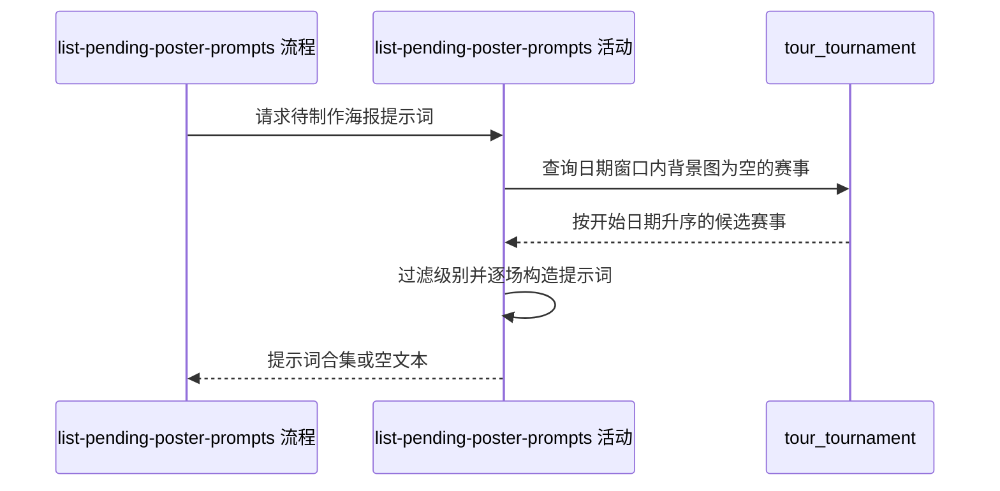

## 概要

汇总近期缺少背景图的职业赛事海报提示词。

## 时序图

## 触发条件

内容人员打开待制作海报名单时执行。活动以服务运行当天为基准，每次重新查询，不复用历史名单。

## 活动契约

### 入参

无。

### 成功返回

| 字段 | 类型 | 必填 | 说明 |
|---|---|---|---|
| `promptText` | 字符串 | 是 | 按赛事开始日期升序拼接的提示词块；无入选赛事时为空文本 |

## 异常分支

无业务异常。无候选或全部候选被过滤均按成功返回空文本。

## 领域依赖

无

## 业务动作

A1 计算运行当天前后各一个月的闭合日期窗口
A2 查询窗口相交且尚未绑定背景图的赛事
A3 过滤低于 250 的数字级别并规范化提示词素材
A4 逐场构造海报提示词并按赛事顺序拼接

## 详细流程

1. `A1` 以运行当天为中心，起点为前一个月同日，终点为后一个月同日。
2. `A2` 读取 `start_date <= 终点`、`end_date >= 起点` 且 `background_path` 为 `NULL` 或空串的赛事，按 `start_date` 升序。
3. `A3` 对 `category` 去首尾空白；可解析为整数且小于 250 的候选被剔除，空白、非数字及不小于 250 的级别保留。
4. 场地类型转为小写后映射常见中文描述，未知值原样使用；赛事级别映射展示名与拍摄角度，未知级别原样展示并使用默认中角度俯视。
5. `A4` 用赛事名称、级别、场地类型和非空城市构造提示词，包含球场特色、城市元素、赛事重要程度、避免侵权与 16:9 比例要求。
6. 按查询顺序以双换行分隔线连接提示词块；不落库、不缓存、不分页。

## 边界情况

- 日期相交判断包含窗口两端；跨越整个窗口的赛事仍会入选。
- 多场赛事开始日期相同时不额外保证次序。
- `background_path` 仅由 `NULL` 或空串判为空，纯空白字符串不视为空。
- 无候选或所有数字级别均小于 250 时返回空文本。
- 城市为空时不输出城市行；未知场地和级别不会导致失败。

## 实现提示

保持日期计算、筛选与提示词模板集中；一次请求基于同一查询结果生成，避免逐场回查造成内容漂移。
