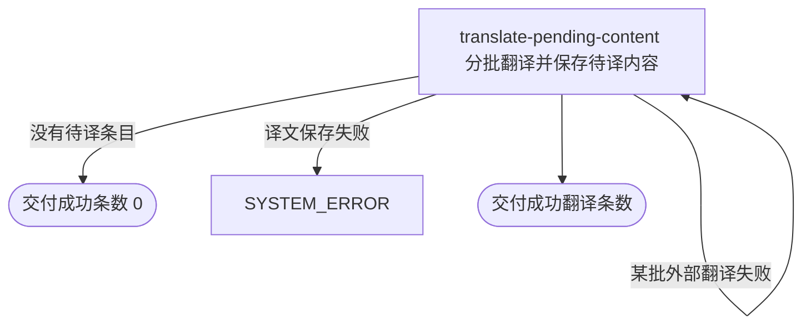

## 概要

为内容人员翻译全部待译条目并保存非空译文。

## 触发

内容人员从翻译维护入口手工发起，调用方是内容工具。一次请求读取当时全部待译条目，按每批最多 50 条依次处理，直到初始清单处理完后同步返回；处理中新增的待译条目不纳入本次。重复发起会再次处理仍处于待译状态的条目，已成功翻译的条目不会重复处理。

## 接口契约

### 请求参数

无

### 成功响应

| 字段 | 类型 | 说明 |
|---|---|---|
| 成功翻译条数 | 整数 | 本次取得非空译文并成功保存的条目总数；没有待译内容时为 0 |

## 业务活动

- translate-pending-content  读取全部待译条目，分批调用 DeepSeek，并把每批非空译文保存到对应条目

## 流程图

## 详细流程

1. 读取当前全部待译条目；没有待译内容时不调用 DeepSeek，直接交付成功条数 0。
2. 按读取顺序每 50 条组成一批，将原文、业务对象类型和目标语言一次性交给 DeepSeek。
3. DeepSeek 没有返回有效结果或返回行数与本批条数不一致时，整批保持待译并继续下一批，不重试也不计入成功数。
4. 对数量一致的结果逐条去除首尾空白；空白译文对应条目保持待译，非空译文保存到原条目并计入成功数。
5. 每批保存成功后清除翻译缓存，再继续下一批；全部初始待译条目处理完后交付累计成功条数。

## 异常分支

| 对外失败码 | 触发条件 | 由哪个活动报出 | 补偿动作或超时处理 | 对外提示 |
|---|---|---|---|---|
| 无 | DeepSeek 未返回有效结果，或返回数量与本批条目数不一致 | translate-pending-content | 该批全部保持待译，保留此前成功批次并继续下一批 | 仅通过最终成功条数体现 |
| 无 | DeepSeek 对单条内容返回空白译文 | translate-pending-content | 该条保持待译，同批其他非空译文照常保存 | 仅通过最终成功条数体现 |
| `SYSTEM_ERROR` | 待读取条目失败或译文保存失败 | translate-pending-content | 处理终止；此前已保存批次保留，当前及后续批次按失败位置保持原状 | 系统异常，请稍后重试 |

## 技术线索

- 表 `translation`，待译口径为 `translated_text` 为空字符串
- 外部系统：DeepSeek，模型 `deepseek-v4-pro`
