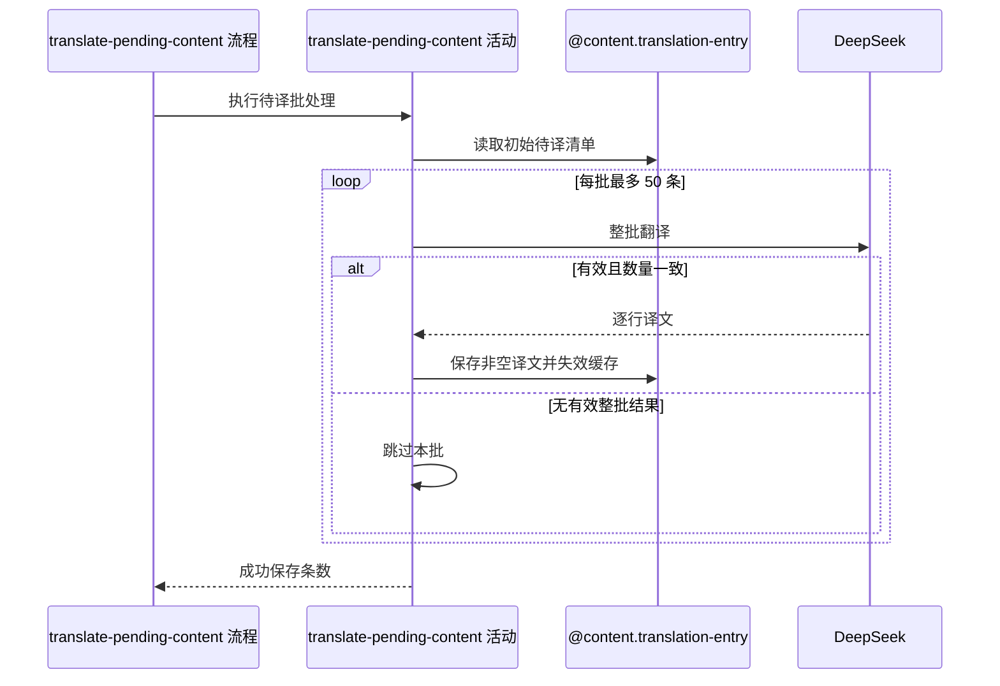

## 概要

分批翻译全部待译条目并保存有效译文。

## 时序图

## 触发条件

内容人员从翻译维护入口手工发起。一次请求同步处理开始时取得的全部待译条目，重复请求仅重新处理仍待译的条目。

## 活动契约

### 入参

无。

### 成功返回

| 字段 | 类型 | 必填 | 说明 |
|---|---|---|---|
| `successCount` | 整数 | 是 | 本次取得非空译文并成功保存的条目总数；无待译条目时为 0 |

## 异常分支

| 错误标识 | 触发条件 | 处理 |
|---|---|---|
| 无 | DeepSeek 无有效结果或数量不符 | 本批保持待译并继续后续批次 |
| 无 | 单条译文去除首尾空白后为空 | 该条保持待译，同批其他有效条目照常保存 |
| `SYSTEM_ERROR` | 初始读取或任一批保存失败 | 终止处理；保留此前成功批次，失败批及后续条目保持原状 |

## 领域依赖

### @content.translation-entry

- 输入：读取全部待译条目的意图，或一批条目 ID 与去除首尾空白后的非空译文
- 输出：返回请求开始时的待译清单；保存时仅更新对应译文字段并使翻译缓存失效。异常形态：读取或保存失败作为 `SYSTEM_ERROR` 终止活动

## 业务动作

A1 冻结请求开始时的全部待译条目清单
A2 按仓储顺序每 50 条划分处理批次
A3 逐批请求 DeepSeek 并校验整批结果
A4 保存每批非空译文、失效缓存并累计成功数

## 详细流程

1. `A1` 一次性读取 `translated_text` 为空串的记录；清单为空时返回 0，不调用 DeepSeek。
2. 初始清单随后固定，处理中新增的待译条目不纳入本次；仓储不保证额外排序。
3. `A2` 按读取顺序每 50 条形成一批，最后一批可少于 50 条。
4. `A3` 将本批实体类型、原文和目标语言一次性交给 DeepSeek；不拆成单条、不自动重试。
5. 外部结果为空或译文数量与本批条目数不一致时，整批计 0、保持待译并继续下一批。
6. `A4` 对数量一致的译文逐条去除首尾空白；空白译文跳过，非空译文按原条目 ID 批量保存并累计。
7. 每批保存成功后失效本地翻译缓存。批次之间无覆盖全部请求的总事务。

## 边界情况

- 无待译内容时成功返回 0。
- 待译条目恰为 50 的倍数时不产生空批次。
- 某批全为空白译文时不执行保存和缓存失效，继续后续批次。
- 某批外部失败不回滚此前批次，也不阻止后续批次。
- 保存失败会终止请求；调用方可重试仍处于待译状态的条目。

## 实现提示

领域层只按 ID 更新译文字段，避免覆盖原文等并发变化；外部 RPC snapshot 当前缺失，继续把批大小和失败隔离策略集中维护。
