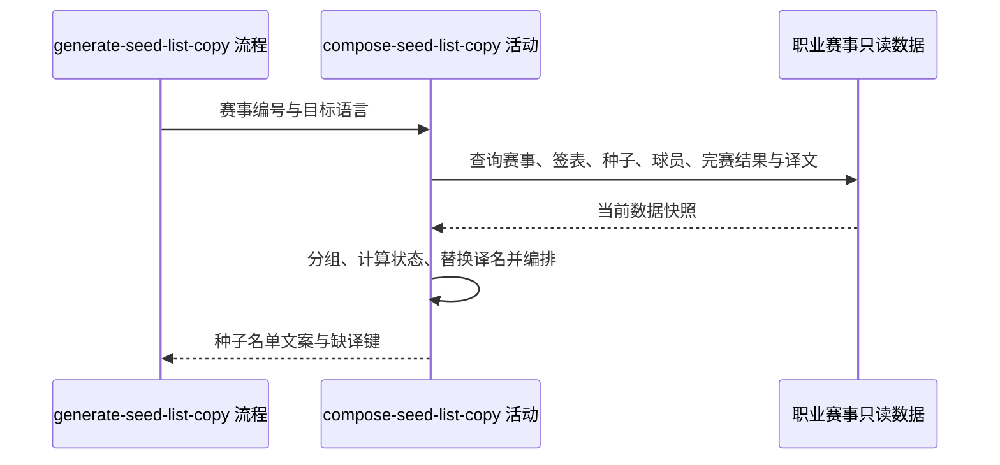

## 概要

汇总赛事种子与淘汰状态并生成目标语言文案。

## 时序图

## 触发条件

内容人员选择职业赛事并请求种子名单时执行。目标语言由流程校验并在缺省时取 `ZH_CN`。

## 活动契约

### 入参

| 字段 | 类型 | 必填 | 约束 |
|---|---|---|---|
| `tournamentIds` | 字符串列表 | 是 | 可为空；部分不存在的编号被忽略 |
| `language` | 枚举 | 是 | `ZH_CN`、`ZH_TW`、`EN`、`JA`、`KO` |

### 成功返回

| 字段 | 类型 | 必填 | 说明 |
|---|---|---|---|
| `copy` | 字符串 | 是 | 种子名单 Markdown；无有效赛事时为固定“无赛事信息”文案 |
| `missingTranslations` | 翻译键集合 | 是 | 缺失的 `PLAYER` 目标语言译名，已按实体类型、原文与语言去重 |

## 异常分支

| 错误标识 | 触发条件 | 处理 |
|---|---|---|
| 无 | 编号为空、全部无效或赛事组无非零种子 | 返回无赛事信息或跳过空组 |
| `SYSTEM_ERROR` | 任一只读数据查询失败 | 停止生成，不返回半成品 |

## 领域依赖

无

## 业务动作

A1 查询有效赛事并按同城、日期相交规则分组排序
A2 读取非零种子报名、球员资料和已结束比赛
A3 计算球员巡回赛、国家地区与参赛或淘汰状态
A4 套用已有目标语言译名并收集缺译键
A5 按赛事组、巡回赛与种子号编排文案

## 详细流程

1. `A1` 忽略找不到的编号；一个有效赛事都没有时返回 `# 种子名单` 与“无赛事信息”，缺译集合为空。
2. 把同城且日期相交的有效赛事归为一组，沿用职业赛事查询的分组顺序。
3. `A2` 通过各赛事签表读取种子非空且不为 0 的报名，补齐球员资料和赛事 `tour`；同时读取赛事全部 `FINISHED` 比赛。
4. `A3` 球员名称优先使用 `last_name`，否则使用 `first_name`；国家按 `nationality` 映射。球员在任一完赛比赛中落败时标为已淘汰并展示可识别轮次，否则标为参赛中。
5. `A4` 只查询 `PLAYER`、指定语言的已有译文；命中时替换名称，未命中时保留原名，并按实体类型、原文和语言收集缺译键。
6. `A5` 跳过没有种子的赛事组；输出组标题，存在多个巡回赛时按首次出现顺序分段，各段按种子号升序生成表格。
7. 本活动只读，不保存文案，也不登记缺译条目。

## 边界情况

- 部分赛事编号无效时继续生成其余赛事内容。
- 球员资料缺失时名称与国家为空，不中断整组。
- 同一球员有多场败绩时淘汰轮次取当前数据归并后的记录，不额外判断比赛先后。
- 赛事组存在但无非零种子时不输出该组；所有组均为空时仍只保留文档标题。
- 未命中译文不视为异常，文案回退原名。

## 实现提示

查询活动保持无副作用；翻译登记由下游活动处理。数据库 snapshot 未刷新，本页字段以现有 snapshot 和实现交叉核对。
