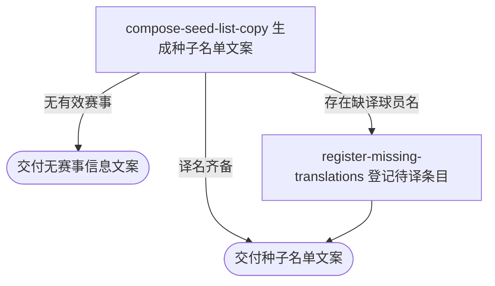

## 概要

按所选职业赛事为内容人员生成目标语言种子名单文案。

## 触发

内容人员选择一个或多个职业赛事后发起，调用方是内容工具。一次请求处理请求中的全部赛事编号，不分页；目标语言未指定时为简体中文。重复请求按当前赛事、签表、比赛和译文重新生成，不保存文案；已存在的待译条目不会重复建立。

## 接口契约

### 请求参数

| 字段 | 类型 | 必填 | 约束 |
|---|---|---|---|
| `tournamentIds` | 字符串列表 | 是 | 一个或多个职业赛事编号；空列表按无赛事信息处理 |
| `lang` | 枚举 | 否 | `ZH_CN`、`ZH_TW`、`EN`、`JA` 或 `KO`；默认 `ZH_CN` |

### 成功响应

| 字段 | 类型 | 说明 |
|---|---|---|
| 种子名单文案 | 纯文本 | 按赛事组和巡回赛编排的种子表；无有效赛事时交付“无赛事信息”文案 |

## 业务活动

- compose-seed-list-copy  汇总所选赛事的种子、球员与淘汰状态，套用已有译名并生成文案
- register-missing-translations  为本次遇到且尚无目标语言译名的球员登记待译条目

## 流程图

## 详细流程

1. 接收职业赛事编号清单和目标语言；未指定语言时采用简体中文。
2. 取得编号对应的职业赛事，忽略找不到的编号；一个有效赛事都没有时交付“无赛事信息”文案。
3. 将同城且日期相交的赛事归为同一赛事组，读取各组全部签表中的非零种子报名，并补齐球员姓名、国家或地区和巡回赛。
4. 根据所选赛事的完赛结果，把种子标为参赛中或已淘汰；淘汰轮次可识别时一并展示。
5. 用已有目标语言译名替换球员原名；没有译名时保留原名并登记待译条目。
6. 依次编排赛事组、巡回赛和种子表格，按种子号升序列出球员、国家或地区与状态；没有种子的赛事组不输出。
7. 同步交付完整纯文本文案，不改写职业赛事、签表、报名、球员或比赛资料。

## 异常分支

| 对外失败码 | 触发条件 | 由哪个活动报出 | 补偿动作或超时处理 | 对外提示 |
|---|---|---|---|---|
| 无 | 赛事编号列表为空，或全部编号都找不到赛事 | compose-seed-list-copy | 不登记翻译条目，按成功结果收场 | 无赛事信息 |
| 无 | 部分赛事编号不存在或某赛事组没有非零种子 | compose-seed-list-copy | 忽略无效编号或空赛事组，继续处理其余内容 | 无 |
| `PARAM_ERROR` | 目标语言不是支持的取值 | 流程 | 不生成文案、不登记待译条目 | 请求参数不合法 |
| `SYSTEM_ERROR` | 读取赛事、签表、球员或比赛资料失败 | compose-seed-list-copy | 停止生成；失败前已登记的待译条目保留 | 系统异常，请稍后重试 |

## 技术线索

- 外部数据口径：ATP、WTA 职业赛事、签表、球员与完赛结果
