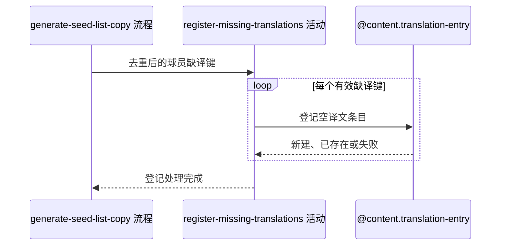

## 概要

为种子名单遇到的缺译球员名登记待译条目。

## 时序图

## 触发条件

上游生成种子名单后存在目标语言缺译球员名时执行；缺译集合为空时无需调用。

## 活动契约

### 入参

| 字段 | 类型 | 必填 | 约束 |
|---|---|---|---|
| `missingTranslations` | 翻译键集合 | 是 | 实体类型为 `PLAYER`，包含非空原文与目标语言 |

### 成功返回

无业务数据；完成所有可登记键的尝试后返回。

## 异常分支

| 错误标识 | 触发条件 | 处理 |
|---|---|---|
| 无 | 相同翻译键已存在或发生并发唯一键冲突 | 按幂等成功处理，不建立重复记录 |
| 无 | 单项登记失败 | 记录失败并继续后续项目，不影响已生成文案 |

## 领域依赖

### @content.translation-entry

- 输入：实体类型 `PLAYER`、非空原文、目标语言，以及登记空译文的意图
- 输出：相同实体类型、原文和语言最多一条记录；不存在时建立待译条目。异常形态：单项失败返回活动记录后继续

## 业务动作

A1 过滤空键与空原文并按翻译键去重
A2 排除已存在的翻译记录
A3 逐项登记空译文条目并隔离单项失败

## 详细流程

1. `A1` 仅接受 `PLAYER` 缺译键，过滤空键和空原文，按实体类型、原文与目标语言去重。
2. `A2` 批量查询已有组合，已有记录不论当前译文是否为空都不重复建立。
3. `A3` 对其余键逐项登记空译文条目；并发命中唯一键时按已存在处理。
4. 单项失败只记录并继续，已成功条目不回滚；活动不改写上游生成的文案。

## 边界情况

- 输入为空或过滤后为空时不访问领域对象。
- 同名球员在同一语言下只登记一次；不同目标语言分别登记。
- 已有非空译文的组合不会被清空。
- 部分失败时调用方仍取得使用原名回退的完整文案。

## 实现提示

领域唯一性由实体类型、原文和语言共同保证；活动只登记待译事实，不在此处调用外部翻译模型。
