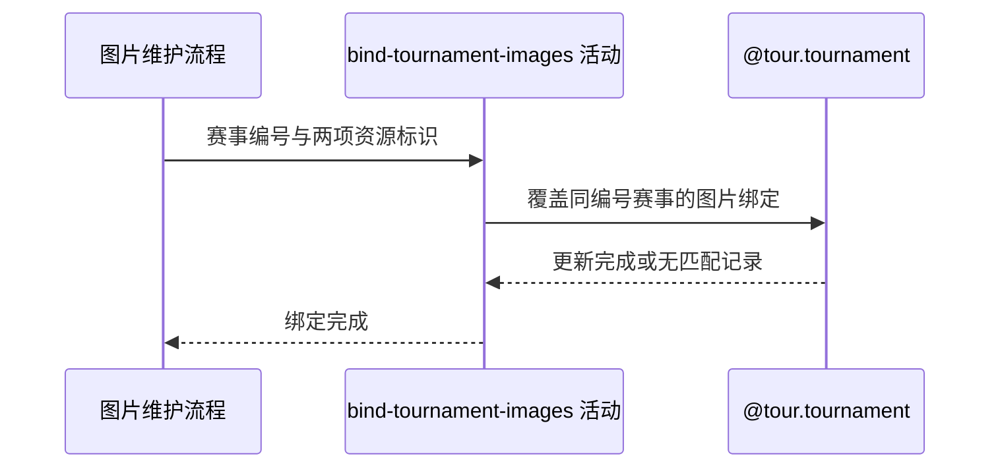

## 概要

把赛事图片资源标识绑定到同编号职业赛事。

## 时序图

## 触发条件

上游已经成功保存主图和背景图后执行，供两个赛事图片维护流程共同编排。

## 活动契约

### 入参

| 字段 | 类型 | 必填 | 约束 |
|---|---|---|---|
| `tournamentId` | 字符串 | 是 | 与对象键对应的职业赛事编号 |
| `imageKey` | 字符串 | 是 | 已保存的主图资源标识 |
| `backgroundKey` | 字符串 | 是 | 已保存的背景图资源标识 |

### 成功返回

无业务数据；无匹配赛事也按成功完成。

## 异常分支

| 错误标识 | 触发条件 | 处理 |
|---|---|---|
| 无 | 没有同编号职业赛事记录 | 不建立绑定，保留对象并按成功返回 |
| `SYSTEM_ERROR` | 图片绑定更新失败 | 赛事保持此前绑定；七牛对象不补偿删除 |

## 领域依赖

### @tour.tournament

- 输入：职业赛事编号、主图资源标识和背景图资源标识，以及覆盖图片绑定的意图
- 输出：所有同编号赛事的 `image_path` 与 `background_path` 被更新；无匹配记录时更新 0 条并成功。异常形态：数据库失败返回 `SYSTEM_ERROR`

## 业务动作

A1 按赛事编号定位全部职业赛事记录
A2 覆盖这些赛事的主图与背景图绑定
A3 向流程确认绑定结束

## 详细流程

1. `A1` 绑定范围仅由 `tournamentId` 决定，不按年份或巡回赛进一步缩小。
2. `A2` 一次更新所有匹配记录的 `image_path` 和 `background_path`，其他字段不变。
3. 不比较旧值、不做版本校验；重复或并发绑定时数据库最终以最后完成的更新为准。
4. 无匹配记录时更新数为 0，但按成功处理；上游已保存对象继续保留。
5. `A3` 活动不生成也不执行手工 SQL；带同步语句的流程只在自动绑定成功后自行组装返回文本。

## 边界情况

- 同一赛事编号跨年份有多条记录时全部更新。
- 资源标识与当前值相同仍可幂等执行。
- 更新失败不删除对象存储中的新图片，也不恢复对象存储中的旧内容。
- 手工同步语句只是流程响应，不参与本活动事务。

## 实现提示

只通过 `@tour.tournament` 修改赛事图片字段；数据库写入活动不在 `reads` 声明写表。
