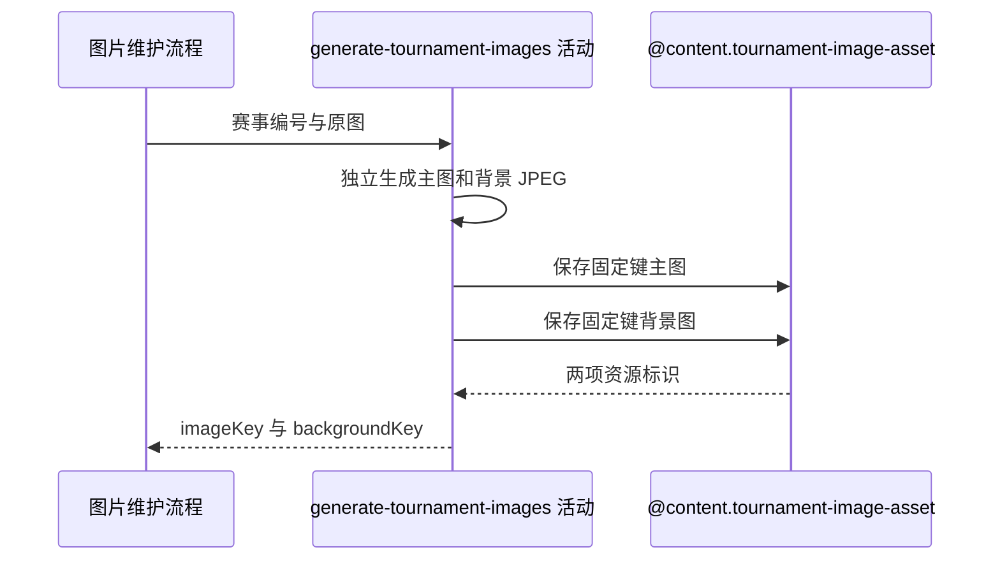

## 概要

从原图生成并保存赛事主图与背景图。

## 时序图

## 触发条件

任一赛事图片维护流程完成 multipart 请求解析后执行；请求总大小由入口限制为 5MB。

## 活动契约

### 入参

| 字段 | 类型 | 必填 | 约束 |
|---|---|---|---|
| `tournamentId` | 字符串 | 是 | 非空职业赛事编号，用于组成固定对象键 |
| `file` | 图片文件 | 是 | 必须可完整读取并解码为图片 |

### 成功返回

| 字段 | 类型 | 必填 | 说明 |
|---|---|---|---|
| `imageKey` | 字符串 | 是 | `tournament/{tournamentId}.jpg` 对应资源标识 |
| `backgroundKey` | 字符串 | 是 | `tournament/{tournamentId}_background.jpg` 对应资源标识 |

## 异常分支

| 错误标识 | 触发条件 | 处理 |
|---|---|---|
| `SYSTEM_ERROR` | 参数缺失、文件读取或 JPEG 转换失败、任一对象保存失败 | 终止活动；已经保存的对象保留，不主动删除 |

## 领域依赖

### @content.tournament-image-asset

- 输入：资源目录、由赛事编号组成的固定文件名，以及主图或背景图 JPEG 字节
- 输出：保存后的资源标识；相同键重复保存时替换对象。异常形态：保存失败返回 `SYSTEM_ERROR`，已完成的前序保存不补偿

## 业务动作

A1 校验赛事编号并读取原图字节
A2 从同一原图独立生成主图与背景 JPEG
A3 依次把两张图片保存到七牛云固定资源位置
A4 返回两项资源标识供下游绑定

## 详细流程

1. `A1` 要求赛事编号非空且文件可读取、可解码；请求超过入口 5MB 限制时不会进入正常处理。
2. `A2` 从原始字节按 JPEG 质量 `0.75` 生成主图，再从同一原始字节以 `50KB` 为目标独立生成背景图。
3. `A3` 先保存 `tournament/{tournamentId}.jpg`，再保存 `tournament/{tournamentId}_background.jpg`；重复上传覆盖相同固定键。
4. 任一步失败立即终止，已经保存的主图或旧对象不删除、不回滚。
5. `A4` 只返回资源标识，不生成访问 URL，也不修改职业赛事记录。

## 边界情况

- 可读取但无法解码为图片的文件按 `SYSTEM_ERROR` 处理。
- 目标 50KB 是压缩目标，不承诺输出字节数严格等于 50KB。
- 背景图生成失败时主图可能已经生成在内存但尚未上传；背景上传失败时主图对象已经保存。
- 相同赛事编号的并发上传共享固定键，最终对象取决于对象存储最后完成的写入。

## 实现提示

七牛 RPC snapshot 当前缺失；保持对象键规则和两次上传顺序集中，日志避免输出图片字节。
