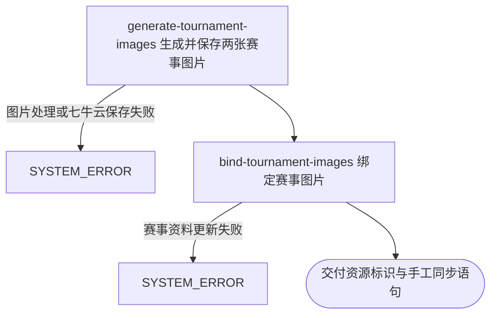

## 概要

为内容人员维护职业赛事图片并交付手工同步语句。

## 触发

内容人员从职业赛事上传入口提交赛事编号和一张原图发起，调用方是内容工具。一次请求只维护一个赛事编号，但会更新所有同编号的赛事记录。重复提交会使用固定资源标识替换七牛云图片，并覆盖现有图片绑定；返回的手工同步语句只供查看，本流程不会再次执行它。

## 接口契约

### 请求参数

| 字段 | 类型 | 必填 | 约束 |
|---|---|---|---|
| `tournamentId` | 字符串 | 是 | 职业赛事编号 |
| `file` | 文件 | 是 | 可读取为图片的原图；整个请求不超过 5MB |

### 成功响应

| 字段 | 类型 | 说明 |
|---|---|---|
| `imageKey` | 字符串 | 七牛云赛事主图资源标识 |
| `backgroundKey` | 字符串 | 七牛云赛事背景图资源标识 |
| `sql` | 字符串 | 按赛事编号手工同步两项图片绑定的更新语句；返回前赛事绑定已经自动更新 |

## 业务活动

- generate-tournament-images  将原图转换为赛事主图与背景图并保存到七牛云固定资源位置
- bind-tournament-images  将两项图片资源标识绑定到所有同编号的职业赛事记录

## 流程图

## 详细流程

1. 接收职业赛事编号和一张原图。
2. 把原图转换为 75% 编码质量的 JPEG 主图，并从同一原图生成以 50KB 为压缩目标的 JPEG 背景图。
3. 以赛事编号组成固定资源标识，将主图与背景图依次保存到七牛云。
4. 按赛事编号找到全部职业赛事记录，将两项资源标识写入其主图和背景图绑定；没有匹配赛事时仍保留七牛云图片并继续成功返回。
5. 交付主图资源标识、背景图资源标识，以及一条按赛事编号手工同步相同绑定的更新语句；返回该语句时自动绑定已经完成。

## 异常分支

| 对外失败码 | 触发条件 | 由哪个活动报出 | 补偿动作或超时处理 | 对外提示 |
|---|---|---|---|---|
| `SYSTEM_ERROR` | 缺少赛事编号或图片、请求超过 5MB、图片无法读取或转成 JPEG、主图或背景图无法保存 | generate-tournament-images | 职业赛事资料不变；已经保存的图片不主动删除 | 系统异常，请稍后重试 |
| `SYSTEM_ERROR` | 两张图片已保存但赛事图片绑定更新失败 | bind-tournament-images | 两张七牛云图片保留，赛事保持此前绑定 | 系统异常，请稍后重试 |
| 无 | 没有同编号的职业赛事记录 | bind-tournament-images | 保留两张七牛云图片，不建立赛事绑定，仍交付资源标识与手工同步语句 | 无 |

## 技术线索

- 表 `tour_tournament`，字段 `tournament_id`、`image_path`、`background_path`
- 外部系统：七牛云对象存储
- 手工同步语句形如 `UPDATE tour_tournament SET image_path = ..., background_path = ... WHERE tournament_id = ...`
