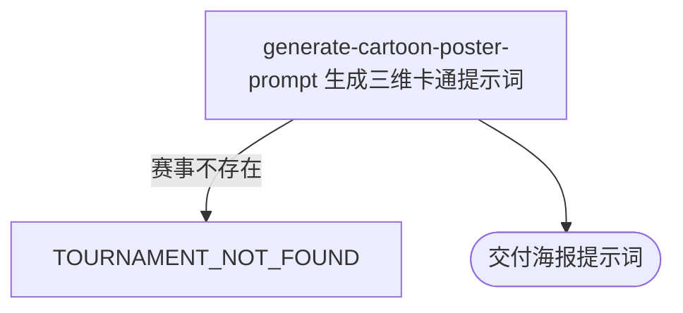

## 概要

为内容人员生成指定职业赛事的三维卡通海报提示词。

## 触发

内容人员从内容赛事海报入口指定一个职业赛事编号发起，调用方是内容工具。一次请求只生成一段提示词，不保存结果。重复请求按当前赛事资料重新生成；同一编号存在多届记录时使用现有查询取得的第一条记录。

## 接口契约

### 请求参数

| 字段 | 类型 | 必填 | 约束 |
|---|---|---|---|
| `tournamentId` | 字符串 | 是 | 需对应一个可查询的职业赛事 |

### 成功响应

| 字段 | 类型 | 说明 |
|---|---|---|
| 海报提示词 | 纯文本 | App Store 风格的三维卡通赛事海报创作要求 |

## 业务活动

- generate-cartoon-poster-prompt  根据赛事级别、场地、城市和特色素材生成三维卡通海报提示词

## 流程图

## 详细流程

1. 按赛事编号取得职业赛事的名称、巡回赛、级别、场地类型和举办城市；赛事不存在时拒绝生成。
2. 生成 App Store 风格、鲜艳配色和柔和卡通光影的三维海报基础描述，并组合赛事名称、巡回赛与级别作为主题。
3. 能识别场地类型时补充球场材质；能识别赛事级别时补充对应的视角、光线与观众规模。
4. 高级别赛事优先补充已登记的中央球场特征，未命中时采用通用中央球场特征；较低级别赛事优先融入已登记的城市特色，没有特色素材时按已有城市信息降级。
5. 补充无人球场、海报留白、16:9 比例和高质量细节要求，交付完整提示词，不修改赛事资料。

## 异常分支

| 对外失败码 | 触发条件 | 由哪个活动报出 | 补偿动作或超时处理 | 对外提示 |
|---|---|---|---|---|
| `TOURNAMENT_NOT_FOUND` | 赛事编号没有对应的职业赛事 | generate-cartoon-poster-prompt | 不生成提示词、不修改赛事资料 | 赛事不存在 |
| 无 | 赛事级别、场地类型或特色素材无法识别 | generate-cartoon-poster-prompt | 省略无法确定的专属描述或采用通用特色，继续交付 | 无 |

## 技术线索

- 表 `tour_tournament`，以 `tournament_id` 查询赛事资料
