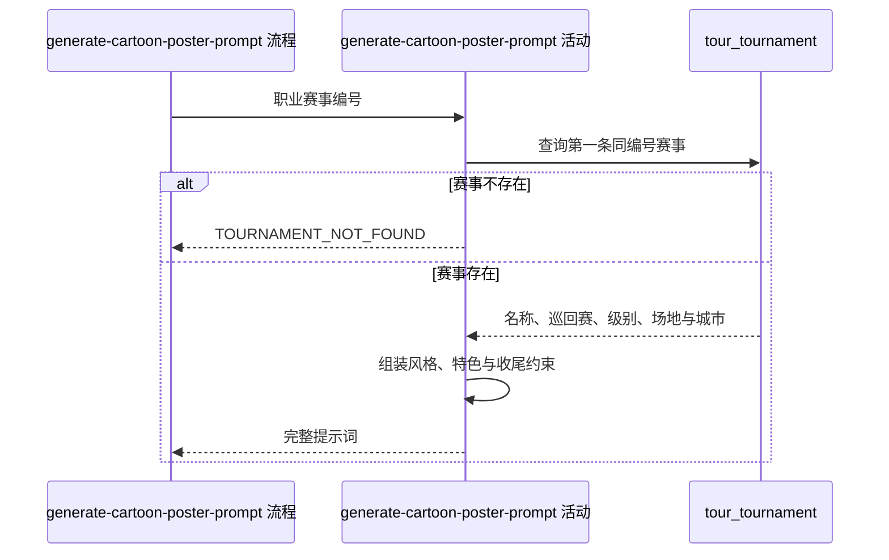

## 概要

按赛事资料生成三维卡通风格海报提示词。

## 时序图

## 触发条件

内容人员从三维海报入口指定一个职业赛事编号时执行；每次按当前资料重新生成，不保存提示词。

## 活动契约

### 入参

| 字段 | 类型 | 必填 | 约束 |
|---|---|---|---|
| `tournamentId` | 字符串 | 是 | 用于查询一个现存职业赛事 |

### 成功返回

| 字段 | 类型 | 必填 | 说明 |
|---|---|---|---|
| `prompt` | 字符串 | 是 | App Store 风格三维卡通赛事海报创作要求 |

## 异常分支

| 错误标识 | 触发条件 | 处理 |
|---|---|---|
| `TOURNAMENT_NOT_FOUND` | 同编号赛事不存在 | 不生成提示词 |
| 无 | 级别、场地或特色素材未识别 | 省略专属段或使用通用特色后继续 |

## 领域依赖

无

## 业务动作

A1 查询同编号的第一条职业赛事
A2 组合三维卡通风格、城市与赛事主题
A3 按场地和级别补充材质、视角、光线及观众规模
A4 选择城市或中央球场特色并追加固定收尾约束

## 详细流程

1. `A1` 按 `tournamentId` 使用现有查询取得第一条记录，不指定年份和排序；未找到时报 `TOURNAMENT_NOT_FOUND`。
2. `A2` 固定采用 App Store 风格、鲜艳配色与柔和卡通光影；主题名由非空的赛事名、`tennis open`、巡回赛和级别去空白后连接，并在前面拼接非空城市。
3. `A3` 场地可识别时补充材质描述；级别可识别时补充对应视角、光线与观众规模，未知值省略专属段。
4. `A4` 对可识别的 1000 及以上级别按赛事编号选择中央球场特色，素材未命中时使用通用中央球场轮廓。
5. 对可识别的 250/500 级别选择城市特色；未命中但城市非空时使用通用城市气质，城市为空时省略特色。
6. 固定追加球场无人、聚焦场馆、海报留白、16:9 与高质量细节要求，只返回文本。

## 边界情况

- 同编号存在多届记录时结果取决于仓储返回的第一条。
- 城市为空时主题不加城市；基础赛事名字段都空时回退“网球赛事”。
- 级别未知时场地材质仍可输出，但视角、光线、观众和特色段全部省略。
- 特色素材按去空白后的赛事编号精确匹配。

## 实现提示

特色素材与级别策略保持为可独立维护的映射；活动纯只读，不登记翻译或修改赛事。
