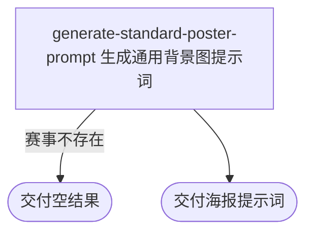

## 概要

为内容人员生成指定职业赛事的通用背景图提示词。

## 触发

内容人员从赛事提示词入口指定一个职业赛事编号发起，调用方是内容工具。一次请求只生成一段提示词，不保存结果。重复请求按当前赛事资料重新生成；同一编号存在多届记录时使用现有查询取得的第一条记录。

## 接口契约

### 请求参数

| 字段 | 类型 | 必填 | 约束 |
|---|---|---|---|
| `tournamentId` | 字符串 | 是 | 职业赛事编号 |

### 成功响应

| 字段 | 类型 | 说明 |
|---|---|---|
| 海报提示词 | 纯文本 | 通用赛事背景图创作要求；赛事不存在时为空结果 |

## 业务活动

- generate-standard-poster-prompt  根据赛事级别、场地和城市生成通用背景图提示词

## 流程图

## 详细流程

1. 按赛事编号取得职业赛事的名称、级别、场地类型和举办城市；赛事不存在时交付空结果。
2. 生成通用赛事背景图规则，要求体现球场材质、赛事重要程度、中央球场特征、自然融入城市元素、避免赛事名称图标等侵权元素，并采用 16:9 比例。
3. 按赛事级别补充建议拍摄角度；级别无法识别时保留原级别文字并采用中角度俯视球场。
4. 按场地类型补充中文描述；无法识别时保留原场地文字。城市为空时省略城市行。
5. 交付包含赛事资料和建议角度的完整提示词，不修改赛事资料。

## 异常分支

| 对外失败码 | 触发条件 | 由哪个活动报出 | 补偿动作或超时处理 | 对外提示 |
|---|---|---|---|---|
| 无 | 赛事编号没有对应的职业赛事 | generate-standard-poster-prompt | 不生成提示词、不修改赛事资料，按成功结果收场 | 空结果 |
| 无 | 赛事级别或场地类型无法识别，或城市为空 | generate-standard-poster-prompt | 保留原文字、采用默认角度或省略城市行，继续交付 | 无 |

## 技术线索

- 表 `tour_tournament`，以 `tournament_id` 查询赛事资料
