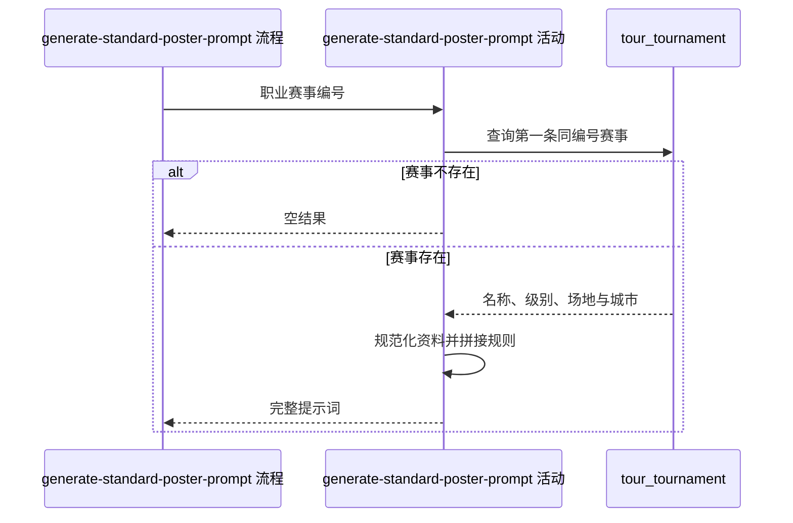

## 概要

按赛事资料生成通用背景图提示词。

## 时序图

## 触发条件

内容人员从通用赛事提示词入口指定一个职业赛事编号时执行；结果不保存、不缓存。

## 活动契约

### 入参

| 字段 | 类型 | 必填 | 约束 |
|---|---|---|---|
| `tournamentId` | 字符串 | 是 | 职业赛事编号 |

### 成功返回

| 字段 | 类型 | 必填 | 说明 |
|---|---|---|---|
| `prompt` | 字符串 | 否 | 通用背景图创作要求；赛事不存在时为无结果 |

## 异常分支

无业务异常。赛事不存在时返回无结果；资料无法识别时采用原文字或默认角度。

## 领域依赖

无

## 业务动作

A1 查询同编号的第一条职业赛事
A2 规范化级别、场地与城市展示值
A3 拼接通用背景图规则、赛事资料和建议角度

## 详细流程

1. `A1` 按 `tournamentId` 使用现有查询取得第一条记录，不指定年份和排序；未找到时返回无结果。
2. `A2` 对 `category` 去空白并映射 `GS`、`1000`、`500`、`250`、`final/finals` 的展示名和拍摄角度；未知级别原样展示并用默认中角度俯视。
3. 场地去空白并转小写后映射常见中文描述，未知值原样展示；城市去空白后为空则省略城市行。
4. `A3` 固定输出球场材质、中央球场、自然城市元素、赛事重要程度、避权和 16:9 规则，再追加赛事名、级别、场地、可选城市及建议角度。
5. 活动只返回提示词，不修改赛事、不缓存、不登记翻译。

## 边界情况

- 同编号存在多届记录时结果取决于仓储返回的第一条。
- 级别大小写只影响映射查找，不改写未知级别原文字。
- 未知场地直接展示规范化后的原值。
- 城市为空只省略城市行，不影响其他固定约束。

## 实现提示

保持固定创作规则与赛事资料段分离，便于扩展级别和场地映射；查询字段与现有 DB snapshot 一致。
