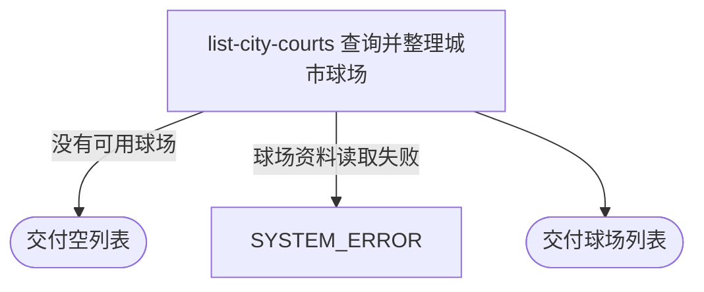

## 概要

为用户或访客交付指定城市的全部可用球场。

## 触发

用户或匿名访客按城市发起，调用方是用户端应用，该入口允许无登录凭证访问。一次请求查询一个城市编码下的全部可用球场，不分页、不限制数量，也不承诺排序。重复请求按当时的球场资料重新查询，不产生业务状态变化。

## 接口契约

### 请求参数

| 字段 | 类型 | 必填 | 约束 |
|---|---|---|---|
| `cityCode` | 字符串 | 是 | 非空白；不校验是否存在于城市名录 |

### 成功响应

| 字段 | 类型 | 说明 |
|---|---|---|
| 球场列表 | 对象列表 | 每项包含球场编号、名称、别名、地址、经纬度、城市与区域、环境及环境名称、标签、备注、拼音、评分、费用、开放时间和联系电话；没有结果时为空列表 |

## 业务活动

- list-city-courts  查询指定城市的全部可用球场并整理为对外清单

## 流程图

## 详细流程

1. 接收城市编码；为空白时拒绝查询。
2. 查询城市编码相同且状态为可用的全部球场；不核对城市名录，也不分页或追加排序。
3. 把别名和标签拆成列表，补充球场环境中文名称。
4. 从扩展资料补充拼音、评分、费用、开放时间和联系电话；扩展资料缺失或无法识别时，对应字段保持为空。
5. 交付球场资料列表；没有可用球场或城市编码不存在时交付空列表。

## 异常分支

| 对外失败码 | 触发条件 | 由哪个活动报出 | 补偿动作或超时处理 | 对外提示 |
|---|---|---|---|---|
| `PARAM_ERROR` | 城市编码为空或只含空白 | 流程 | 本流程只读，无需补偿 | 请选择城市 |
| `SYSTEM_ERROR` | 球场资料读取失败 | list-city-courts | 本流程只读，无需补偿 | 系统异常，请稍后重试 |
| 无 | 城市编码不在城市名录中，或城市内没有可用球场 | list-city-courts | 按成功结果收场 | 空列表 |

## 技术线索

- 表 `rally_court`，按 `city_code` 与 `status = ACTIVE` 查询
