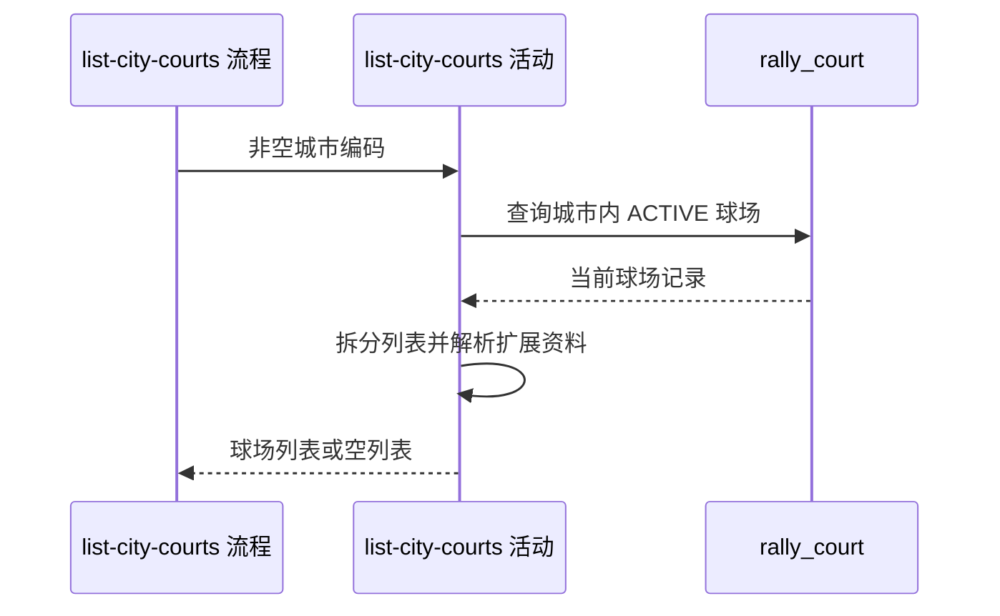

## 概要

查询指定城市的全部可用球场并整理对外字段。

## 时序图

## 触发条件

用户或匿名访客通过城市球场入口提交非空城市编码后执行；活动不要求登录。

## 活动契约

### 入参

| 字段 | 类型 | 必填 | 约束 |
|---|---|---|---|
| `cityCode` | 字符串 | 是 | 非空白；不在活动内核对城市名录 |

### 成功返回

球场对象列表；每项包含编号、名称、别名、地址、经纬度、城市区域、环境及展示名、标签、备注、约球次数和可解析的扩展资料。无匹配记录时为空列表。

## 异常分支

| 错误标识 | 触发条件 | 处理 |
|---|---|---|
| `SYSTEM_ERROR` | 球场资料查询失败 | 终止只读活动 |
| 无 | 城市编码未收录或没有可用球场 | 返回空列表 |

## 领域依赖

无

## 业务动作

A1 查询城市编码精确匹配且状态可用的球场
A2 拆分别名和标签并转换球场环境展示名
A3 解析扩展资料并组装对外球场列表

## 详细流程

1. 流程先校验 `cityCode` 非空白；活动不查询城市名录。
2. `A1` 一次查询 `city_code` 精确相等且 `status=ACTIVE` 的全部记录，不分页、不限量、不追加排序。
3. `A2` 按存储分隔规则把别名和标签转换为列表，并由环境枚举生成中文 `typeShow`。
4. `A3` 从 `ext_data` 补充拼音、拼音首字母、评分、费用、开放时间和联系电话，再映射其余基础字段与约球次数。
5. 扩展资料缺失或无法识别时仅将相应扩展字段留空，不丢弃该球场。

## 边界情况

- 非空但不存在的城市编码返回空列表。
- 数据库未承诺返回顺序，调用方不得依赖列表稳定排序。
- 球场在查询后被停用不改变本次已经取得的响应视图。
- 别名、标签、环境或扩展字段为空不影响球场入选。

## 实现提示

保持单次查询，避免为扩展字段逐球场回查；只读字段已按当前 DB snapshot 列明。
