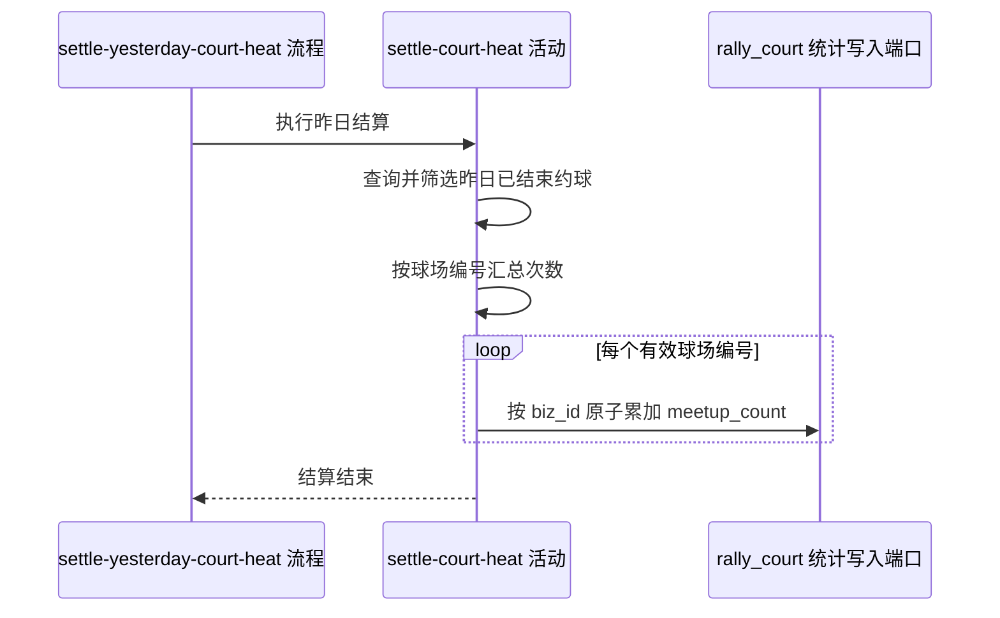

## 概要

汇总昨日合格约球并累加关联球场热度。

## 时序图

## 触发条件

约球定时任务按配置触发，默认每天凌晨 3 点执行；无外部请求参数。

## 活动契约

### 入参

无。

### 成功返回

无业务数据；没有合格约球时也按成功结束。

## 异常分支

| 错误标识 | 触发条件 | 处理 |
|---|---|---|
| 无 | 昨日无已结束约球或无合格球场编号 | 不修改球场，成功结束 |
| 无 | 关联球场编号不存在 | 对应更新影响 0 行，当前继续处理 |
| 无 | 查询或任一累加失败 | 抛给定时任务记录并结束；已完成累加不统一撤销 |

## 领域依赖

无

## 业务动作

A1 确定运行环境昨日完整自然日时间窗
A2 筛选已结束且选场模式、球场编号合格的约球
A3 按球场编号汇总应增加次数
A4 通过统计写入端口逐球场原子累加活动热度

## 详细流程

1. `A1` 使用运行环境 `LocalDate`，取昨日 `LocalTime.MIN` 到 `LocalTime.MAX` 的闭合范围。
2. `A2` 查询结束时间在范围内且状态为 `FINISHED` 的全部约球；再保留 `courtId` 非空且选场模式为 `MAP` 或 `TEXT` 的记录。
3. `A3` 按 `courtId` 汇总记录数；查询或筛选结果为空时直接结束。
4. `A4` 通过现有统计写入端口，对每个分组执行 `meetup_count = COALESCE(meetup_count, 0) + count`，以球场 `biz_id` 定位；该统计字段不进入 `@court.court` 聚合。
5. 各球场逐个更新，不设覆盖整批的总事务；发生异常时终止并交由定时任务记录。

## 边界情况

- 自由填写场地或缺少球场编号的已结束约球不计入。
- 同一约球只给其关联球场增加 1 次，不按参与人数加权。
- 关联球场不存在时当前不记录待补偿对象。
- 没有幂等标记，同一昨日窗口重复运行会再次累计。
- 部分球场更新后失败时不回滚已完成更新，也不自动重试。

## 实现提示

沿用 `CourtRepository.batchIncrementMeetupCount` 统计写入路径，累加必须使用数据库原子表达式避免并发覆盖；调度层保留完整异常日志，后续若要求重跑需先引入结算幂等凭据。
