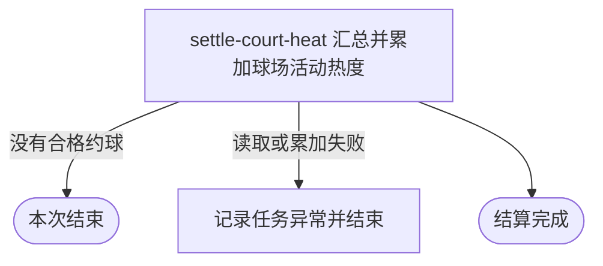

## 概要

每日把昨日合格约球次数累计到关联球场热度。

## 触发

约球定时任务在启用时按配置执行，默认每天凌晨 3 点触发。一次扫描运行环境自然日的昨日完整时间范围，并处理其中全部已结束约球。任务没有幂等标记，同一自然日重复执行会再次累计同一批约球；执行异常只记录日志，不向外部调用方返回结果，也不自动重试。

## 接口契约

### 请求参数

无

### 成功响应

无

## 业务活动

- settle-court-heat  汇总昨日合格约球并按球场批量累加活动热度

## 流程图

## 详细流程

1. 按运行环境日期确定昨日从最早时刻到最晚时刻的完整自然日范围。
2. 读取结束时间落在该范围且状态为已结束的全部约球；没有记录时直接结束。
3. 只保留通过地图或文本搜索选择场地、且已经关联球场编号的约球；自由填写场地和无球场编号的约球不计入。
4. 按球场编号汇总合格约球次数；没有任何有效球场编号时直接结束。
5. 逐个球场把汇总次数累加到现有约球次数，原值为空时从零开始。
6. 全部累加完成后记录任务完成；任一步异常由定时任务记录后结束，不自动重试或撤销此前累加。

## 异常分支

| 对外失败码 | 触发条件 | 由哪个活动报出 | 补偿动作或超时处理 | 对外提示 |
|---|---|---|---|---|
| 无 | 昨日没有已结束约球，或没有符合选场条件且关联球场的约球 | settle-court-heat | 不产生变更，按成功结果收场 | 无 |
| 无 | 约球关联的球场编号不存在 | settle-court-heat | 对应热度无法增加，当前不记录失败对象或补记 | 无 |
| 无 | 读取约球或累加球场热度失败 | settle-court-heat | 任务结束并记录日志；此前已累加球场不统一撤销，不自动重试 | 无 |

## 技术线索

- 表 `rally_meetup`，字段 `end_time`、`status`、`court_select_mode`、`court_id`
- 表 `rally_court`，以 `biz_id` 定位并累加 `meetup_count`
- 默认调度：每天凌晨 3 点；配置 `job.meetup.court-statistics.cron`
