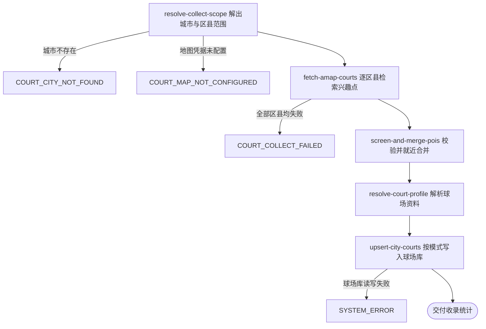

## 概要

运营按城市从高德抓取网球场写入球场库，拿到本次收录统计。

## 触发

运营在后台点「抓取球场」发起，调用方是运营后台，需带运营密钥。一次触发处理一个城市编码下的全部区县，抓取同步执行到结束才返回。同一城市同时只允许一份抓取在跑，前一份还没结束时后到的请求直接以 `COURT_COLLECT_IN_PROGRESS` 拒绝；不同城市互不影响。同一城市先后两次抓取不做幂等，第二次按当次模式重新跑一遍。

## 接口契约

### 请求参数

| 字段 | 类型 | 必填 | 约束 |
|---|---|---|---|
| `cityCode` | 字符串 | 是 | 非空白，需存在于平台城市名录 |
| `mode` | 枚举 | 是 | `FULL` 全量覆盖 / `INCREMENT` 增量 |

### 成功响应

| 字段 | 类型 | 说明 |
|---|---|---|
| `cityCode` | 字符串 | 本次抓取的城市编码 |
| `cityName` | 字符串 | 本次抓取的城市名称 |
| `mode` | 枚举 | 本次采用的抓取模式 |
| `districtCount` | 整数 | 本次实际检索的区县数量，未按区县拆分时为 0 |
| `fetchedCount` | 整数 | 从高德取回的兴趣点总条数 |
| `filteredCount` | 整数 | 被校验丢弃与被就近合并并掉的兴趣点条数 |
| `validCount` | 整数 | 解析出的球场条数 |
| `insertedCount` | 整数 | 本次新增的球场条数 |
| `updatedCount` | 整数 | 本次改写的球场条数，增量模式固定为 0 |
| `skippedCount` | 整数 | 因已收录而跳过的球场条数，全量覆盖模式固定为 0 |
| `failedDistricts` | 字符串列表 | 抓取失败的区县编码，全部成功时为空列表 |

## 业务活动

- resolve-collect-scope  校验城市编码存在，取得城市名称，并按编码推导规则解出本次要检索的区县范围
- fetch-amap-courts  逐个区县向高德分页检索网球场兴趣点，汇总兴趣点并记下抓取失败的区县
- screen-and-merge-pois  对兴趣点做有效性校验，再按就近合并挑出主记录并把被并掉的名称记为别名
- resolve-court-profile  把主记录解析成待写入的球场资料，含球场环境判定、标签生成、经纬度拆分与扩展资料整理
- upsert-city-courts  按全量覆盖或增量模式把球场写入球场库，统计新增、改写与跳过条数

## 流程图

## 详细流程

1. 接收城市编码与抓取模式，确认该城市当前没有别的抓取在跑，占住这个城市的抓取名额。
2. 在城市名录中确认该城市编码存在并取得城市名称，同时确认地图服务的调用凭据已配置。
3. 在区县名录中按编码推导规则取得该城市下的全部区县；一个区县都取不到时，改为按城市编码整体检索。
4. 逐个区县向地图服务按关键词「网球场」检索，一页取完取下一页，直到某一页取不到结果为止；相邻两次检索之间留出间隔以避开调用频率限制。某个区县检索失败时跳过它继续下一个，把该区县记入失败清单。
5. 汇总全部取回的场所记录，逐条做有效性校验，丢弃培训类、穿线类等非标准场地以及不是网球场的条目。
6. 对通过校验的场所记录做就近合并，同一处场馆被拆成多条时只留评分最高的一条作为主记录，其余记录的名称记作主记录的别名。
7. 逐条把主记录解析成球场资料：判定室内还是室外、生成球场标签、拆出经纬度、按城市与区县名录补齐归属名称，并把评分、人均消费、营业时间、联系电话以及球场名称的拼音与拼音首字母整理为扩展资料。
8. 按抓取模式写入球场库：全量覆盖模式下，三方来源编号已存在的球场按本次结果改写，不存在的新增；增量模式下，三方来源编号已存在的球场跳过，只新增不存在的。新增的球场生成球场业务编号，来源记为系统录入，状态记为可用。单条写入失败时跳过它继续写其余的。
9. 交付本次的检索区县数、取回条数、丢弃条数、有效条数、新增条数、改写条数、跳过条数和抓取失败的区县清单，并释放该城市的抓取名额。

## 异常分支

| 对外失败码 | 触发条件 | 由哪个活动报出 | 补偿动作或超时处理 | 对外提示 |
|---|---|---|---|---|
| `PARAM_ERROR` | 城市编码为空白，或抓取模式为空、不是 `FULL` 与 `INCREMENT` 之一 | 流程 | 无，未开始抓取 | 参数错误 |
| `COURT_COLLECT_IN_PROGRESS` | 该城市已有一份抓取在跑 | 流程 | 无，不占用名额、不写库 | 该城市正在抓取中，请稍后重试 |
| `COURT_CITY_NOT_FOUND` | 城市编码在城市名录中不存在 | resolve-collect-scope | 释放该城市的抓取名额 | 城市不存在 |
| `COURT_MAP_NOT_CONFIGURED` | 地图服务的调用凭据未配置 | resolve-collect-scope | 释放该城市的抓取名额，一次检索都不发起 | 地图服务未配置 |
| `COURT_COLLECT_FAILED` | 本次检索的全部区县都失败，一条场所记录都没取到 | fetch-amap-courts | 释放该城市的抓取名额，未写入任何球场 | 球场抓取失败 |
| `SYSTEM_ERROR` | 球场库读写整体失败 | upsert-city-courts | 释放该城市的抓取名额，失败前已写入的球场保留，不回滚 | 系统异常，请稍后重试 |

部分区县检索失败、单条场所记录经纬度缺失、单条评分无法识别、单条球场写入失败都不中断流程，跳过后继续，失败的区县在成功响应的 `failedDistricts` 中列出。

## 技术线索

- 表 `rally_court`，字段 `biz_id`、`source_id`、`name`、`alias`、`address`、`lng`、`lat`、`city_code`、`district_code`、`city_name`、`district_name`、`type`、`tags`、`ext_data`、`source`、`status`
- `source_id` 为唯一键，全量覆盖模式按 `INSERT ... ON DUPLICATE KEY UPDATE` 写入
- 城市名录 `city.json`，区县名录 `district.json`
- 外部系统：高德地图，关键词搜索接口 `https://restapi.amap.com/v5/place/text`，参数 `keywords`、`region`、`city_limit=true`、`show_fields=children,business,indoor`、`page_size`、`page_num`
- 现有抓取脚本 `/Users/chenxintong/workspace/court-search`，分页每页 25 条、请求间隔 0.5 秒、就近合并阈值 100 米、`高评分` 标签阈值 4.6 分
