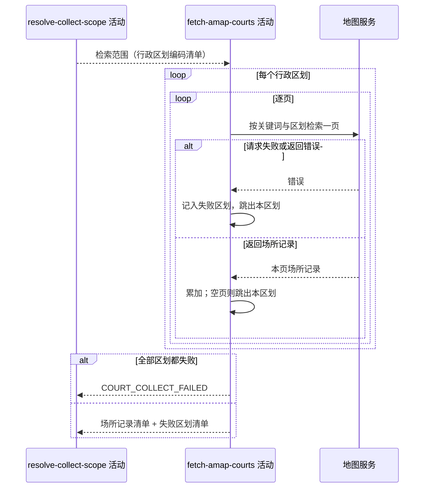

## 概要

逐个行政区划向地图服务分页检索网球场，汇总结果与失败区划。

## 时序图

## 触发条件

检索范围已解出、地图服务凭据已确认配置之后执行。执行时还没有任何场所记录被取回。

## 活动契约

### 入参

| 字段 | 类型 | 必填 | 约束 |
|---|---|---|---|
| `regionCodes` | 字符串列表 | 是 | 非空，要逐个检索的行政区划编码 |

### 成功返回

| 字段 | 类型 | 必填 | 说明 |
|---|---|---|---|
| `pois` | 场所记录列表 | 是 | 全部区划取回的场所记录，未去重、未过滤 |
| `fetchedCount` | 整数 | 是 | 场所记录总条数 |
| `failedRegions` | 字符串列表 | 是 | 检索失败的行政区划编码，全部成功时为空列表 |

场所记录保留地图服务返回的原始形态，至少含场所编号、名称、地址、经纬度、区划编码、区划名称、场所类型串，以及推荐标签、关键标签、评分、人均消费、一周营业时间、联系电话。

## 异常分支

| 错误标识 | 触发条件 | 来源 |
|---|---|---|
| `COURT_COLLECT_FAILED` | 全部行政区划都检索失败，一条场所记录都没取到 | collect-city-courts 流程 `COURT_COLLECT_FAILED` 一行 |

## 领域依赖

无

## 业务动作

A1 按固定关键词「网球场」逐个行政区划检索，每个区划从第一页翻到取不到结果为止
A2 相邻两次检索之间留出固定间隔，避开地图服务的调用频率限制
A3 某个区划检索失败时跳过它继续下一个，把该区划编码记入失败清单
A4 全部区划都失败时报 `COURT_COLLECT_FAILED`，否则汇总场所记录、总条数与失败区划清单返回

## 详细流程

1. `A1` 的翻页终止条件是某一页取不到任何场所记录，此时认为该区划已取完，进入下一个区划。
2. `A2` 的间隔在每次请求之后等待，最后一次请求之后也可以省去。
3. `A3` 中「检索失败」包含网络异常、超时，以及地图服务返回业务错误码两种情况；某一页失败即放弃该区划剩余页，已取到的前几页照常保留。
4. `A4` 的判定看是否一条场所记录都没取到，而不是看失败区划数量——部分区划失败但仍有结果时按成功返回。
5. 本活动只读外部数据，不产生任何状态变更，无事务、无补偿。整条抓取同步执行，失败区划不重试。

## 边界情况

- 检索范围只含城市编码本身：按一个区划处理，同样分页翻取。
- 某区划确实没有网球场：第一页就空，不算失败，不记入失败清单。
- 地图凭据无效：每个区划都返回业务错误，全部记入失败清单，最终报 `COURT_COLLECT_FAILED`。
- 同一场馆在多个区划边界重复出现：不在本活动去重，交给下一个活动的就近合并处理。
- 单个区划场所记录极多：不设条数上限，翻到空页为止。

## 实现提示

关键词搜索接口 `https://restapi.amap.com/v5/place/text`，参数 `keywords=网球场`、`region=<区划编码>`、`city_limit=true`、`show_fields=children,business,indoor`、`page_size=25`、`page_num` 从 1 递增；请求间隔 0.5 秒。响应体 `status` 为 `1` 才算成功，场所记录在 `pois` 数组里。走项目统一的 HTTP 工具类，放在基础设施层的三方客户端里。
