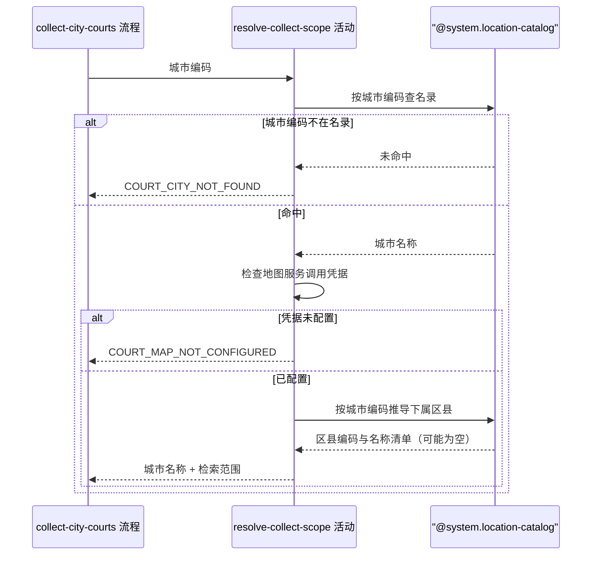

## 概要

校验城市与地图凭据，解出本次要逐个检索的区县范围。

## 时序图

## 触发条件

运营发起城市球场抓取、该城市的抓取名额已被占住、参数格式校验通过后，作为整条抓取的第一步执行。执行时还没有向地图服务发起任何请求。

## 活动契约

### 入参

| 字段 | 类型 | 必填 | 约束 |
|---|---|---|---|
| `cityCode` | 字符串 | 是 | 非空白，六位城市编码 |

### 成功返回

| 字段 | 类型 | 必填 | 说明 |
|---|---|---|---|
| `cityCode` | 字符串 | 是 | 原样回传的城市编码 |
| `cityName` | 字符串 | 是 | 名录中该城市编码对应的中文名称 |
| `regionCodes` | 字符串列表 | 是 | 本次要逐个检索的行政区划编码。名录中能推导出区县时为区县编码清单；一个区县都推不出时只含城市编码本身 |
| `districtCount` | 整数 | 是 | 推导出的区县数量。未按区县拆分时为 0 |

## 异常分支

| 错误标识 | 触发条件 | 来源 |
|---|---|---|
| `COURT_CITY_NOT_FOUND` | 城市编码在城市名录中查不到 | collect-city-courts 流程 `COURT_CITY_NOT_FOUND` 一行 |
| `COURT_MAP_NOT_CONFIGURED` | 地图服务的调用凭据为空 | collect-city-courts 流程 `COURT_MAP_NOT_CONFIGURED` 一行 |

## 领域依赖

### @system.location-catalog

- 输入：城市编码
- 输出：命中时给出该城市的中文名称；再按编码归属规则给出该城市下的全部区县编码与名称，直辖市按编码前两位归属、其余城市按前四位归属，名录里没有下属区县的城市给出空清单。异常形态：城市编码不在名录中时给出「未命中」的结论，名录本身不报错

## 业务动作

A1 按城市编码查名录取城市名称，未命中则报 `COURT_CITY_NOT_FOUND`
A2 检查地图服务的调用凭据已配置，未配置则报 `COURT_MAP_NOT_CONFIGURED`
A3 按编码归属规则推导该城市下的全部区县
A4 区县为空时把城市编码本身作为唯一检索范围，否则用区县编码清单作为检索范围

## 详细流程

1. `A1` 未命中时立刻报错返回，不进入 `A2`。
2. `A2` 排在推导区县之前，凭据没配好时一次地图请求都不发起，避免白跑。
3. `A3` 的归属规则由名录承担，本活动只取结果，不自己算编码前缀。
4. `A4` 决定后续按区县逐个检索还是按整座城市一次检索；按城市检索时返回的区县数量为 0。
5. 本活动只读名录与配置，不产生任何状态变更，无事务、无补偿。

## 边界情况

- 城市在名录中但没有下属区县（东莞、中山、三沙、儋州、嘉峪关等）：检索范围只含城市编码本身，区县数量为 0。
- 直辖市：区县编码按前两位归属，能推导出下属各区。
- 名录中的区县数据偏旧，含已撤销区县或缺少新设区县：照常按名录推导，已撤销的区县检索不到结果、新设区县抓不到，本活动不做修正。
- 凭据配置成空白字符串：视同未配置。

## 实现提示

地图服务凭据从应用配置读取，判空只看是否为空白，不在这里做真实性验证——凭据无效由后续的检索活动表现为区县抓取失败。
