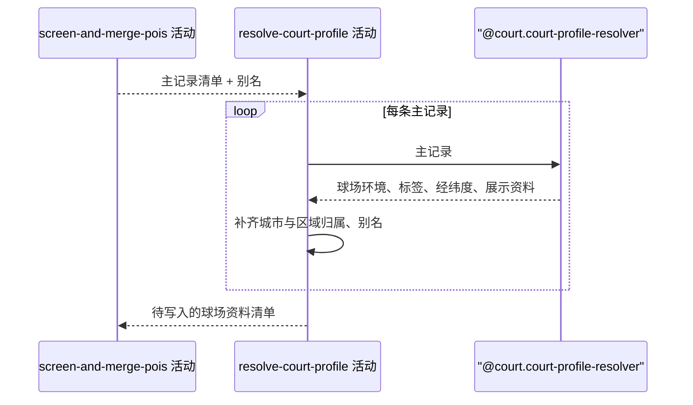

## 概要

把主记录逐条解析成可以写库的球场资料。

## 时序图

## 触发条件

主记录清单已经筛选与就近合并完毕之后执行。执行时这批球场还没有写入球场库。

## 活动契约

### 入参

| 字段 | 类型 | 必填 | 约束 |
|---|---|---|---|
| `keepers` | 主记录列表 | 是 | 可为空列表 |
| `aliasOf` | 主记录到别名的对应关系 | 是 | 可为空 |
| `cityCode` | 字符串 | 是 | 本次抓取的城市编码 |
| `cityName` | 字符串 | 是 | 本次抓取的城市名称 |

### 成功返回

| 字段 | 类型 | 必填 | 说明 |
|---|---|---|---|
| `courts` | 球场资料列表 | 是 | 待写入球场库的球场资料，含三方来源编号、名称、别名、地址、经纬度、城市与区域归属、球场环境、标签、展示资料 |
| `validCount` | 整数 | 是 | 解析出的球场条数 |

## 异常分支

无

## 领域依赖

### @court.court-profile-resolver

- 输入：一条地图服务的场所记录
- 输出：给出该场所的球场环境结论——名称、地址、场所类型串、推荐标签、关键标签拼起来含「室内」判为室内，含楼顶、天台、屋顶、露台之一判为室外，地址中出现 3 到 9 层楼层判为室外，含公园、广场、体育场之一判为室外，都不命中则判不出；给出一组球场标签——空调、楼顶、草地、红土、硬地、近地铁、停车方便、公共设施、高评分（评分不小于 4.6）、24 小时营业、有灯光，以及随球场环境结论附带的室内场或室外场；把经纬度串拆成经度与纬度；把评分、人均消费、一周营业时间、联系电话整理成展示资料，缺哪项就不给哪项。异常形态：经纬度串缺失或无法解析时经度纬度都给空；评分无法识别为数字时视为没有评分，不判高评分

## 业务动作

A1 逐条把主记录交给解析规则，取回球场环境、标签、经纬度与展示资料
A2 把本次抓取的城市编码与名称作为球场的城市归属，把主记录自带的区划编码与名称作为区域归属
A3 把该主记录被并掉的记录名称作为球场别名
A4 汇成待写入的球场资料清单与有效条数返回

## 详细流程

1. `A1` 逐条独立解析，单条解析不出球场环境不影响其余条目，该条球场环境留空。
2. `A2` 的城市归属一律以本次抓取的城市为准，不采用场所记录自带的城市编码与城市名称。
3. `A3` 中没有被并掉记录的主记录，别名留空。
4. 球场业务编号、来源、状态、拼音不在这里生成，由写入环节交给球场自身负责。
5. 本活动只做解析，不产生任何状态变更，无事务、无补偿。

## 边界情况

- 入参主记录清单为空：返回空球场资料清单，有效条数为 0。
- 场所记录没有区划编码或区划名称：区域归属留空，城市归属照常。
- 场所记录的城市与本次抓取的城市不一致：以本次抓取的城市为准，不丢弃该条。
- 场所记录一条标签都没命中：标签留空。
- 评分、人均消费、营业时间、电话全部缺失：展示资料只留后续由球场自身补上的拼音两项。

## 实现提示

球场环境判定与标签生成的关键词、评分阈值集中成常量表，便于日后调整；标签按判定顺序追加，不去重、不排序。
