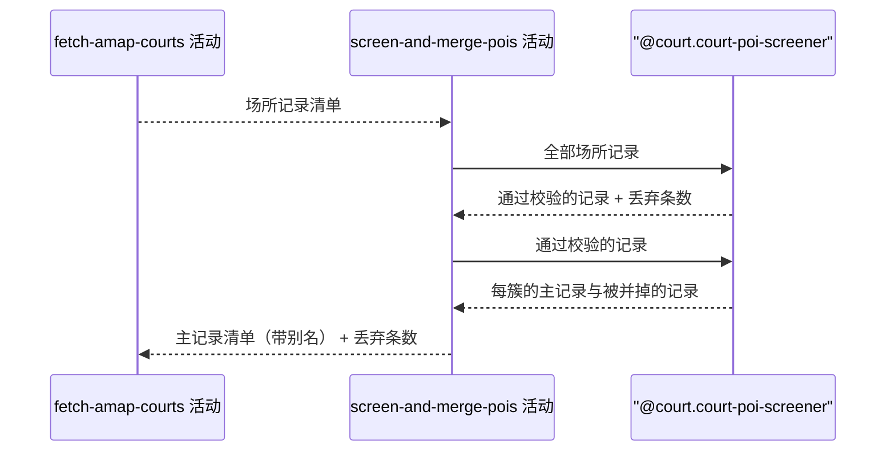

## 概要

筛掉非网球场记录，再把同一处场馆的多条记录并成一条。

## 时序图

## 触发条件

地图服务的场所记录已全部取回之后执行。执行时场所记录未经任何筛选与去重。

## 活动契约

### 入参

| 字段 | 类型 | 必填 | 约束 |
|---|---|---|---|
| `pois` | 场所记录列表 | 是 | 可为空列表，来自地图服务的原始记录 |

### 成功返回

| 字段 | 类型 | 必填 | 说明 |
|---|---|---|---|
| `keepers` | 主记录列表 | 是 | 每簇留下的一条场所记录 |
| `aliasOf` | 主记录到别名的对应关系 | 是 | 每条主记录被并掉的其他记录名称，没有被并掉的记录时为空 |
| `filteredCount` | 整数 | 是 | 被校验丢弃的条数与被并掉的条数之和 |

## 异常分支

无

## 领域依赖

### @court.court-poi-screener

- 输入：地图服务返回的场所记录清单
- 输出：先给出哪些记录该保留、哪些该丢弃——名称或地址含培训类、穿线类字样的丢弃，推荐标签与关键标签拼接后不含「网球场」的丢弃；再对保留下来的记录按地理位置聚簇，球面距离不超过 100 米的记录归为同一簇，每簇给出评分最高的一条作为主记录、其余作为被并掉的记录，评分为空视为最低，经纬度缺失的记录各自成簇。异常形态：入参为空清单时给出空结果，不报错

## 业务动作

A1 把全部场所记录交给筛选规则，取回保留清单与丢弃条数
A2 把保留下来的记录交给就近合并规则，取回每簇的主记录与被并掉的记录
A3 把每条主记录被并掉的记录名称汇成它的别名
A4 累加丢弃条数与被并掉的条数，连同主记录清单一起返回

## 详细流程

1. `A1` 与 `A2` 顺序执行，只有通过校验的记录才进入就近合并。
2. `A2` 的聚簇按相互可达传递：A 与 B 相距不超过 100 米、B 与 C 相距不超过 100 米时，A、B、C 同属一簇，即便 A 与 C 相距超过 100 米。
3. `A3` 的别名只取被并掉记录的名称，其余字段一概丢弃。
4. `A4` 的丢弃条数把两类都算进去：没通过校验的，和通过校验但被并掉的。
5. 本活动只做筛选与归并，不产生任何状态变更，无事务、无补偿。

## 边界情况

- 入参为空清单：返回空主记录清单，丢弃条数为 0。
- 全部记录都没通过校验：返回空主记录清单，丢弃条数等于入参条数。
- 记录经纬度缺失或无法解析：不参与聚簇，各自成一簇，自己就是主记录。
- 同一簇内多条记录评分相同：取其中任意一条为主记录，其余记为别名。
- 一簇内被并掉的记录很多，名称连接后超过别名字段长度：由后续写入环节按字段上限截断，本活动不截断。

## 实现提示

聚簇用并查集，距离用 Haversine 公式按米计算，阈值 100 米、评分阈值等参数集中成常量，便于日后按城市调整。
