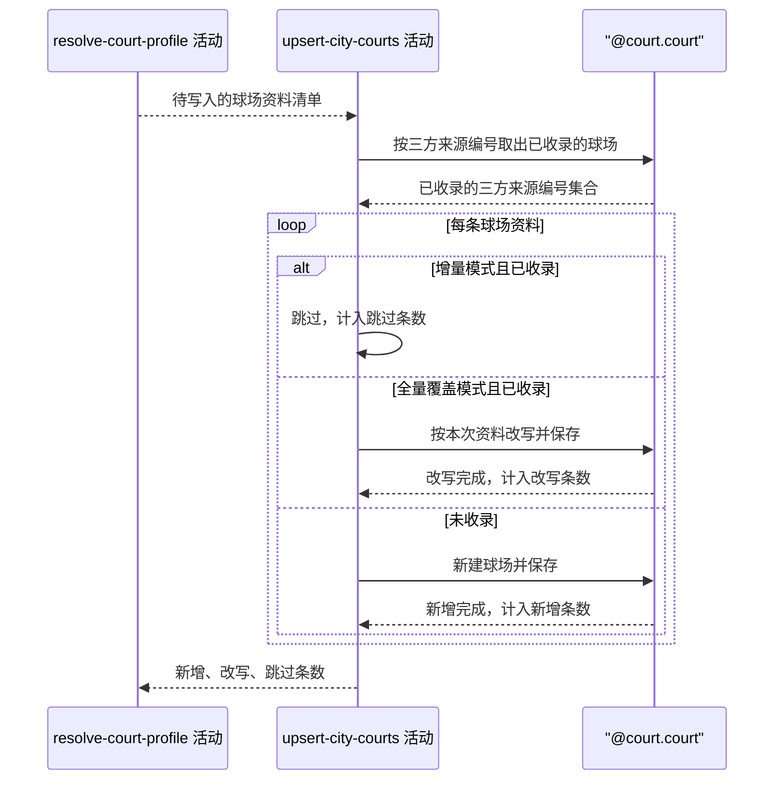

## 概要

按全量覆盖或增量模式把解析好的球场写入球场库并统计。

## 时序图

## 触发条件

球场资料已逐条解析完毕之后，作为整条抓取的最后一步执行。执行前这批球场中有一部分可能已在库中。

## 活动契约

### 入参

| 字段 | 类型 | 必填 | 约束 |
|---|---|---|---|
| `courts` | 球场资料列表 | 是 | 可为空列表，来自解析活动 |
| `mode` | 枚举 | 是 | `FULL` 全量覆盖 / `INCREMENT` 增量 |

### 成功返回

| 字段 | 类型 | 必填 | 说明 |
|---|---|---|---|
| `insertedCount` | 整数 | 是 | 本次新增的球场条数 |
| `updatedCount` | 整数 | 是 | 本次改写的球场条数，增量模式固定为 0 |
| `skippedCount` | 整数 | 是 | 因已收录而跳过的球场条数，全量覆盖模式固定为 0 |

## 异常分支

| 错误标识 | 触发条件 | 来源 |
|---|---|---|
| `SYSTEM_ERROR` | 球场库整体读写失败，无法继续写入 | collect-city-courts 流程 `SYSTEM_ERROR` 一行 |

## 领域依赖

### @court.court

- 输入：一批带三方来源编号的球场资料；写入模式
- 输出：按三方来源编号判定哪些球场已收录；未收录的建成新球场，业务编号已生成、来源为系统录入、状态为可用、扩展资料里的拼音与拼音首字母与球场名称一致；已收录的在全量覆盖模式下按本次资料改写名称、别名、地址、经纬度、城市与区域归属、球场环境、标签与展示资料，业务编号、来源、备注、场地材质与约球次数保持原值，在增量模式下一概不动。异常形态：单条写入失败时把失败原样抛出交给本活动决定是否继续；球场库整体不可用时把失败原样抛出，不吞掉

## 业务动作

A1 按本批球场资料的三方来源编号，取出其中已经收录过的那些
A2 增量模式下跳过已收录的球场，计入跳过条数
A3 全量覆盖模式下把已收录的球场按本次资料改写并保存，计入改写条数
A4 未收录的球场一律新建并保存，计入新增条数
A5 汇总新增、改写、跳过条数返回

## 详细流程

1. `A1` 一次批量判定，不逐条查库。
2. `A2` 与 `A3` 互斥，由模式决定走哪条；`A4` 两种模式下都执行。
3. `A2` 到 `A4` 逐条独立提交，不共用一个事务：单条写入失败时跳过该条继续写其余的，失败的条目不计入任何计数，已写入的保留、不回滚。
4. 只有球场库整体不可用、后续条目已无法继续写入时才报 `SYSTEM_ERROR`，此时失败前已写入的球场保留。
5. 三方来源编号是判定「已收录」的唯一依据，运营手工录入的球场没有三方来源编号，永远不会被本活动匹配到。

## 边界情况

- 入参球场资料为空清单：三项计数都为 0，不做任何写入。
- 同一批中两条球场资料的三方来源编号相同：后写的按已收录处理，模式决定改写还是跳过。
- 别名连接后超过字段长度上限：按上限截断后写入，不因此丢弃整条球场。
- 已被运营停用的球场在全量覆盖模式下再次抓到：状态被改回可用，停用效果被抹掉。
- 已被运营编辑过名称或标签的球场在全量覆盖模式下再次抓到：人工改动被本次抓取结果覆盖。

## 实现提示

全量覆盖走 `INSERT ... ON DUPLICATE KEY UPDATE`，唯一键是 `rally_court.source_id`；增量先按三方来源编号批量查出已存在的集合，再只插入不在集合里的。两种模式都分批提交，单批规模控制在百条量级。
