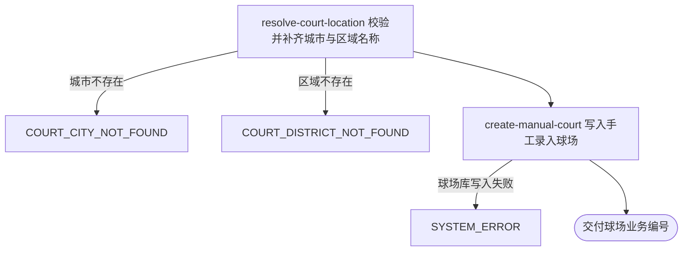

## 概要

运营手工录入一个球场，拿到新球场的业务编号。

## 触发

运营在后台填完球场表单后提交，调用方是运营后台，需带运营密钥。一次触发录入一个球场。不做查重也不做幂等，同一份表单重复提交会录出多条球场。

## 接口契约

### 请求参数

| 字段 | 类型 | 必填 | 约束 |
|---|---|---|---|
| `name` | 字符串 | 是 | 非空白，最长 128 字符 |
| `cityCode` | 字符串 | 是 | 非空白，需存在于平台城市名录 |
| `alias` | 字符串列表 | 否 | 以英文逗号连接后最长 128 字符 |
| `address` | 字符串 | 否 | 最长 256 字符 |
| `lng` | 小数 | 否 | -180 到 180 |
| `lat` | 小数 | 否 | -90 到 90 |
| `districtCode` | 字符串 | 否 | 需存在于平台区县名录 |
| `remark` | 字符串 | 否 | 最长 255 字符 |
| `type` | 枚举 | 否 | `INDOOR` / `OUTDOOR` |
| `surface` | 枚举 | 否 | `HARD` / `CLAY` / `GRASS` |
| `tags` | 字符串列表 | 否 | 以英文逗号连接后最长 512 字符 |
| `rating` | 字符串 | 否 | 评分展示值 |
| `cost` | 字符串 | 否 | 费用展示值 |
| `opentime` | 字符串 | 否 | 开放时间展示值 |
| `tel` | 字符串 | 否 | 联系电话 |
| `status` | 枚举 | 否 | `COLLECTED` / `ACTIVE` / `DISABLED`，不填按 `ACTIVE` |

### 成功响应

| 字段 | 类型 | 说明 |
|---|---|---|
| `courtId` | 字符串 | 新增球场的业务编号 |

## 业务活动

- resolve-court-location  校验城市编码与区域编码在名录中存在，取得城市名称与区域名称
- create-manual-court  生成球场业务编号，整理别名、标签与扩展资料，写入一条来源为系统录入、无三方来源编号的球场

## 流程图

## 详细流程

1. 接收运营填写的球场资料。
2. 在城市名录中确认城市编码存在并取得城市名称；填了区域编码时，在区县名录中确认存在并取得区域名称。
3. 生成球场业务编号。
4. 把别名列表与标签列表分别以英文逗号连接，把评分、费用、开放时间、联系电话，以及按球场名称生成的拼音与拼音首字母整理为扩展资料。
5. 写入球场，来源记为系统录入，三方来源编号留空，约球次数记为 0，状态取运营填的值，没填按可用。
6. 交付新增球场的业务编号。

## 异常分支

| 对外失败码 | 触发条件 | 由哪个活动报出 | 补偿动作或超时处理 | 对外提示 |
|---|---|---|---|---|
| `PARAM_ERROR` | 球场名称或城市编码为空白；球场环境、场地材质、球场状态不是允许的取值；经纬度超出取值范围；名称、别名、地址、备注、标签超出长度上限 | 流程 | 无，未写库 | 参数错误 |
| `COURT_CITY_NOT_FOUND` | 城市编码在城市名录中不存在 | resolve-court-location | 无，未写库 | 城市不存在 |
| `COURT_DISTRICT_NOT_FOUND` | 区域编码在区县名录中不存在 | resolve-court-location | 无，未写库 | 区域不存在 |
| `SYSTEM_ERROR` | 球场库写入失败 | create-manual-court | 无，未写库 | 系统异常，请稍后重试 |

## 技术线索

- 表 `rally_court`，本流程写入 `biz_id`、`name`、`alias`、`address`、`lng`、`lat`、`city_code`、`district_code`、`city_name`、`district_name`、`remark`、`type`、`surface`、`tags`、`ext_data`、`source`、`status`、`meetup_count`
- `source` 固定为 `SYSTEM`，`source_id` 留空
- 城市名录 `city.json`，区县名录 `district.json`
